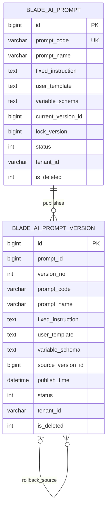

# 提示词管理数据库设计

## 1. 文档信息

| 项目 | 内容 |
| --- | --- |
| 数据库设计编号 | DB-REQ-2026-001 |
| 关联需求 | [REQ-2026-001 提示词管理](../requirements/REQ-2026-001-prompt-management.md) |
| 关联详细设计 | [DESIGN-REQ-2026-001 提示词管理详细设计](../design/DESIGN-REQ-2026-001-prompt-management.md) |
| 文档版本 | 0.5 |
| 文档状态 | 开发中 |
| 数据库 | MySQL |
| 负责人 | 待指定 |
| 创建/更新日期 | 2026-09-09 |

## 2. 目标与范围

- 设计目标：持久化当前可编辑草稿和不可变发布版本，支持租户隔离、并发发布、停用和回滚。
- 数据边界：两张提示词基础表均为租户级数据，tenantId 由安全上下文和 MyBatis 租户插件控制。
- 范围外：模型配置、模型响应、调用历史、Token/成本、效果评估、跨租户共享和其他数据库方言。
- 历史数据：当前不存在既有提示词数据，不需要回填。
- 审计与脱敏：不涉及。REQ-2026-001 0.2 已移除审计范围，后续如需通用审计应建立独立需求，本设计不预设相关表、字段、脚本或配置。

| 表名 | 变更类型 | 租户表 | Entity 基类 | 说明 |
| --- | --- | :---: | --- | --- |
| `blade_ai_prompt` | 新增 | 是 | `TenantEntity` | 提示词身份、当前草稿、状态和当前版本指针 |
| `blade_ai_prompt_version` | 新增 | 是 | `TenantEntity` | 不可修改的发布/回滚版本快照 |

## 3. 数据模型

### 3.1 ER 图



### 3.2 关系说明

| 关系 | 基数 | 约束方式 | 删除/停用行为 |
| --- | --- | --- | --- |
| `blade_ai_prompt` -> `blade_ai_prompt_version` | 1:N | 应用校验 + 联合唯一索引，不建物理外键 | 存在任一版本时禁止删除主记录；停用保留版本 |
| `blade_ai_prompt.current_version_id` -> version | 1:0/1 | 发布事务内校验 tenant/prompt 归属 | 发布或回滚原子切换；停用不清空 |
| rollback version -> source version | N:0/1 | `source_version_id` 应用校验 | 来源版本永久保留 |

仓库现有表普遍不使用数据库外键，本设计沿用该方式，避免部署顺序和逻辑删除与物理外键冲突。完整性由事务、租户条件、唯一索引和服务校验共同保证。

## 4. 表结构

### 4.1 SpringBlade 约定

- 主键使用应用侧雪花 `BIGINT`，不使用 `AUTO_INCREMENT`。
- `tenant_id` 使用 `VARCHAR(12)`；两张提示词表加入 `blade.tenant.tables`。
- 框架基础元数据字段为 `create_user`、`create_dept`、`create_time`、`update_user`、`update_time`。
- ER 实体框、字段清单和 DDL 统一按 `id`、核心业务字段、`tenant_id`、框架基础字段的顺序展示，优先让读者看到业务结构。
- `status` 表示业务状态，`is_deleted` 为逻辑删除标记。
- 使用 `InnoDB`、`utf8mb4` 和当前全量脚本的 `utf8mb4_general_ci` 排序规则。
- JSON 内容使用 `TEXT` 保存，由 Jackson 2 管线序列化并由应用层执行 Schema 校验，不依赖 MySQL JSON 函数。

### 4.2 `blade_ai_prompt`

| 序号 | 字段 | MySQL 类型 | 允许空 | 默认值 | 键/索引 | 说明 |
| ---: | --- | --- | :---: | --- | --- | --- |
| 1 | `id` | `BIGINT` | 否 | 无 | PK | 雪花主键 |
| 2 | `prompt_code` | `VARCHAR(64)` | 否 | 无 | UK | 稳定编码，应用统一转小写，创建后不可改 |
| 3 | `prompt_name` | `VARCHAR(100)` | 否 | 无 | IDX | 管理名称 |
| 4 | `fixed_instruction` | `TEXT` | 是 | NULL | 无 | 当前草稿固定指令 |
| 5 | `user_template` | `TEXT` | 是 | NULL | 无 | 当前草稿用户输入模板 |
| 6 | `variable_schema` | `TEXT` | 否 | 无 | 无 | 当前草稿变量定义 JSON 数组 |
| 7 | `draft_revision` | `BIGINT` | 否 | `1` | 无 | 草稿内容修订号，只在内容/变量变化时递增 |
| 8 | `draft_dirty` | `TINYINT` | 否 | `1` | 无 | `1` 表示存在未发布草稿 |
| 9 | `current_version_id` | `BIGINT` | 是 | NULL | IDX | 当前运行时版本 ID |
| 10 | `current_version_no` | `INT` | 否 | `0` | 无 | 当前/最近发布版本号 |
| 11 | `lock_version` | `BIGINT` | 否 | `0` | 无 | 聚合并发版本，每次写操作递增 |
| 12 | `status` | `INT` | 否 | `0` | IDX | `0=草稿态, 1=已发布可用, 2=已停用` |
| 13 | `tenant_id` | `VARCHAR(12)` | 否 | `'000000'` | UK/IDX | 租户 ID，排在业务字段之后 |
| 14 | `create_user` | `BIGINT` | 是 | NULL | 无 | 创建人 |
| 15 | `create_dept` | `BIGINT` | 是 | NULL | 无 | 创建部门 |
| 16 | `create_time` | `DATETIME` | 是 | NULL | 无 | 创建时间 |
| 17 | `update_user` | `BIGINT` | 是 | NULL | 无 | 更新人 |
| 18 | `update_time` | `DATETIME` | 是 | NULL | 无 | 更新时间 |
| 19 | `is_deleted` | `INT` | 否 | `0` | IDX | `0=未删除, 1=已删除` |

约束说明：

- `fixed_instruction` 与 `user_template` 可分别为空，但应用校验禁止同时为空。
- 唯一键不包含 `is_deleted`，因此逻辑删除后编码仍被保留，不允许复用。
- `current_version_id` 为空时 `status` 必须为 0；状态 1 或 2 时必须存在当前版本。该约束由 Service 保证。
- `draft_dirty=0` 表示当前草稿与最后一次普通发布快照一致；回滚后强制设为 1，因为保留的草稿与回滚版本可能不同。

### 4.3 `blade_ai_prompt_version`

| 序号 | 字段 | MySQL 类型 | 允许空 | 默认值 | 键/索引 | 说明 |
| ---: | --- | --- | :---: | --- | --- | --- |
| 1 | `id` | `BIGINT` | 否 | 无 | PK | 雪花主键 |
| 2 | `prompt_id` | `BIGINT` | 否 | 无 | UK/IDX | 主提示词 ID |
| 3 | `version_no` | `INT` | 否 | 无 | UK | 从 1 单调递增 |
| 4 | `prompt_code` | `VARCHAR(64)` | 否 | 无 | IDX | 发布时稳定编码快照 |
| 5 | `prompt_name` | `VARCHAR(100)` | 否 | 无 | 无 | 发布时名称快照 |
| 6 | `fixed_instruction` | `TEXT` | 是 | NULL | 无 | 固定指令快照 |
| 7 | `user_template` | `TEXT` | 是 | NULL | 无 | 用户模板快照 |
| 8 | `variable_schema` | `TEXT` | 否 | 无 | 无 | 变量定义快照 |
| 9 | `source_type` | `INT` | 否 | `1` | 无 | `1=普通发布, 2=回滚发布` |
| 10 | `source_version_id` | `BIGINT` | 是 | NULL | IDX | 回滚来源版本；普通发布为空 |
| 11 | `source_draft_revision` | `BIGINT` | 是 | NULL | 无 | 普通发布对应草稿修订号 |
| 12 | `content_hash` | `CHAR(64)` | 否 | 无 | 无 | 规范化快照 SHA-256，用于完整性核对 |
| 13 | `change_note` | `VARCHAR(500)` | 否 | 无 | 无 | 发布/回滚说明 |
| 14 | `publish_user` | `BIGINT` | 否 | 无 | 无 | 发布人 |
| 15 | `publish_time` | `DATETIME` | 否 | 无 | IDX | 发布时间 |
| 16 | `status` | `INT` | 否 | `1` | 无 | 固定为有效历史记录 |
| 17 | `tenant_id` | `VARCHAR(12)` | 否 | `'000000'` | UK/IDX | 租户 ID，排在业务字段之后 |
| 18 | `create_user` | `BIGINT` | 是 | NULL | 无 | 与发布人一致的框架基础字段 |
| 19 | `create_dept` | `BIGINT` | 是 | NULL | 无 | 发布人部门 |
| 20 | `create_time` | `DATETIME` | 是 | NULL | 无 | 与发布时间一致 |
| 21 | `update_user` | `BIGINT` | 是 | NULL | 无 | 保持 NULL，不允许更新 |
| 22 | `update_time` | `DATETIME` | 是 | NULL | 无 | 保持 NULL，不允许更新 |
| 23 | `is_deleted` | `INT` | 否 | `0` | 无 | 固定为 0，不允许业务删除 |

`content_hash` 对 `promptCode`、名称、两段内容和规范化变量 JSON 计算 SHA-256。它不替代数据库约束，只用于版本校验、故障排查和验证历史记录未被意外改写。

## 5. 约束与索引

| 名称 | 类型 | 字段顺序 | 支撑规则/查询 |
| --- | --- | --- | --- |
| `uk_blade_ai_prompt_tenant_code` | UNIQUE | `tenant_id, prompt_code` | 租户内稳定编码唯一且删除后不复用 |
| `idx_blade_ai_prompt_tenant_status` | INDEX | `tenant_id, status, is_deleted` | 状态分页与运行时状态过滤 |
| `idx_blade_ai_prompt_tenant_name` | INDEX | `tenant_id, prompt_name, is_deleted` | 名称前缀/精确查询 |
| `idx_blade_ai_prompt_current_version` | INDEX | `tenant_id, current_version_id` | 当前版本归属检查 |
| `uk_blade_ai_prompt_version_no` | UNIQUE | `tenant_id, prompt_id, version_no` | 单提示词版本号唯一 |
| `idx_blade_ai_prompt_version_time` | INDEX | `tenant_id, prompt_id, publish_time` | 历史版本倒序查询 |
| `idx_blade_ai_prompt_version_code` | INDEX | `tenant_id, prompt_code` | 按编码辅助排查 |

正文采用 `%keyword%` 搜索不在第一阶段范围，因此不为 TEXT 创建全文索引。名称/编码模糊搜索应优先支持前缀匹配；若使用前置 `%`，普通索引不能保证生效，测试需关注实际执行计划。

## 6. SQL 与迁移

### 6.1 脚本影响

| 脚本 | 是否修改 | 内容 |
| --- | :---: | --- |
| `doc/sql/blade/blade.mysql.all.create.sql` | 已修改 | 登记 `prompt`、`prompt_version` 两张表及 API Scope |
| `doc/sql/blade/blade.mysql.upgrade.5.0.1.prompt-management.sql` | 已新增 | 存量环境新增两张提示词表及 API Scope |

以下 DDL 已同步至正式全量和升级脚本。目标 MySQL 小版本上的执行、重复执行保护和回滚演练仍待用户完成。

### 6.2 DDL 基线

```sql
CREATE TABLE `blade_ai_prompt` (
  `id` bigint NOT NULL COMMENT '主键',
  `prompt_code` varchar(64) NOT NULL COMMENT '稳定编码',
  `prompt_name` varchar(100) NOT NULL COMMENT '提示词名称',
  `fixed_instruction` text NULL COMMENT '当前草稿固定指令',
  `user_template` text NULL COMMENT '当前草稿用户输入模板',
  `variable_schema` text NOT NULL COMMENT '当前草稿变量定义JSON',
  `draft_revision` bigint NOT NULL DEFAULT 1 COMMENT '草稿修订号',
  `draft_dirty` tinyint NOT NULL DEFAULT 1 COMMENT '是否存在未发布草稿',
  `current_version_id` bigint NULL DEFAULT NULL COMMENT '当前发布版本ID',
  `current_version_no` int NOT NULL DEFAULT 0 COMMENT '当前发布版本号',
  `lock_version` bigint NOT NULL DEFAULT 0 COMMENT '并发控制版本',
  `status` int NOT NULL DEFAULT 0 COMMENT '0草稿 1已发布 2已停用',
  `tenant_id` varchar(12) NOT NULL DEFAULT '000000' COMMENT '租户ID',
  `create_user` bigint NULL DEFAULT NULL COMMENT '创建人',
  `create_dept` bigint NULL DEFAULT NULL COMMENT '创建部门',
  `create_time` datetime NULL DEFAULT NULL COMMENT '创建时间',
  `update_user` bigint NULL DEFAULT NULL COMMENT '修改人',
  `update_time` datetime NULL DEFAULT NULL COMMENT '修改时间',
  `is_deleted` int NOT NULL DEFAULT 0 COMMENT '是否已删除',
  PRIMARY KEY (`id`),
  UNIQUE KEY `uk_blade_ai_prompt_tenant_code` (`tenant_id`, `prompt_code`),
  KEY `idx_blade_ai_prompt_tenant_status` (`tenant_id`, `status`, `is_deleted`),
  KEY `idx_blade_ai_prompt_tenant_name` (`tenant_id`, `prompt_name`, `is_deleted`),
  KEY `idx_blade_ai_prompt_current_version` (`tenant_id`, `current_version_id`)
) ENGINE=InnoDB DEFAULT CHARSET=utf8mb4 COLLATE=utf8mb4_general_ci COMMENT='AI提示词';

CREATE TABLE `blade_ai_prompt_version` (
  `id` bigint NOT NULL COMMENT '主键',
  `prompt_id` bigint NOT NULL COMMENT '提示词ID',
  `version_no` int NOT NULL COMMENT '版本号',
  `prompt_code` varchar(64) NOT NULL COMMENT '稳定编码快照',
  `prompt_name` varchar(100) NOT NULL COMMENT '名称快照',
  `fixed_instruction` text NULL COMMENT '固定指令快照',
  `user_template` text NULL COMMENT '用户模板快照',
  `variable_schema` text NOT NULL COMMENT '变量定义快照JSON',
  `source_type` int NOT NULL DEFAULT 1 COMMENT '1普通发布 2回滚发布',
  `source_version_id` bigint NULL DEFAULT NULL COMMENT '回滚来源版本ID',
  `source_draft_revision` bigint NULL DEFAULT NULL COMMENT '来源草稿修订号',
  `content_hash` char(64) NOT NULL COMMENT '快照SHA-256',
  `change_note` varchar(500) NOT NULL COMMENT '变更说明',
  `publish_user` bigint NOT NULL COMMENT '发布人',
  `publish_time` datetime NOT NULL COMMENT '发布时间',
  `status` int NOT NULL DEFAULT 1 COMMENT '状态',
  `tenant_id` varchar(12) NOT NULL DEFAULT '000000' COMMENT '租户ID',
  `create_user` bigint NULL DEFAULT NULL COMMENT '创建人',
  `create_dept` bigint NULL DEFAULT NULL COMMENT '创建部门',
  `create_time` datetime NULL DEFAULT NULL COMMENT '创建时间',
  `update_user` bigint NULL DEFAULT NULL COMMENT '修改人',
  `update_time` datetime NULL DEFAULT NULL COMMENT '修改时间',
  `is_deleted` int NOT NULL DEFAULT 0 COMMENT '是否已删除',
  PRIMARY KEY (`id`),
  UNIQUE KEY `uk_blade_ai_prompt_version_no` (`tenant_id`, `prompt_id`, `version_no`),
  KEY `idx_blade_ai_prompt_version_time` (`tenant_id`, `prompt_id`, `publish_time`),
  KEY `idx_blade_ai_prompt_version_code` (`tenant_id`, `prompt_code`),
  KEY `idx_blade_ai_prompt_version_source` (`tenant_id`, `source_version_id`)
) ENGINE=InnoDB DEFAULT CHARSET=utf8mb4 COLLATE=utf8mb4_general_ci COMMENT='AI提示词发布版本';
```

### 6.3 迁移流程


- 历史数据处理：无。
- 重复执行策略：升级脚本执行前检查两张目标表均不存在；脚本按单次执行设计，不使用静默 `CREATE TABLE IF NOT EXISTS` 掩盖半完成结构。
- 锁表与耗时风险：仅创建新表，不扫描和修改既有业务表，预计风险较低；仍需在目标 MySQL 版本演练。
- 初始化数据：不初始化提示词正文；权限和菜单数据由独立初始化 SQL 在实现阶段确定。

### 6.4 回滚

1. DDL 后代码尚未发布且两张表无数据时，可按 `version -> prompt` 顺序删除。
2. 两张表已有数据时默认保留表并回滚应用；必须物理回滚时先停止调用方和 `blade-ai`、导出数据并校验备份。
3. 已发布版本和逻辑删除编码均不得自动删除；无备份时物理删除不可逆。

## 7. 隔离、一致性与安全

- 租户隔离：两张提示词表加入 `blade.tenant.tables`；自定义 SQL 显式匹配 `tenant_id` 和 `is_deleted=0`。
- 逻辑删除：仅 `blade_ai_prompt` 可以受控逻辑删除；版本表不提供更新/删除入口。
- 编码复用：不允许复用逻辑删除记录的编码，避免业务代码在不同时间引用同一编码却得到不同语义。
- 发布一致性：主记录行锁覆盖版本号分配、版本插入和当前指针切换；任一步失败整体回滚。
- 回滚一致性：目标版本必须匹配当前 tenantId 和 promptId；新版本的 `source_version_id` 指向目标版本。
- 并发编辑：更新 SQL 匹配 `lock_version`，受影响行数为 0 时返回冲突。
- 日志边界：数据库只保存需求规定的提示词定义与版本快照；日志不得记录完整正文、测试值或运行时值。
- 备份与导出：数据库备份属于敏感配置数据，访问权限至少等同于提示词发布权限。

## 8. 验证清单

- [ ] 全量脚本和升级脚本创建相同表结构。
- [ ] Entity 字段、类型、基类和 Long 序列化与表结构一致。
- [ ] 基础表的 `tenant_id`、唯一键、状态、逻辑删除和框架基础字段默认值正确。
- [ ] 同租户重复编码失败，不同租户相同编码成功，逻辑删除后编码仍不可复用。
- [ ] 双发布不会产生重复版本号，失败发布不切换当前版本。
- [ ] 回滚生成新版本且不修改来源版本。
- [ ] 停用后主表状态即时阻止运行时读取，历史版本仍可查询。
- [ ] SQL 在目标 MySQL 版本完成升级、结构核对、重复执行保护和回滚演练。

当前为设计阶段，以上检查均未执行。

## 9. 开放问题与变更记录

| 编号 | 问题/风险 | 负责人 | 状态/结论 |
| --- | --- | --- | --- |
| DB-ITEM-001 | `prompt_name`、正文、变量数量和 `change_note` 的上限需业务与运维确认 | 待指定 | 已按设计默认容量实现，真实环境验收后按需求变更调整 |
| DB-ITEM-002 | 目标生产 MySQL 小版本和在线 DDL 策略尚未指定 | 待指定 | 开放；本次仅新增表 |
| DB-ITEM-003 | 权限/API Scope 初始化数据的 ID 分配和默认授权角色待确认 | 待指定 | API Scope ID 已分配并入脚本；默认角色仍不写死，由部署环境授权 |

| 日期 | 版本 | 变更内容 | 修改人 |
| --- | --- | --- | --- |
| 2026-09-09 | 0.1 | 根据 REQ-2026-001 和详细设计创建数据库设计初稿 | Codex |
| 2026-09-09 | 0.2 | 拆分基础表与审计扩展，精简审计字段并移除通用脱敏设计 | Codex |
| 2026-09-09 | 0.3 | 根据 REQ-2026-001 0.2 删除全部审计表、索引、DDL 和迁移设计 | Codex |
| 2026-09-09 | 0.4 | 调整字段信息层级，将租户字段下移到核心业务字段之后 | Codex |
| 2026-09-09 | 0.5 | 同步全量与升级 SQL、API Scope 和实际实现状态，保留真实 MySQL 验证项 | Codex |
