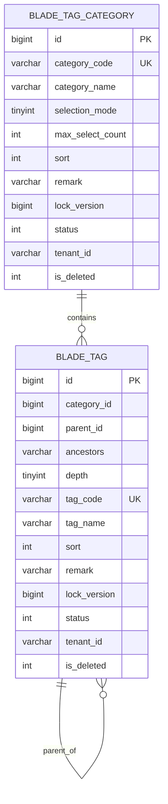

# 标签分类管理数据库设计

## 1. 文档信息

| 项目 | 内容 |
| --- | --- |
| 数据库设计编号 | DB-REQ-2026-002 |
| 关联需求 | [REQ-2026-002 标签分类管理](../requirements/REQ-2026-002-tag-category-management.md) |
| 关联详细设计 | [DESIGN-REQ-2026-002 标签分类管理详细设计](../design/DESIGN-REQ-2026-002-tag-category-management.md) |
| 文档版本 | 0.3 |
| 文档状态 | 开发中 |
| 数据库 | MySQL |
| 负责人 | 待指定 |
| 创建/更新日期 | 2026-09-10 |

## 2. 目标与范围

- 设计目标：持久化租户级标签分类、选择规则和层级标签，支持稳定编码、状态控制、并发版本、受控逻辑删除及有效路径判断。
- 数据边界：分类与标签均属于当前租户共享基础数据；tenantId 由安全上下文和 MyBatis 租户插件控制。
- 范围外：标签与业务资源关联、引用统计、版本历史、批量导入导出、跨租户共享、审计、脱敏和其他数据库方言。
- 历史数据：当前无既有标签分类表和数据，不需要回填或兼容转换。

| 表名 | 变更类型 | 租户表 | Entity 基类 | 说明 |
| --- | --- | :---: | --- | --- |
| `blade_tag_category` | 新增 | 是 | `TenantEntity` | 分类身份、选择规则、排序、状态和并发版本 |
| `blade_tag` | 新增 | 是 | `TenantEntity` | 标签分类归属、父子路径、排序、状态和并发版本 |

## 3. 数据模型

### 3.1 ER 图



### 3.2 关系说明

| 关系 | 基数 | 约束方式 | 删除/停用行为 |
| --- | --- | --- | --- |
| `blade_tag_category` -> `blade_tag` | 1:N | 应用校验 + `category_id` 索引，不建物理外键 | 存在未删除标签时禁止删除分类；停用分类不改写标签状态 |
| `blade_tag.parent_id` -> `blade_tag.id` | 1:N 自关联 | `parent_id`、`ancestors`、`depth` + Service 事务校验 | 存在未删除直接子节点时禁止删除；停用父节点不改写子节点状态 |

仓库现有业务表通常不使用数据库外键，本设计沿用该方式，避免逻辑删除和发布顺序与物理外键冲突。关系完整性由分类级行锁、租户条件、唯一索引和服务校验共同保证。

## 4. 表结构

### 4.1 SpringBlade 约定

- 主键使用应用侧雪花 `BIGINT`，不使用 `AUTO_INCREMENT`。
- 两张表均使用 `tenant_id VARCHAR(12)` 并加入 `blade.tenant.tables`。
- Entity 继承 `TenantEntity`；框架基础字段为 `create_user`、`create_dept`、`create_time`、`update_user`、`update_time`、`status` 和 `is_deleted`。
- 字段顺序统一为 `id`、核心业务字段、tenantId、框架基础字段；ER 图、字段清单和 DDL 保持一致。
- `status` 值域为 `0=停用, 1=启用`；新建数据默认 1。
- `is_deleted` 值域为 `0=未删除, 1=已删除`。
- 使用 `InnoDB`、`utf8mb4` 和当前全量脚本的 `utf8mb4_general_ci` 排序规则。
- Long ID 和 `lock_version` 对外按字符串序列化，不改变数据库 BIGINT 类型。

### 4.2 `blade_tag_category`

| 序号 | 字段 | MySQL 类型 | 允许空 | 默认值 | 键/索引 | 说明 |
| ---: | --- | --- | :---: | --- | --- | --- |
| 1 | `id` | `BIGINT` | 否 | 无 | PK | 雪花主键 |
| 2 | `category_code` | `VARCHAR(64)` | 否 | 无 | UK | 租户内稳定编码，小写 snake_case，创建后不可修改 |
| 3 | `category_name` | `VARCHAR(100)` | 否 | 无 | 无 | 分类名称，去除首尾空白后长度 1~100 |
| 4 | `selection_mode` | `TINYINT` | 否 | `1` | 无 | `1=单选, 2=多选` |
| 5 | `max_select_count` | `INT` | 否 | `1` | 无 | 单选固定 1，多选为 1~100 |
| 6 | `sort` | `INT` | 否 | `0` | IDX | 非负排序值，越小越靠前 |
| 7 | `remark` | `VARCHAR(500)` | 是 | NULL | 无 | 分类说明 |
| 8 | `lock_version` | `BIGINT` | 否 | `0` | 无 | 客户端并发版本，每次实际写入递增 |
| 9 | `status` | `INT` | 否 | `1` | IDX | `0=停用, 1=启用` |
| 10 | `tenant_id` | `VARCHAR(12)` | 否 | `'000000'` | UK/IDX | 租户 ID |
| 11 | `create_user` | `BIGINT` | 是 | NULL | 无 | 创建人 |
| 12 | `create_dept` | `BIGINT` | 是 | NULL | 无 | 创建部门，仅作框架基础字段，不作为数据权限条件 |
| 13 | `create_time` | `DATETIME` | 是 | NULL | IDX | 创建时间，用于稳定排序 |
| 14 | `update_user` | `BIGINT` | 是 | NULL | 无 | 更新人 |
| 15 | `update_time` | `DATETIME` | 是 | NULL | 无 | 更新时间 |
| 16 | `is_deleted` | `INT` | 否 | `0` | IDX | 逻辑删除标记 |

约束说明：

- `category_code` 由应用统一转为小写并校验 `^[a-z][a-z0-9_]{0,63}$`。
- 唯一键不包含 `is_deleted`，逻辑删除后原编码继续被占用。
- `selection_mode` 与 `max_select_count` 的组合约束由 Service 校验，不使用依赖具体 MySQL 小版本的 CHECK 约束。
- 同状态幂等请求不更新数据库，也不递增 `lock_version` 和 `update_time`。

### 4.3 `blade_tag`

| 序号 | 字段 | MySQL 类型 | 允许空 | 默认值 | 键/索引 | 说明 |
| ---: | --- | --- | :---: | --- | --- | --- |
| 1 | `id` | `BIGINT` | 否 | 无 | PK | 雪花主键 |
| 2 | `category_id` | `BIGINT` | 否 | 无 | UK/IDX | 所属分类，创建后不可修改 |
| 3 | `parent_id` | `BIGINT` | 否 | `0` | IDX | 父标签 ID，根标签为 0 |
| 4 | `ancestors` | `VARCHAR(512)` | 否 | `'0'` | 无 | 祖先 ID 路径，根标签为 `0` |
| 5 | `depth` | `TINYINT` | 否 | `1` | 无 | 根标签为 1，最大 8 |
| 6 | `tag_code` | `VARCHAR(64)` | 否 | 无 | UK | 分类内稳定编码，小写 snake_case，创建后不可修改 |
| 7 | `tag_name` | `VARCHAR(100)` | 否 | 无 | 无 | 标签名称，去除首尾空白后长度 1~100 |
| 8 | `sort` | `INT` | 否 | `0` | IDX | 同级及查询稳定排序值 |
| 9 | `remark` | `VARCHAR(500)` | 是 | NULL | 无 | 标签说明 |
| 10 | `lock_version` | `BIGINT` | 否 | `0` | 无 | 客户端并发版本，每次实际写入递增 |
| 11 | `status` | `INT` | 否 | `1` | IDX | `0=停用, 1=启用` |
| 12 | `tenant_id` | `VARCHAR(12)` | 否 | `'000000'` | UK/IDX | 租户 ID |
| 13 | `create_user` | `BIGINT` | 是 | NULL | 无 | 创建人 |
| 14 | `create_dept` | `BIGINT` | 是 | NULL | 无 | 创建部门，仅作框架基础字段，不作为数据权限条件 |
| 15 | `create_time` | `DATETIME` | 是 | NULL | IDX | 创建时间，用于稳定排序 |
| 16 | `update_user` | `BIGINT` | 是 | NULL | 无 | 更新人 |
| 17 | `update_time` | `DATETIME` | 是 | NULL | 无 | 更新时间 |
| 18 | `is_deleted` | `INT` | 否 | `0` | IDX | 逻辑删除标记 |

祖先路径规则：

1. 根节点保存 `parent_id=0`、`ancestors='0'`、`depth=1`。
2. 非根节点保存 `ancestors = parent.ancestors + ',' + parent.id`，`depth = parent.depth + 1`。
3. `ancestors` 只包含祖先，不包含当前 ID；通过逗号分隔完整 ID，禁止使用无分隔符的子串判断。
4. `ancestors`、`depth` 和 tenantId 仅由服务端维护，更新 DTO 不提供这些字段。
5. 移动标签时在分类级事务中重算目标节点及全部后代路径；任一节点超过 8 级则整体回滚。
6. 子树路径变化属于资源变化，受影响后代的 `lock_version`、更新人和更新时间同步更新。

编码和删除规则：

- `tag_code` 由应用统一转为小写并校验 `^[a-z][a-z0-9_]{0,63}$`。
- 标签编码在 `(tenant_id, category_id)` 范围内唯一；不同分类可使用相同编码。
- 唯一键不包含 `is_deleted`，标签逻辑删除后原租户、原分类内编码不可复用。
- 标签所属分类不可修改；跨分类调整必须删除原标签并使用新编码创建，且本期不提供复制或批量迁移能力。

## 5. 约束与索引

### 5.1 索引清单

| 名称 | 类型 | 字段顺序 | 支撑规则/查询 |
| --- | --- | --- | --- |
| `uk_blade_tag_category_tenant_code` | UNIQUE | `tenant_id, category_code` | 分类编码租户内唯一且删除后不复用 |
| `idx_blade_tag_category_list` | INDEX | `tenant_id, is_deleted, sort, create_time, id` | 分类未删除数据的稳定分页排序 |
| `uk_blade_tag_tenant_category_code` | UNIQUE | `tenant_id, category_id, tag_code` | 标签编码在分类内唯一且删除后不复用 |
| `idx_blade_tag_tree` | INDEX | `tenant_id, category_id, is_deleted, sort, create_time, id` | 分类完整树的稳定顺序读取 |
| `idx_blade_tag_parent` | INDEX | `tenant_id, category_id, parent_id, is_deleted` | 直接子节点查询和叶子删除校验 |
| `idx_blade_tag_option` | INDEX | `tenant_id, category_id, status, is_deleted, sort, create_time, id` | 分类有效选项候选数据读取 |

### 5.2 设计说明

- 分类按名称、标签按名称的查询允许包含匹配；第一阶段不创建无法稳定支撑前置 `%` 的普通名称索引。
- 分类编码查询由唯一索引前缀支撑；标签编码查询在指定 categoryId 时由唯一索引支撑。
- `ancestors` 用于应用层结构校验和路径重算，不做前缀/包含查询索引；分类树按 categoryId 一次加载后在内存构建。
- `idx_blade_tag_tree` 支撑分类完整树和删除分类前的标签存在性检查；`idx_blade_tag_parent` 专门支撑直接子节点与叶子删除校验。
- 所有索引均以 tenantId 开头，符合租户内访问模式；跨租户查询不在需求范围内。

## 6. SQL 与迁移

### 6.1 脚本影响

| 脚本 | 是否修改 | 内容 |
| --- | :---: | --- |
| `doc/sql/blade/blade.mysql.all.create.sql` | 已实现 | 增加两张表及 10 个 API Scope 初始化数据 |
| `doc/sql/blade/blade.mysql.upgrade.5.0.1.tag-category-management.sql` | 已新增 | 存量环境新增两张标签表及权限资源 |

正式全量与升级脚本已按以下 DDL 同步。脚本尚未在真实 MySQL 环境执行，仍需核对目标小版本、重复执行保护、索引和回滚流程。

### 6.2 DDL 基线

```sql
CREATE TABLE `blade_tag_category` (
  `id` bigint NOT NULL COMMENT '主键',
  `category_code` varchar(64) NOT NULL COMMENT '分类稳定编码',
  `category_name` varchar(100) NOT NULL COMMENT '分类名称',
  `selection_mode` tinyint NOT NULL DEFAULT 1 COMMENT '选择模式:1单选 2多选',
  `max_select_count` int NOT NULL DEFAULT 1 COMMENT '最大可选数量',
  `sort` int NOT NULL DEFAULT 0 COMMENT '排序',
  `remark` varchar(500) NULL DEFAULT NULL COMMENT '说明',
  `lock_version` bigint NOT NULL DEFAULT 0 COMMENT '并发控制版本',
  `status` int NOT NULL DEFAULT 1 COMMENT '状态:0停用 1启用',
  `tenant_id` varchar(12) NOT NULL DEFAULT '000000' COMMENT '租户ID',
  `create_user` bigint NULL DEFAULT NULL COMMENT '创建人',
  `create_dept` bigint NULL DEFAULT NULL COMMENT '创建部门',
  `create_time` datetime NULL DEFAULT NULL COMMENT '创建时间',
  `update_user` bigint NULL DEFAULT NULL COMMENT '修改人',
  `update_time` datetime NULL DEFAULT NULL COMMENT '修改时间',
  `is_deleted` int NOT NULL DEFAULT 0 COMMENT '是否已删除',
  PRIMARY KEY (`id`),
  UNIQUE KEY `uk_blade_tag_category_tenant_code` (`tenant_id`, `category_code`),
  KEY `idx_blade_tag_category_list` (`tenant_id`, `is_deleted`, `sort`, `create_time`, `id`)
) ENGINE=InnoDB DEFAULT CHARSET=utf8mb4 COLLATE=utf8mb4_general_ci COMMENT='标签分类';

CREATE TABLE `blade_tag` (
  `id` bigint NOT NULL COMMENT '主键',
  `category_id` bigint NOT NULL COMMENT '所属分类ID',
  `parent_id` bigint NOT NULL DEFAULT 0 COMMENT '父标签ID',
  `ancestors` varchar(512) NOT NULL DEFAULT '0' COMMENT '祖先标签ID路径',
  `depth` tinyint NOT NULL DEFAULT 1 COMMENT '层级深度',
  `tag_code` varchar(64) NOT NULL COMMENT '标签稳定编码',
  `tag_name` varchar(100) NOT NULL COMMENT '标签名称',
  `sort` int NOT NULL DEFAULT 0 COMMENT '排序',
  `remark` varchar(500) NULL DEFAULT NULL COMMENT '说明',
  `lock_version` bigint NOT NULL DEFAULT 0 COMMENT '并发控制版本',
  `status` int NOT NULL DEFAULT 1 COMMENT '状态:0停用 1启用',
  `tenant_id` varchar(12) NOT NULL DEFAULT '000000' COMMENT '租户ID',
  `create_user` bigint NULL DEFAULT NULL COMMENT '创建人',
  `create_dept` bigint NULL DEFAULT NULL COMMENT '创建部门',
  `create_time` datetime NULL DEFAULT NULL COMMENT '创建时间',
  `update_user` bigint NULL DEFAULT NULL COMMENT '修改人',
  `update_time` datetime NULL DEFAULT NULL COMMENT '修改时间',
  `is_deleted` int NOT NULL DEFAULT 0 COMMENT '是否已删除',
  PRIMARY KEY (`id`),
  UNIQUE KEY `uk_blade_tag_tenant_category_code` (`tenant_id`, `category_id`, `tag_code`),
  KEY `idx_blade_tag_tree` (`tenant_id`, `category_id`, `is_deleted`, `sort`, `create_time`, `id`),
  KEY `idx_blade_tag_parent` (`tenant_id`, `category_id`, `parent_id`, `is_deleted`),
  KEY `idx_blade_tag_option` (`tenant_id`, `category_id`, `status`, `is_deleted`, `sort`, `create_time`, `id`)
) ENGINE=InnoDB DEFAULT CHARSET=utf8mb4 COLLATE=utf8mb4_general_ci COMMENT='标签';
```

### 6.3 迁移流程


- 历史数据处理：无，不执行数据回填。
- 重复执行策略：升级前检查两张表均不存在；脚本按单次执行设计，不使用 `CREATE TABLE IF NOT EXISTS` 掩盖半完成结构。
- 执行顺序：先 `blade_tag_category`，后 `blade_tag`，再写入 API Scope 权限数据。
- 锁表与耗时风险：仅创建新表和新增权限记录，不扫描既有业务表；仍需在目标 MySQL 小版本演练。
- 初始化业务数据：不预置分类和标签，避免将未确认业务口径写入全量脚本。
- 权限初始化：资源 ID 使用 `220260910000000001`~`220260910000000010`，通过 `tag_manage` 页面菜单统一绑定 `menu_id`；默认角色授权仍未确认，脚本不写角色或顶部菜单授权。

### 6.4 回滚

1. DDL 执行后应用尚未发布且两张表无数据时，按 `blade_tag`、`blade_tag_category` 顺序删除，并删除本需求新增的 API Scope 数据。
2. 应用已发布但无业务数据时，先关闭权限入口并回滚 `blade-system`，再移除 Nacos 租户表配置和空表。
3. 表中已有业务数据时默认保留表并只回滚应用；需要物理回滚时先停止写入、导出两张表并验证备份。
4. 标签路径、逻辑删除记录和稳定编码占用不可由应用回滚自动恢复；无有效备份时物理删除不可逆。

## 7. 隔离、一致性与安全

- 租户隔离：两张表加入 `blade.tenant.tables`；自定义分页、行锁、计数和批量更新 SQL 显式匹配 tenantId 与 `is_deleted=0`。
- 分类归属：标签 tenantId 必须与分类 tenantId 一致，创建和移动事务均先锁并校验分类。
- 层级一致性：父节点必须同租户、同分类；`ancestors` 不得包含当前 ID；移动后统一重算子树路径和深度。
- 并发一致性：分类作为标签树聚合锁；资源 `lock_version` 检测客户端陈旧状态；唯一索引处理并发重复创建。
- 逻辑删除：分类仅在无未删除标签时删除，标签仅在无未删除子节点时删除；均不物理级联。
- 编码复用：唯一键不包含逻辑删除标记，已使用编码永久占用原唯一范围。
- 状态有效性：数据库只保存分类和标签自身状态；有效选项由应用根据分类、全部祖先和自身状态实时计算。
- 数据权限：tenantId 是唯一数据可见范围，不按 `create_user` 或 `create_dept` 过滤。
- 敏感数据：本设计不新增审计或脱敏能力；数据库不保存密码、Token、密钥、连接串和业务资源内容。

## 8. 验证清单

- [ ] 全量脚本和升级脚本创建相同的两张表、字段、默认值和索引。
- [ ] Entity 字段、Java 类型、基类、逻辑删除和 Long 序列化与表结构一致。
- [ ] 同租户分类编码重复失败，不同租户相同分类编码成功，逻辑删除后分类编码仍不可复用。
- [ ] 同租户同分类标签编码重复失败，不同分类相同标签编码成功，逻辑删除后原分类编码仍不可复用。
- [ ] 根节点和非根节点的 `parent_id`、`ancestors`、`depth` 符合规则，移动子树后路径完整且最大深度不超过 8。
- [ ] 分类删除与标签创建、标签移动与删除等并发场景不会产生孤儿或跨分类路径。
- [ ] 陈旧 `lock_version` 更新失败，同状态幂等请求不产生额外版本和时间变化。
- [ ] 停用分类或祖先标签后有效选项正确排除，重新启用后保存为启用的节点正确恢复。
- [ ] Nacos 租户表配置、Mapper 自定义 SQL 和权限资源已同步且不提供跨租户入口。
- [ ] 标签管理页面、10 个按钮和 10 个 API Scope 的菜单关联正确，脚本重复执行不产生重复有效记录。
- [ ] SQL 不包含真实账号、密码、Token、连接串或生产数据。
- [ ] 目标 MySQL 完成升级、重复执行保护、结构核对和回滚演练。

当前仅完成数据库设计，以上检查均未执行。

## 9. 开放问题与变更记录

| 编号 | 问题/风险 | 负责人 | 状态/结论 |
| --- | --- | --- | --- |
| DB-ITEM-001 | 编码长度、名称长度、说明长度和最大多选数量需业务确认 | 待指定 | 设计建议分别为 64、100、500 和 100，待评审 |
| DB-ITEM-002 | 标签最大层级需业务和运维确认 | 待指定 | 设计建议最大 8 级，`ancestors VARCHAR(512)` 容量充足 |
| DB-ITEM-003 | 目标生产 MySQL 小版本和在线 DDL 策略尚未指定 | 运维负责人 | 开放；本次仅新增表 |
| DB-ITEM-004 | API Scope 菜单关联方式和默认授权角色尚未确认 | 待指定 | 已通过 `tag_manage` 页面菜单绑定 10 个 Scope；默认角色授权仍保持开放，脚本不自动授权 |
| DB-ITEM-005 | 缺少分类和标签的典型/最大数据量指标 | 技术负责人 | 开放；第一阶段按分类全量读取树，验收时采集执行计划和响应时间 |

| 日期 | 版本 | 变更内容 | 修改人 |
| --- | --- | --- | --- |
| 2026-09-10 | 0.1 | 根据 REQ-2026-002 和详细设计创建数据库设计初稿，明确两表结构、层级路径、唯一键和迁移方案 | Codex |
| 2026-09-10 | 0.2 | 同步 MySQL 全量/升级脚本、API Scope ID 和 Nacos 租户表配置，记录真实数据库验证待执行 | Codex |
| 2026-09-10 | 0.3 | 同步标签页面菜单、按钮、Scope `menu_id` 绑定和幂等升级脚本，保留默认角色授权开放项 | Codex |
