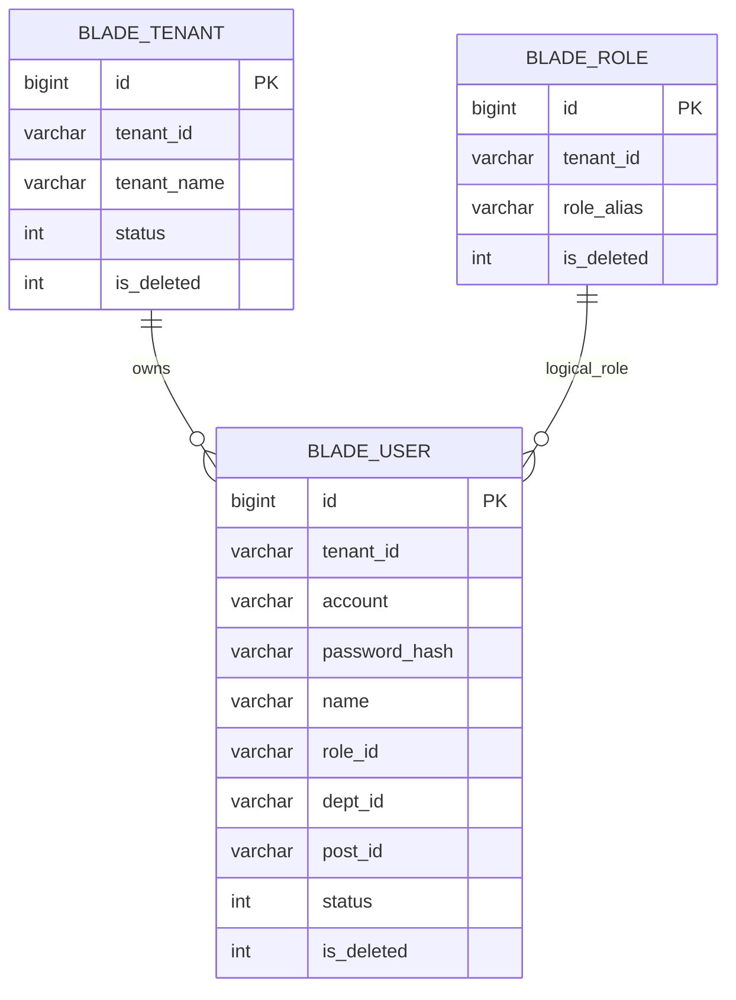
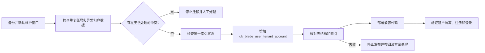

# 用户自助注册数据库设计

## 1. 文档信息

| 项目 | 内容 |
| --- | --- |
| 数据库设计编号 | DB-REQ-2026-003 |
| 关联需求 | [REQ-2026-003 用户自助注册](../requirements/REQ-2026-003-user-registration.md) |
| 关联详细设计 | [DESIGN-REQ-2026-003 用户自助注册详细设计](../design/DESIGN-REQ-2026-003-user-registration.md) |
| 文档版本 | 0.4 |
| 文档状态 | 开发中 |
| 数据库 | MySQL |
| 负责人 | 待指定 |
| 创建/更新日期 | 2026-09-14 |

## 2. 目标与范围

- 设计目标：在不新增注册申请表、租户字段或虚拟部门数据的前提下，复用现有 `blade_user` 保存注册用户，并通过数据库唯一约束保证租户内账号永久唯一。
- 数据边界：注册用户为租户级数据；注册时租户由用户填写或默认值确定，经服务端验证后写入 `blade_user.tenant_id`。
- 配置边界：注册开关、默认租户 `000000` 和注册频率限制属于配置或 Redis，不落 MySQL。
- 认证边界：图形验证码属于 Redis 临时数据；本期不新增邮件、短信或验证码持久化表。
- 组织边界：C 端注册用户不进入 `blade_dept` 和 `blade_post`，不创建虚拟部门；用户表沿用无部门、无岗位的现有存储语义。
- 历史数据：增加唯一索引前必须检查存量账号重复、空租户和异常空账号；发现可能冲突的数据时停止迁移并人工处理，不自动删除或合并用户。
- 范围外：租户创建、审批申请、邮件/短信验证、用户资料扩展、账号找回和独立注册流水表。

| 表名 | 变更类型 | 租户表 | Entity 基类 | 说明 |
| --- | --- | :---: | --- | --- |
| `blade_user` | 修改 | 是 | `TenantEntity` | 增加租户内账号唯一索引；复用现有用户字段保存注册结果 |
| `blade_tenant` | 不变 | 否 | `BaseEntity` | 仅作为已有租户有效性校验的数据来源 |
| `blade_role` | 不变 | 是逻辑归属 | 无 | 使用目标租户已有普通用户角色，不新增注册专用角色表 |
| `blade_dept` | 不变 | 是 | 无 | C 端注册用户不创建或挂载虚拟部门 |

## 3. 数据模型

### 3.1 ER 图



### 3.2 关系说明

| 关系 | 基数 | 约束方式 | 删除/停用行为 |
| --- | --- | --- | --- |
| `blade_tenant` -> `blade_user` | 1:N | `blade_user.tenant_id` + 应用校验，不建物理外键 | 租户不存在、停用或删除时不得注册；现有用户按登录校验处理 |
| `blade_role` -> `blade_user` | 1:N 逻辑关联 | `blade_user.role_id` 保存角色 ID 字符串，由 Service 校验角色属于目标租户 | 目标普通角色不存在或已删除时不得注册，不回退管理角色 |
| `blade_dept` -> `blade_user` | 不建立注册关联 | C 端用户使用无部门、无岗位语义，不创建虚拟部门 | 不新增部门数据，不改变现有部门树 |

项目现有用户角色字段为字符串集合，角色关系不是物理外键；本设计沿用现状，不新增用户角色关系表，也不通过数据库外键阻止逻辑删除。租户、角色和用户的归属一致性由服务端校验、租户条件和现有逻辑删除规则保证。

## 4. 表结构

### 4.1 SpringBlade 约定

- `blade_user` 为既有租户业务表，Entity 继承 `TenantEntity`，继续使用现有租户处理方式；本需求不新增租户表配置。
- 主键使用应用侧雪花 `BIGINT`，不使用 `AUTO_INCREMENT`。
- 本次升级不重排既有字段，仅将 `name` 从 `VARCHAR(20)` 扩至 `VARCHAR(32)`，以满足最长 32 位账号作为默认昵称的规则；其他字段长度和可空性不变。
- 用户密码继续存储为现有单向摘要结果，不新增明文密码、验证码、邮件或短信字段。
- `status` 值域为 `0=停用, 1=启用`；新注册用户明确写入 `1`。
- `is_deleted` 值域为 `0=未删除, 1=已删除`；唯一键不包含该字段，保证逻辑删除后账号不复用。
- C 端注册用户不创建 `blade_dept` 或 `blade_post` 数据；`dept_id` 和 `post_id` 使用现有无部门、无岗位存储约定，具体写入值由详细设计固定。
- 使用 `InnoDB`、`utf8mb4` 和当前脚本的 `utf8mb4_general_ci` 排序规则；该排序规则支持账号大小写不敏感的唯一比较。

### 4.2 `blade_user` 字段

| 序号 | 字段 | MySQL 类型 | 允许空 | 默认值 | 键/索引 | 说明 |
| ---: | --- | --- | :---: | --- | --- | --- |
| 1 | `id` | `BIGINT` | 否 | 无 | PK | 雪花主键 |
| 2 | `tenant_id` | `VARCHAR(12)` | 是 | `'000000'` | UK(联合) | 租户编号；新注册数据必须为已验证的非空有效租户 |
| 3 | `code` | `VARCHAR(12)` | 是 | NULL | 无 | 用户编号，注册首版不要求填写 |
| 4 | `account` | `VARCHAR(45)` | 是 | NULL | UK(联合) | 登录账号；注册时必须非空，租户内大小写不敏感且永久唯一 |
| 5 | `password` | `VARCHAR(45)` | 是 | NULL | 无 | 现有密码摘要；注册时不得保存明文密码 |
| 6 | `name` | `VARCHAR(32)` | 是 | NULL | 用户昵称；注册未填写时使用最长 32 位账号 |
| 7 | `real_name` | `VARCHAR(10)` | 是 | NULL | 无 | 真名；首版注册不要求填写 |
| 8 | `avatar` | `VARCHAR(2000)` | 是 | NULL | 无 | 头像；首版注册不写入 |
| 9 | `email` | `VARCHAR(45)` | 是 | NULL | 无 | 邮箱；首版不作为注册凭据或验证方式 |
| 10 | `phone` | `VARCHAR(45)` | 是 | NULL | 无 | 手机；首版不作为注册凭据或验证方式 |
| 11 | `birthday` | `DATETIME` | 是 | NULL | 无 | 生日；首版注册不写入 |
| 12 | `sex` | `SMALLINT` | 是 | NULL | 无 | 性别；首版注册不要求填写 |
| 13 | `role_id` | `VARCHAR(1000)` | 是 | NULL | 无 | 目标租户普通用户角色 ID 集合，服务端生成 |
| 14 | `dept_id` | `VARCHAR(1000)` | 是 | NULL | 无 | 无部门语义，服务端按现有约定写入 |
| 15 | `post_id` | `VARCHAR(1000)` | 是 | NULL | 无 | 无岗位语义，服务端按现有约定写入 |
| 16 | `create_user` | `BIGINT` | 是 | NULL | 无 | 匿名注册不使用前端用户身份 |
| 17 | `create_dept` | `BIGINT` | 是 | NULL | 无 | 匿名注册不使用前端部门身份 |
| 18 | `create_time` | `DATETIME` | 是 | NULL | 无 | 创建时间 |
| 19 | `update_user` | `BIGINT` | 是 | NULL | 无 | 更新人 |
| 20 | `update_time` | `DATETIME` | 是 | NULL | 无 | 更新时间 |
| 21 | `status` | `INT` | 是 | NULL | 无 | `0=停用, 1=启用`；注册成功写入 `1` |
| 22 | `is_deleted` | `INT` | 是 | `0` | 无 | `0=未删除, 1=已删除` |

字段说明：

- `tenant_id` 和 `account` 在既有表中允许为空是历史结构事实；注册接口不得接受空租户或空账号。空租户由业务层解析为 `000000` 后再写入。
- `account` 的首尾空白由应用层清理，大小写比较由应用规则和 `utf8mb4_general_ci` 共同保证。
- `password` 只保存现有摘要格式。SM2 传输解密、摘要计算和密码校验属于认证/服务设计，不在数据库层保存临时明文。
- `role_id`、`dept_id` 和 `post_id` 是现有字符串字段，数据库不建立外键；注册用户不得通过客户端直接指定这些字段。
- `create_user`、`create_dept` 不虚构匿名操作人身份；是否由框架自动填充由实现设计确定，但不能写入前端伪造值。

## 5. 约束与索引

| 名称 | 类型 | 字段顺序 | 支撑规则/查询 |
| --- | --- | --- | --- |
| `PRIMARY` | PRIMARY KEY | `id` | 用户唯一标识 |
| `uk_blade_user_tenant_account` | UNIQUE | `tenant_id, account` | 同一租户内账号唯一；逻辑删除后账号仍不可复用 |

约束说明：

- 唯一索引不包含 `is_deleted`，因此已逻辑删除的账号继续占用原租户内账号名。
- 当前表使用 `utf8mb4_general_ci`，同一租户内英文账号大小写按不敏感方式比较；应用层仍需先去除账号首尾空白并执行格式校验。
- 当前表的 `tenant_id` 和 `account` 历史上允许为空。注册接口必须拒绝空值；升级脚本不擅自把历史空值用户改写到其他租户。
- 同一账号在不同租户可以存在，因为唯一键包含 `tenant_id`。
- 本需求不新增名称、状态或租户查询索引；注册和登录均可使用 `(tenant_id, account)` 唯一索引，避免推测性索引。
- 项目不使用物理外键约束；角色、租户和用户的归属由服务端校验及现有逻辑删除规则保证。

## 6. SQL 与迁移

### 6.1 脚本影响

| 脚本 | 是否修改 | 内容 |
| --- | :---: | --- |
| `doc/sql/blade/blade.mysql.all.create.sql` | 已同步 | 扩展昵称字段并增加租户内账号唯一索引 |
| `doc/sql/blade/blade.mysql.upgrade.5.0.1.user-registration.sql` | 已新增 | 存量环境检查重复账号、扩展昵称字段并增加唯一索引 |
| `doc/sql/blade/blade.mysql.data.*.sql` | 否 | 本需求不新增测试用户、租户、角色或部门数据 |

全量脚本和升级脚本已同步；真实数据库执行前仍必须完成历史数据检查、备份和维护窗口确认。

### 6.2 DDL/数据处理

全量脚本中的 `blade_user` 表应在现有主键定义后增加：

```sql
UNIQUE KEY `uk_blade_user_tenant_account` (`tenant_id`, `account`)
```

存量升级的核心 DDL 为：

```sql
ALTER TABLE `blade_user`
  MODIFY COLUMN `name` VARCHAR(32) NULL DEFAULT NULL COMMENT '昵称',
  ADD UNIQUE KEY `uk_blade_user_tenant_account` (`tenant_id`, `account`);
```

执行 DDL 前必须完成以下检查：

```sql
-- 检查同一租户内按注册规则归一化后重复的账号。
SELECT
  tenant_id,
  LOWER(TRIM(account)) AS normalized_account,
  COUNT(*) AS duplicate_count
FROM blade_user
WHERE tenant_id IS NOT NULL
  AND account IS NOT NULL
GROUP BY tenant_id, LOWER(TRIM(account))
HAVING COUNT(*) > 1;

-- 检查历史空租户、空账号和空白账号，禁止在迁移中自动猜测归属。
SELECT id, tenant_id, account, is_deleted
FROM blade_user
WHERE tenant_id IS NULL
   OR TRIM(tenant_id) = ''
   OR account IS NULL
   OR TRIM(account) = '';
```

- 历史重复检查必须包含启用和逻辑删除记录，因为唯一键不包含 `is_deleted`。
- 按归一化账号发现重复时，暂停迁移，由业务负责人确认保留账号、改名或数据合并方案；数据库脚本不得自动删除、覆盖或合并用户。
- 空租户和空账号记录不纳入新的自助注册，但不在本需求中自动修改；是否修复由存量数据治理单独决定。
- 若目标表已经存在同名索引，升级脚本不得重复添加；应先检查索引定义是否与本设计一致。
- 迁移完成后执行 `SHOW CREATE TABLE blade_user` 和索引查询，确认唯一索引字段顺序、排序规则和名称正确。

重复执行策略：升级脚本默认按单次迁移执行。执行前检查重复数据和索引状态；若索引已存在且定义一致，则视为已完成，不重复执行 `ALTER TABLE`。若定义不一致，停止迁移并人工评估，不自动删除既有索引。

锁表与耗时风险：增加唯一索引可能扫描并重建 `blade_user`，耗时取决于用户规模、MySQL 版本和 DDL 算法；生产环境必须先备份并在同版本、相近数据量环境演练在线 DDL 或维护窗口方案。

### 6.3 迁移流程



迁移顺序：

1. 备份 `blade_user` 并确认可恢复。
2. 执行重复账号、空值和已有索引检查。
3. 解决阻断唯一索引的重复数据，并保留处理记录。
4. 执行唯一索引 DDL，校验 `tenant_id, account` 顺序。
5. 发布兼容的 API 契约、服务实现、认证入口和 Saber 调用方。
6. 在测试环境验证普通注册、不同租户同名账号、逻辑删除账号和并发注册。

### 6.4 回滚

- 代码回滚前提：唯一索引是对现有用户写入规则的收紧，旧版用户管理代码仍可在索引存在时工作；优先只回滚应用和关闭注册开关，不回滚索引。
- 数据库回滚步骤：若设计评审后确认必须移除索引，应先关闭注册、停止相关写入、备份并检查重复风险，再执行 `ALTER TABLE blade_user DROP INDEX uk_blade_user_tenant_account`；不自动删除或恢复用户数据。
- 逻辑删除账号不复用是本设计的业务规则；一旦通过唯一索引阻止新账号复用，回滚索引不会恢复已被拒绝的注册请求。
- 不可逆数据：迁移前人工处理的重复账号改名、合并或删除不由本需求自动回滚，必须依赖业务备份和处理记录恢复。
- 若唯一索引创建失败，保持旧代码和数据库结构，注册开关继续关闭，待冲突数据或在线 DDL 问题解决后重试。

## 7. 隔离、一致性与安全

- 租户隔离：新用户的 `tenant_id` 只能来自服务端验证通过的已有租户；默认值 `000000` 属于配置规则，不依赖数据库默认值替代业务校验。
- 租户有效性：注册前检查 `blade_tenant` 的租户编号、`status=1` 和 `is_deleted=0`；本需求不修改 `blade_tenant` 表结构。
- 角色一致性：`role_id` 只能引用目标租户内未删除的普通角色；数据库不建物理外键，避免现有字符串角色集合结构与逻辑删除冲突。
- 部门边界：C 端用户不插入 `blade_dept` 和 `blade_post`；`dept_id`、`post_id` 的无部门、无岗位值由服务端统一写入，不能由前端决定。
- 逻辑删除：所有登录和注册账号检查必须排除 `is_deleted=1`；唯一索引不包含 `is_deleted`，确保逻辑删除账号不能被自助注册复用。
- 并发一致性：应用层重复检查用于用户提示，数据库唯一索引作为最终并发约束；唯一键冲突必须转换为明确业务失败，不得返回成功。
- 事务一致性：用户创建、角色归属和必要的缓存失效必须在服务层形成完整结果；异常时不得保留半成品用户。
- 密码安全：数据库仅保存现有密码摘要；注册请求中的明文密码、SM2 临时值、验证码和令牌不得写入数据库或日志。
- 临时数据：图形验证码和注册限流数据存放在 Redis，按有效期自动过期，不在 MySQL 留存注册申请记录。

## 8. 验证清单

- [ ] 全量脚本中的 `blade_user` 与升级脚本最终结构一致，唯一索引名称和字段顺序正确。
- [ ] Entity 字段、Java 类型、`TenantEntity` 基类、逻辑删除和 Long 序列化与现有表结构一致。
- [ ] 同一租户内相同账号和仅大小写不同账号无法重复创建。
- [ ] 不同租户可以创建相同账号，且租户归属明确。
- [ ] 逻辑删除账号仍占用原租户账号名，不能通过注册复用。
- [ ] 历史重复账号、空租户和异常空账号检查在唯一索引迁移前完成。
- [ ] 并发注册同一租户和账号最多生成一条用户记录，唯一键冲突被转换为业务失败。
- [ ] 注册用户不会新增 `blade_dept`、`blade_post` 或虚拟部门数据。
- [ ] 目标租户不存在、停用、删除或缺少普通角色时不会产生用户数据。
- [ ] 用户状态、逻辑删除和租户条件在登录查询中按需求生效。
- [ ] 注册开关、默认租户和验证码不新增 MySQL 持久化字段或临时表。
- [ ] SQL 不包含真实账号、密码、Token、密钥、连接串或生产数据。
- [ ] 目标 MySQL 完成结构核对、重复执行检查、备份恢复和回滚演练。

当前已同步全量脚本和升级脚本；真实数据库中的重复账号检查、索引执行、备份恢复和回滚演练尚未执行。

## 9. 开放问题与变更记录

| 编号 | 问题/风险 | 负责人 | 状态/结论 |
| --- | --- | --- | --- |
| DB-ITEM-001 | 现有存量 `blade_user` 是否存在同租户重复账号、大小写冲突或空租户数据尚未在真实数据库核对 | 数据库负责人 | 开放；增加唯一索引前必须取得检查证据 |
| DB-ITEM-002 | 目标 MySQL 小版本、用户规模和在线 DDL/维护窗口策略尚未指定 | 运维负责人 | 开放；迁移前完成同环境演练 |
| DB-ITEM-003 | 各已有租户是否均已配置有效普通用户角色尚未确认 | 租户管理员 | 开放；未配置租户不得开启或执行注册 |
| DB-ITEM-004 | 无部门、无岗位在所有 C 端业务查询中的兼容性尚未验证 | 技术负责人 | 开放；实现与测试阶段核对 `dept_id`、`post_id` 的统一值 |
| DB-ITEM-005 | 账号和密码具体校验规则仍以需求评审结论为准，当前不新增数据库字段或 CHECK 约束 | 产品负责人 | 开放；应用层校验，字段长度沿用现有表结构 |

| 日期 | 版本 | 变更内容 | 修改人 |
| --- | --- | --- | --- |
| 2026-09-14 | 0.1 | 创建用户自助注册数据库设计初稿，明确复用 `blade_user`、增加租户内账号唯一索引、不新增注册表和虚拟部门，以及历史数据迁移与回滚边界 | Codex |
| 2026-09-14 | 0.2 | 关联用户自助注册详细设计，补充 auth、user-api、system、网关和 Saber 的数据边界与登录状态兼容要求 | Codex |
| 2026-09-14 | 0.3 | 补充详细设计双向链接，保持需求、数据库设计和详细设计文档链一致 | Codex |
| 2026-09-14 | 0.4 | 同步昵称字段扩容、`blade_user` 全量唯一索引和升级脚本，登记代码实现及真实数据库待验证项 | Codex |
