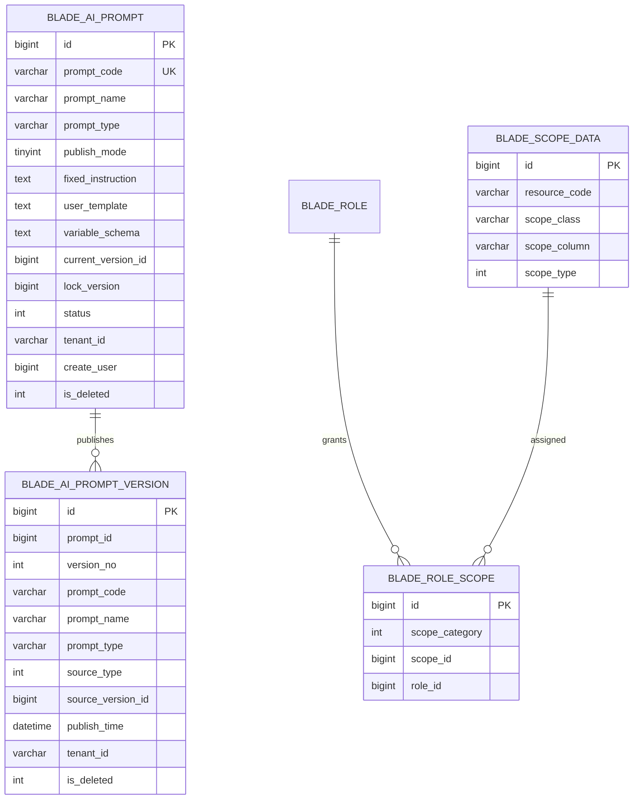
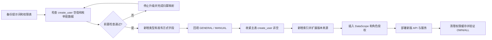

# 提示词类型、发布方式与数据权限增强数据库设计

## 1. 文档信息

| 项目 | 内容 |
| --- | --- |
| 数据库设计编号 | DB-REQ-2026-005 |
| 关联需求 | [REQ-2026-005 提示词类型、发布方式与数据权限增强](../requirements/REQ-2026-005-prompt-scope-and-publishing.md) |
| 关联详细设计 | [DESIGN-REQ-2026-005 提示词类型、发布方式与数据权限增强详细设计](../design/DESIGN-REQ-2026-005-prompt-scope-and-publishing.md) |
| 文档版本 | 0.2 |
| 文档状态 | 开发中 |
| 数据库 | MySQL |
| 负责人 | 待指定 |
| 创建/更新日期 | 2026-09-16 |

## 2. 目标与范围

- 设计目标：在现有提示词主表和不可变版本表上增加业务类型、发布方式和自动发布来源，并为基于 `create_user` 的本人数据范围提供稳定约束和索引。
- 数据边界：提示词主表和版本表继续按 `tenant_id` 隔离；DataScope 配置使用现有全局权限表，不新增提示词权限业务表。
- 历史数据：现有主记录和版本默认归类为 `GENERAL`；现有主记录默认发布方式为 `MANUAL`；`create_user` 为空的数据必须先获得明确归属后才能执行非空约束升级。
- 范围外：跨租户归属、每条提示词独立可见范围、部门数据范围、其他数据库方言、提示词正文审计和脱敏。

| 表名 | 变更类型 | 租户表 | Entity 基类 | 说明 |
| --- | --- | :---: | --- | --- |
| `blade_ai_prompt` | 修改 | 是 | `TenantEntity` | 新增类型和发布方式，收紧创建人归属，增加 DataScope 查询索引 |
| `blade_ai_prompt_version` | 修改 | 是 | `TenantEntity` | 新增类型快照，扩展版本来源值域 |
| `blade_scope_data` | 初始化数据 | 否 | `BaseEntity` | 新增提示词分页和单资源的 OWN/ALL 数据权限规则 |
| `blade_role_scope` | 初始化数据 | 否 | 无 | 将普通用户角色绑定 OWN，管理员角色绑定 ALL |

## 3. 数据模型

### 3.1 ER 图



### 3.2 关系说明

| 关系 | 基数 | 约束方式 | 删除/停用行为 |
| --- | --- | --- | --- |
| `blade_ai_prompt` -> `blade_ai_prompt_version` | 1:N | 应用校验 + `tenant_id,prompt_id,version_no` 唯一索引 | 存在版本时禁止删除主记录；停用保留版本 |
| `blade_ai_prompt.current_version_id` -> version | 1:0/1 | 发布事务内校验租户和 prompt 归属 | 发布/回滚/自动发布原子切换；停用不清空 |
| `blade_scope_data` -> `blade_role_scope` | 1:N | `scope_category=1` + 应用授权，不建物理外键 | 删除规则前先解除角色绑定并清理缓存 |
| `blade_role` -> `blade_role_scope` | 1:N | 角色授权流程 | 角色删除或调整时清理关联和缓存 |

提示词表继续不建立物理外键，沿用仓库现有事务、逻辑删除和应用完整性校验方式。

## 4. 表结构

### 4.1 SpringBlade 约定

- 主键使用应用侧雪花 `BIGINT`，不使用 `AUTO_INCREMENT`。
- 两张提示词表继续继承 `TenantEntity`，使用 `tenant_id VARCHAR(12)` 并保留现有租户表配置。
- `create_user` 是框架基础字段，同时作为提示词本人数据权限字段；主表升级后不允许为空。
- `status` 继续表示草稿、已发布和已停用；`publish_mode` 不替代业务状态。
- JSON 变量定义继续使用 `TEXT` 并由应用层校验。
- 使用 `InnoDB`、`utf8mb4` 和 `utf8mb4_general_ci`。
- DataScope 表保持现有结构，本需求只增加配置数据，不改变权限框架表结构。

### 4.2 `blade_ai_prompt` 字段

| 序号 | 字段 | MySQL 类型 | 允许空 | 默认值 | 键/索引 | 说明 |
| ---: | --- | --- | :---: | --- | --- | --- |
| 1 | `id` | `BIGINT` | 否 | 无 | PK | 雪花主键 |
| 2 | `prompt_code` | `VARCHAR(64)` | 否 | 无 | UK | 租户内稳定编码，创建后不可改 |
| 3 | `prompt_name` | `VARCHAR(100)` | 否 | 无 | IDX | 提示词名称 |
| 4 | `prompt_type` | `VARCHAR(32)` | 否 | `'GENERAL'` | IDX | `GENERAL/SYSTEM/TEXT/IMAGE` |
| 5 | `publish_mode` | `TINYINT` | 否 | `1` | 无 | `1=MANUAL, 2=AUTO` |
| 6 | `fixed_instruction` | `TEXT` | 是 | NULL | 无 | 当前草稿固定指令 |
| 7 | `user_template` | `TEXT` | 是 | NULL | 无 | 当前草稿用户输入模板 |
| 8 | `variable_schema` | `TEXT` | 否 | 无 | 无 | 当前草稿变量定义 JSON |
| 9 | `draft_revision` | `BIGINT` | 否 | `1` | 无 | 草稿修订号 |
| 10 | `draft_dirty` | `TINYINT` | 否 | `1` | 无 | 是否存在未发布草稿 |
| 11 | `current_version_id` | `BIGINT` | 是 | NULL | IDX | 当前发布版本 ID |
| 12 | `current_version_no` | `INT` | 否 | `0` | 无 | 当前/最近版本号 |
| 13 | `lock_version` | `BIGINT` | 否 | `0` | 无 | 聚合并发版本 |
| 14 | `status` | `INT` | 否 | `0` | IDX | `0=草稿, 1=已发布, 2=已停用` |
| 15 | `tenant_id` | `VARCHAR(12)` | 否 | `'000000'` | UK/IDX | 租户 ID |
| 16 | `create_user` | `BIGINT` | 否 | 无 | IDX | 创建人和本人数据所有者，由服务端写入且不可修改 |
| 17 | `create_dept` | `BIGINT` | 是 | NULL | 无 | 创建部门，仅保留框架元数据 |
| 18 | `create_time` | `DATETIME` | 是 | NULL | 无 | 创建时间 |
| 19 | `update_user` | `BIGINT` | 是 | NULL | 无 | 更新人 |
| 20 | `update_time` | `DATETIME` | 是 | NULL | IDX | 更新时间 |
| 21 | `is_deleted` | `INT` | 否 | `0` | IDX | 逻辑删除标记 |

补充约束：

- `prompt_type` 使用稳定大写编码。新增、停用或重命名类型必须通过需求和迁移处理，不能直接修改历史编码。
- `publish_mode=AUTO` 的创建或更新成功后必须存在当前版本，且 `status=1`、`draft_dirty=0`。
- `create_user` 不允许通过更新接口修改。写 SQL仍携带已授权资源的原创建人条件。
- 唯一键继续不包含 `is_deleted`，逻辑删除后编码不可复用。

### 4.3 `blade_ai_prompt_version` 字段

| 序号 | 字段 | MySQL 类型 | 允许空 | 默认值 | 键/索引 | 说明 |
| ---: | --- | --- | :---: | --- | --- | --- |
| 1 | `id` | `BIGINT` | 否 | 无 | PK | 雪花主键 |
| 2 | `prompt_id` | `BIGINT` | 否 | 无 | UK/IDX | 主提示词 ID |
| 3 | `version_no` | `INT` | 否 | 无 | UK | 单提示词内单调递增 |
| 4 | `prompt_code` | `VARCHAR(64)` | 否 | 无 | IDX | 编码快照 |
| 5 | `prompt_name` | `VARCHAR(100)` | 否 | 无 | 无 | 名称快照 |
| 6 | `prompt_type` | `VARCHAR(32)` | 否 | `'GENERAL'` | 无 | 发布时类型快照 |
| 7 | `fixed_instruction` | `TEXT` | 是 | NULL | 无 | 固定指令快照 |
| 8 | `user_template` | `TEXT` | 是 | NULL | 无 | 用户模板快照 |
| 9 | `variable_schema` | `TEXT` | 否 | 无 | 无 | 变量定义快照 |
| 10 | `source_type` | `INT` | 否 | `1` | 无 | `1=手工发布, 2=回滚发布, 3=自动发布` |
| 11 | `source_version_id` | `BIGINT` | 是 | NULL | IDX | 回滚来源版本 ID |
| 12 | `source_draft_revision` | `BIGINT` | 是 | NULL | 无 | 手工/自动发布的来源草稿修订号 |
| 13 | `content_hash` | `CHAR(64)` | 否 | 无 | 无 | 正文内容 SHA-256 |
| 14 | `change_note` | `VARCHAR(500)` | 否 | 无 | 无 | 发布或回滚说明 |
| 15 | `publish_user` | `BIGINT` | 否 | 无 | 无 | 实际执行发布的用户 |
| 16 | `publish_time` | `DATETIME` | 否 | 无 | IDX | 发布时间 |
| 17 | `status` | `INT` | 否 | `1` | 无 | 历史版本有效状态 |
| 18 | `tenant_id` | `VARCHAR(12)` | 否 | `'000000'` | UK/IDX | 租户 ID |
| 19 | `create_user` | `BIGINT` | 是 | NULL | 无 | 框架创建人，通常与发布人一致 |
| 20 | `create_dept` | `BIGINT` | 是 | NULL | 无 | 发布人部门 |
| 21 | `create_time` | `DATETIME` | 是 | NULL | 无 | 与发布时间一致 |
| 22 | `update_user` | `BIGINT` | 是 | NULL | 无 | 历史版本不更新 |
| 23 | `update_time` | `DATETIME` | 是 | NULL | 无 | 历史版本不更新 |
| 24 | `is_deleted` | `INT` | 否 | `0` | 无 | 历史版本不提供业务删除 |

`publish_mode` 不写入版本表。版本实际产生方式由 `source_type` 表达，主记录 `publish_mode` 表达后续保存行为。回滚版本的 `prompt_type` 复制目标历史版本类型；回滚不改变主记录 `publish_mode`。

现有 `content_hash` 继续只计算编码、名称、固定指令、用户模板和规范化变量 JSON，不包含分类元数据 `prompt_type`，因此无需重算历史 hash。类型完整性由不可变版本行本身保证。

### 4.4 DataScope 初始化数据

本需求不修改 `blade_scope_data` 和 `blade_role_scope` 表结构，新增以下逻辑记录。DataScope 使用 `220260916500000001` 至 `220260916500000004`，升级脚本的角色绑定从 `220260916600000001` 顺序分配；仓库静态检索未发现 ID 冲突，目标数据库仍需执行前置核验。

| 资源编号 | `scope_class` | 范围 | `scope_type` | `scope_column` | `scope_field` |
| --- | --- | --- | ---: | --- | --- |
| `ai:prompt:data:page:own` | `org.springblade.ai.prompt.mapper.PromptMapper.selectScopePage` | 本人 | 2 | `create_user` | `*` |
| `ai:prompt:data:page:all` | 同上 | 全部 | 1 | `-` | `*` |
| `ai:prompt:data:resource:own` | `org.springblade.ai.prompt.mapper.PromptMapper.selectScopePrompt` | 本人 | 2 | `create_user` | `*` |
| `ai:prompt:data:resource:all` | 同上 | 全部 | 1 | `-` | `*` |

- `menu_id` 绑定现有提示词管理菜单；菜单不存在时升级脚本停止 DataScope 授权初始化并给出核验结果。
- `role_alias=user` 绑定两条 OWN 记录。
- `role_alias=admin`、`role_alias=administrator` 绑定两条 ALL 记录。
- `blade_role_scope.scope_category=1` 表示数据权限。
- 同一角色、同一 Mapper 只绑定一个范围；正式脚本必须提供冲突核验 SQL。

## 5. 约束与索引

| 名称 | 类型 | 字段顺序 | 支撑规则/查询 |
| --- | --- | --- | --- |
| `uk_blade_ai_prompt_tenant_code` | UNIQUE | `tenant_id, prompt_code` | 当前租户编码唯一且删除后不复用 |
| `idx_blade_ai_prompt_tenant_status` | INDEX | `tenant_id, status, is_deleted` | 管理状态和运行时状态过滤 |
| `idx_blade_ai_prompt_tenant_name` | INDEX | `tenant_id, prompt_name, is_deleted` | 名称筛选 |
| `idx_blade_ai_prompt_current_version` | INDEX | `tenant_id, current_version_id` | 当前版本归属检查 |
| `idx_blade_ai_prompt_tenant_creator` | INDEX | `tenant_id, create_user, is_deleted, update_time` | OWN 数据范围分页和更新时间排序 |
| `idx_blade_ai_prompt_tenant_type` | INDEX | `tenant_id, prompt_type, is_deleted, update_time` | ALL 范围下类型筛选和排序 |
| `uk_blade_ai_prompt_version_no` | UNIQUE | `tenant_id, prompt_id, version_no` | 版本号唯一 |
| `idx_blade_ai_prompt_version_time` | INDEX | `tenant_id, prompt_id, publish_time` | 版本历史倒序查询 |
| `idx_blade_ai_prompt_version_code` | INDEX | `tenant_id, prompt_code` | 按编码排查历史版本 |
| `idx_blade_ai_prompt_version_source` | INDEX | `tenant_id, source_version_id` | 回滚来源定位 |

`publish_mode` 只有两个值，首期不建立独立索引。列表仅按发布方式筛选时允许在当前租户范围扫描；实际数据量和执行计划达到瓶颈后再评估组合索引，避免为低选择性字段预建索引。

## 6. SQL 与迁移

### 6.1 脚本影响

| 脚本 | 是否修改 | 内容 |
| --- | :---: | --- |
| `doc/sql/blade/blade.mysql.all.create.sql` | 是 | 更新两张提示词表字段、索引和 DataScope 初始化数据 |
| `doc/sql/blade/blade.mysql.upgrade.5.0.1.prompt-scope-and-publishing.sql` | 新增 | 存量字段升级、历史默认值、创建人约束、DataScope 和角色授权 |
| `doc/sql/blade/blade.mysql.upgrade.5.0.1.prompt-menu-permission.sql` | 是 | 删除“不使用 DataScope”的旧说明，保持菜单/API Scope 初始化职责 |

### 6.2 迁移流程



### 6.3 DDL 基线

```sql
ALTER TABLE `blade_ai_prompt`
  ADD COLUMN `prompt_type` varchar(32) NOT NULL DEFAULT 'GENERAL' COMMENT '提示词业务类型' AFTER `prompt_name`,
  ADD COLUMN `publish_mode` tinyint NOT NULL DEFAULT 1 COMMENT '发布方式:1手工发布,2自动发布' AFTER `prompt_type`,
  ADD KEY `idx_blade_ai_prompt_tenant_creator` (`tenant_id`, `create_user`, `is_deleted`, `update_time`),
  ADD KEY `idx_blade_ai_prompt_tenant_type` (`tenant_id`, `prompt_type`, `is_deleted`, `update_time`);

ALTER TABLE `blade_ai_prompt_version`
  ADD COLUMN `prompt_type` varchar(32) NOT NULL DEFAULT 'GENERAL' COMMENT '提示词类型快照' AFTER `prompt_name`,
  MODIFY COLUMN `source_type` int NOT NULL DEFAULT 1 COMMENT '来源类型:1手工发布,2回滚发布,3自动发布';

-- create_user 空值必须按经确认的归属映射回填后再执行。
ALTER TABLE `blade_ai_prompt`
  MODIFY COLUMN `create_user` bigint NOT NULL COMMENT '创建人/数据所有者';
```

正式升级脚本还必须包含：

1. 表、字段和索引存在性前置检查，避免半完成结构被重复执行覆盖。
2. `prompt_type` 非法值、`publish_mode NOT IN (1,2)`、`create_user IS NULL` 的核验查询。
3. 四条 `blade_scope_data` 记录及对应 `blade_role_scope` 授权，使用 `NOT EXISTS` 防止重复初始化。
4. 标准 `user/admin/administrator` 角色先清理错误范围，再初始化 OWN/ALL；同时提供同一角色同一 `scope_class` 的冲突检查。
5. 执行结果查询，输出字段、索引、DataScope 和角色授权状态。

### 6.4 历史数据处理

- 所有已有主记录：`prompt_type='GENERAL'`、`publish_mode=1`。
- 所有已有版本：`prompt_type='GENERAL'`；现有 `source_type=1/2` 保持不变。
- 主记录 `create_user` 非空：保留原值。
- 主记录 `create_user` 为空：不得使用 `update_user`、发布人或固定管理员自动猜测归属。运维必须提供 `prompt_id -> owner_user_id` 映射或明确删除无效草稿，完成后才能收紧非空约束并开放 OWN。
- 逻辑删除记录也必须具备明确创建人，避免管理员查询和后续排障出现无归属记录。

### 6.5 重复执行与锁表风险

- 升级脚本按单次结构升级设计；DataScope 和角色授权数据使用 `NOT EXISTS` 保证重复运行不重复插入。
- `ALTER TABLE` 会修改已有提示词表，目标环境必须评估数据量、MySQL 小版本和在线 DDL 能力。
- 新增带默认值的非空列与修改 `create_user` 可能触发表重建或元数据锁；生产执行前必须在同版本副本演练耗时。
- 升级期间暂停提示词写操作，避免创建人空值预检与约束切换之间出现新数据。

### 6.6 回滚

1. 先暂停提示词写入口并回滚 Saber 和 `blade-ai` 应用。
2. 删除本需求新增的 `blade_role_scope` 绑定和 `blade_scope_data` 记录，清理系统缓存。
3. 保留新增列和索引是推荐的紧急回滚方式，旧代码可忽略新增列并使用默认值。
4. 必须物理回滚时，先导出 `prompt_type`、`publish_mode` 和 `source_type=3` 的数据，再删除新增索引和列。
5. `source_type=3` 的自动发布版本不得删除或改写为手工发布；应用回滚后仍作为历史版本保留。
6. 恢复 `create_user` 可空会削弱数据所有权约束，仅在确认不再启用 OWN 时执行。

物理删除新增列会丢失类型与发布方式配置，属于有损回滚，必须有备份和书面确认。

## 7. 隔离、一致性与安全

- 租户隔离：两张提示词表继续由租户插件和自定义 SQL的 `tenant_id` 条件共同保护。
- 数据所有权：主表 `create_user` 非空、不可更新，作为 DataScope OWN 唯一字段。
- 版本所有权：版本通过 `prompt_id` 继承主记录数据范围，不使用版本 `publish_user/create_user` 判定所有者。
- 逻辑删除：仅主表支持受控逻辑删除；编码删除后不复用；版本表不提供业务删除。
- 自动发布一致性：版本插入和主表草稿/当前版本切换在同一本地事务内完成。
- 并发一致性：发布类操作锁定主记录；所有写 SQL匹配 `lock_version`，唯一索引作为最后保护。
- DataScope 缓存：权限数据变更后清理 `SYS_CACHE`，避免短期沿用旧角色范围。
- 敏感数据：类型、模式和所有者 ID可用于管理展示；提示词正文、变量定义和预览值不进入普通日志或权限配置表。

## 8. 验证清单

- [ ] 全量脚本和升级脚本生成一致的提示词字段、默认值和索引。
- [ ] Entity、枚举、DTO/VO 与 `prompt_type`、`publish_mode`、版本来源值域一致。
- [ ] 存量主记录和版本正确回填 `GENERAL`，主记录正确回填 `MANUAL`。
- [ ] 所有主记录 `create_user` 非空，新增记录由服务端稳定写入。
- [ ] OWN 查询使用创建人索引并仅返回本人数据；ALL 返回当前租户全部数据。
- [ ] 版本访问先校验主记录范围，不按版本发布人误过滤。
- [ ] MANUAL 保存不切换版本；AUTO 保存原子生成版本。
- [ ] 自动发布失败不留下版本、草稿或指针部分变化。
- [ ] DataScope 记录、角色绑定和缓存清理均生效。
- [ ] 同一角色同一 Mapper 不存在冲突范围绑定。
- [ ] 升级、重复执行保护、应用回滚和物理回滚已在目标 MySQL 版本演练。
- [ ] SQL 不包含真实账号、密码、Token 或生产提示词正文。

全量脚本和独立升级脚本已完成静态同步；未连接 MySQL，字段、索引、DDL 锁、角色绑定、重复执行和回滚检查均保持未执行。

## 9. 开放问题与变更记录

| 编号 | 问题/风险 | 负责人 | 状态/结论 |
| --- | --- | --- | --- |
| DB-ITEM-001 | 存量 `create_user` 为空记录的实际数量和归属映射尚未确认 | 产品/运维 | 开放；未解决前不得执行非空约束和开放 OWN |
| DB-ITEM-002 | 目标生产 MySQL 小版本、表数据量和在线 DDL 策略尚未指定 | 运维 | 开放；生产前必须演练 |
| DB-ITEM-003 | DataScope 与 RoleScope 雪花 ID 尚未在正式升级脚本中分配 | 开发负责人 | 已分配固定区间并完成仓库静态冲突检索，待目标库核验 |
| DB-ITEM-004 | 新租户的 admin/user 角色 DataScope 初始化方式需与租户开通流程同步 | 系统负责人 | 开放；现有角色由升级 SQL处理，未来角色由授权流程处理 |
| DB-ITEM-005 | 多角色同时绑定 OWN 与 ALL 时框架缺少显式优先级 | 权限负责人 | 通过授权约束和上线核验避免冲突，不在本需求修改 DataScope 框架 |

| 日期 | 版本 | 变更内容 | 修改人 |
| --- | --- | --- | --- |
| 2026-09-16 | 0.1 | 根据 REQ-2026-005 0.4 和详细设计建立字段、索引、迁移、DataScope 初始化及回滚设计初稿 | Codex |
| 2026-09-16 | 0.2 | 同步全量脚本和独立升级脚本，分配 DataScope/RoleScope ID，增加创建人阻断检查、角色授权和冲突核验 SQL | Codex |
