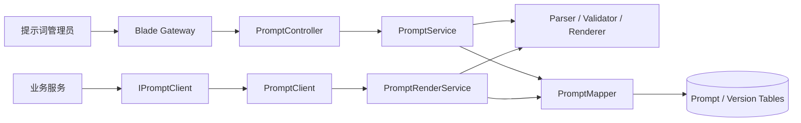
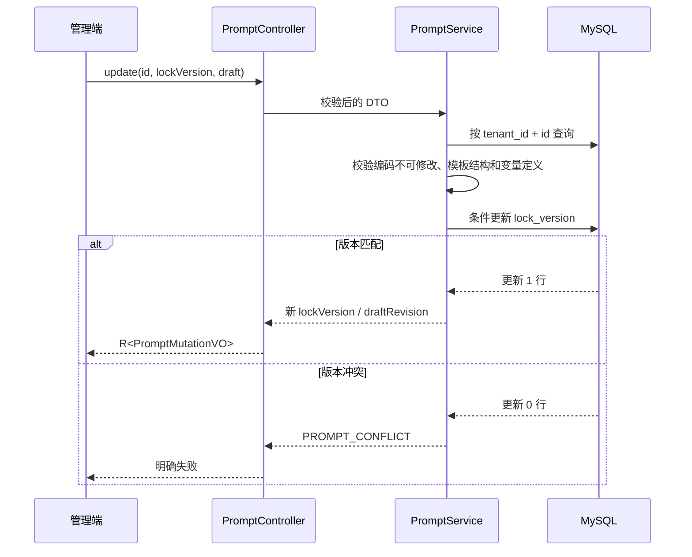
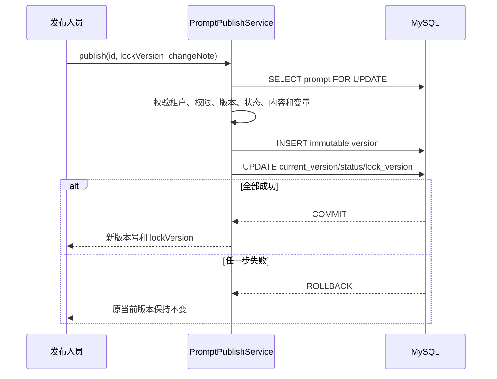
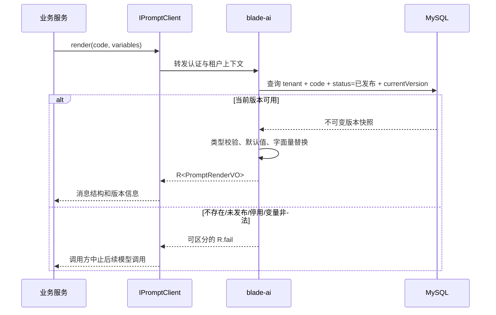

# 提示词管理详细设计

## 1. 文档信息

| 项目 | 内容 |
| --- | --- |
| 设计编号 | DESIGN-REQ-2026-001 |
| 关联需求 | [REQ-2026-001 提示词管理](../requirements/REQ-2026-001-prompt-management.md) |
| 关联数据库设计 | [DB-REQ-2026-001 提示词管理数据库设计](../database/DB-REQ-2026-001-prompt-management.md) |
| 文档版本 | 0.4 |
| 文档状态 | 开发中 |
| 技术负责人 | 待指定 |
| 创建/更新日期 | 2026-09-09 |

## 2. 设计摘要

### 2.1 目标

1. 新增独立 `blade-ai-api` 契约模块和 `blade-ai` 服务模块，统一承载提示词管理、模板渲染和内部业务调用，避免提示词能力绑定到 `blade-system` 或任一具体业务服务。
2. 使用“可变草稿主记录 + 不可变发布版本”模型，保证草稿编辑不影响运行时，发布、停用和回滚具备原子性。
3. 使用当前安全上下文确定用户、角色和租户，管理接口按动作校验权限，运行时 Feign 不接收客户端传入的租户字段。
4. 使用统一解析和渲染组件完成变量识别、类型校验、默认值处理和字面量替换；不执行表达式、不递归渲染、不调用模型。

### 2.2 非目标

- 不实现 Saber 前端、模型调用、会话、Token/成本统计、A/B 测试、灰度或定时发布。
- 不提供跨租户共享、导入导出、标签分类和模型供应商配置。
- 第一阶段不引入 Redis 提示词缓存，以停用和发布结果实时一致为优先。
- 不为无登录上下文的后台任务定义新的机器身份体系；此类调用需在接入前补充已确认的服务身份方案。
- 不建设提示词专属审计、通用审计、脱敏规则引擎或脱敏配置；后续如需通用审计，应建立独立需求，本设计不做预留。

### 2.3 关键决策

| 决策 | 结论 | 依据 |
| --- | --- | --- |
| 服务归属 | 新建 `blade-ai-api` + `blade-ai` | 能力会被多个业务域调用，且 `AppConstant.APPLICATION_AI_NAME` 已存在 |
| 草稿模型 | `blade_ai_prompt` 保存当前可编辑草稿 | 编辑无需复制多张临时版本，运行时仍只读发布表 |
| 发布模型 | `blade_ai_prompt_version` 保存不可变快照 | 满足历史、回滚和原发布版本不被覆盖 |
| 变量存储 | 按有序 JSON 数组存入 `TEXT` | 第一阶段无需按变量查询，应用层校验更适合版本快照 |
| 并发控制 | `SELECT ... FOR UPDATE` + `lockVersion` | 行锁保证事务内串行，版本号拒绝陈旧客户端请求 |
| 回滚语义 | 从历史快照生成新版本，不覆盖当前草稿 | 保留管理员尚未发布的编辑内容，避免回滚造成草稿丢失 |
| 运行时缓存 | 第一阶段不缓存 | 没有明确性能指标，先避免停用后的短时脏读 |
| 审计与脱敏 | 不涉及 | REQ-2026-001 0.2 已移除审计范围，且未要求脱敏功能 |

### 2.4 需求映射

| 需求/验收标准 | 设计落点 | 验证方式 |
| --- | --- | --- |
| REQ-001 / AC-001~002 | `PromptController.list/detail`、租户拦截、显式存在性检查 | 分页、越租户和不存在接口测试 |
| REQ-002 / AC-003~006 | `create/update/copy/remove`、编码唯一键、删除前置校验 | 接口、唯一键和历史版本删除测试 |
| REQ-003 / AC-007~008 | `PromptContentValidator`、双消息结构 | 单项为空、双空和顺序测试 |
| REQ-004 / AC-009~012 | `PromptTemplateParser`、`PromptVariableValidator` | 解析、缺失、类型、长度测试 |
| REQ-005 / AC-013~015 | 无状态 `preview` 接口 | 未保存预览、无持久化副作用测试 |
| REQ-006 / AC-016~019 | `publish/disable` 本地事务、版本快照和状态检查 | 成功、失败注入、停用读取测试 |
| REQ-007 / AC-020~022 | 版本查询、回滚生成新版本 | 历史不可变、合法/非法回滚测试 |
| REQ-008 / AC-023~025 | `IPromptClient.render`、仅当前有效版本查询 | 当前版本、草稿隔离、Fallback 测试 |
| REQ-009 / AC-026~027 | `@PreAuth(permission=...)`、租户上下文 | 无权限和越租户测试 |

## 3. 改动范围

| 层次 | 模块/路径 | 主要改动 |
| --- | --- | --- |
| Maven 聚合 | `pom.xml`、`blade-service-api/pom.xml`、`blade-service/pom.xml` | 聚合 `blade-ai-api`、`blade-ai`，根依赖管理登记 API 模块 |
| API 契约 | `blade-service-api/blade-ai-api` | Entity、DTO、VO、Feign、Fallback、错误码和枚举 |
| 服务实现 | `blade-service/blade-ai` | Controller、Feign 服务端、核心 Service、Mapper/XML、Wrapper、模板引擎 |
| 公共能力 | `blade-common` | 不新增服务名常量；复用现有 `AppConstant.APPLICATION_AI_NAME` |
| 网关 | `blade-gateway` | 复用服务发现路由，无静态路由改动；验证 Feign 路径只能在授权上下文访问 |
| 配置 | `doc/nacos/blade.yaml`、可选 `blade-ai-{profile}.yaml` | 登记两张基础租户表；按环境覆盖提示词长度和变量数量上限 |
| 数据库 | `doc/sql/blade` | 全量脚本和提示词基础升级脚本只包含主表与版本表 |
| 调用方 | 各业务服务 | 仅依赖 `blade-ai-api` 并调用 `IPromptClient`，禁止依赖 `blade-ai` |
| 权限数据 | `blade_menu`、`blade_api_scope` 相关初始化数据 | 登记管理动作和运行时读取权限，具体角色授权由部署环境配置 |

## 4. 架构与流程

### 4.1 架构图



管理流量经网关访问服务本地 `/prompt/**` 路径，对外实际路径为 `/blade-ai/prompt/**`。内部调用使用 `/feign/client/prompt/**`，由 Feign 传递当前认证和租户上下文。

### 4.2 草稿编辑时序



### 4.3 发布时序



### 4.4 运行时渲染时序



### 4.5 状态判定

数据库 `status` 值域：`0=草稿态`、`1=已发布可用`、`2=已停用`。是否存在待发布草稿由 `draft_dirty` 表示，不能只由 `status` 推断。

| 主状态 | `current_version_id` | `draft_dirty` | 管理端含义 | 运行时行为 |
| --- | --- | --- | --- | --- |
| 0 | NULL | 1 | 首个草稿 | 失败：未发布 |
| 1 | 非 NULL | 0 | 已发布，无新草稿 | 使用当前版本 |
| 1 | 非 NULL | 1 | 已发布，存在新草稿 | 继续使用当前版本 |
| 2 | 非 NULL | 0/1 | 已停用 | 失败：已停用 |

## 5. 模块设计

### 5.1 `blade-ai-api`

基础包：`org.springblade.ai.prompt`。

| 类型 | 名称 | 职责 |
| --- | --- | --- |
| Entity | `Prompt` | 草稿、状态、当前版本指针和并发版本 |
| Entity | `PromptVersion` | 不可变发布快照 |
| DTO | `PromptCreateDTO` | 名称、编码、草稿内容、变量定义 |
| DTO | `PromptUpdateDTO` | ID、`lockVersion`、可编辑字段 |
| DTO | `PromptCopyDTO` | 来源 ID、新名称、新编码 |
| DTO | `PromptPreviewDTO` | 未持久化内容和测试变量 |
| DTO | `PromptPublishDTO` | ID、`lockVersion`、变更说明 |
| DTO | `PromptDisableDTO` | ID、`lockVersion`、停用说明 |
| DTO | `PromptRollbackDTO` | ID、目标版本 ID、`lockVersion`、变更说明 |
| DTO | `PromptRenderRequest` | 稳定编码和运行时变量，不包含 tenantId |
| VO | `PromptListVO` | 管理列表摘要和可执行状态 |
| VO | `PromptDetailVO` | 当前草稿、当前版本摘要、警告和动作状态 |
| VO | `PromptVersionVO` | 完整不可变版本快照 |
| VO | `PromptRenderVO` | 渲染消息、版本、错误和警告 |
| VO | `PromptMutationVO` | ID、状态、新 `lockVersion`、版本号 |
| Feign | `IPromptClient` | 业务服务按编码渲染当前版本 |
| Fallback | `IPromptClientFallback` | 返回 `R.fail(PROMPT_SERVICE_UNAVAILABLE)`，不返回 `null` |
| Enum | `PromptStatus`、`VariableType`、`VersionSourceType` | 统一数据库值和接口语义 |

所有对外 `Long` 字段按项目 Jackson 大数转字符串约定输出；Entity 主键同时使用 `ToStringSerializer`，避免调用方绕过全局配置时丢失精度。

### 5.2 `blade-ai`

| 类型 | 名称 | 职责 |
| --- | --- | --- |
| Application | `AiApplication` | 使用 `AppConstant.APPLICATION_AI_NAME` 启动 |
| Controller | `PromptController` | 管理 HTTP API、参数校验、权限入口和 `R<T>` 响应 |
| Feign 服务端 | `PromptClient` | `@Hidden`，实现 `IPromptClient` |
| Service | `IPromptService` | 查询、草稿、复制、删除和状态能力 |
| Service | `IPromptPublishService` | 发布、停用、回滚事务 |
| Service | `IPromptRenderService` | 无状态预览与运行时渲染 |
| Parser | `PromptTemplateParser` | 识别 `{{variableName}}`，保留出现顺序并去重 |
| Validator | `PromptContentValidator` | 内容、变量定义、类型、长度和发布警告 |
| Renderer | `PromptTemplateRenderer` | 非递归字面量替换，输出固定指令和用户消息 |
| Mapper/XML | `PromptMapper` | 分页、详情和带行锁主记录查询 |
| Mapper/XML | `PromptVersionMapper` | 版本插入、列表、详情和目标版本查询 |
| Wrapper | `PromptWrapper`、`PromptVersionWrapper` | Entity/聚合结果转换为 VO |

`Prompt`、`PromptVersion` 均继承 `TenantEntity`，对应 Service 使用 `BaseService` / `BaseServiceImpl`。版本服务不暴露通用更新、删除能力。

### 5.3 模板变量模型

`variable_schema` 保存有序 JSON 数组，示例：

```json
[
  {
    "name": "contractText",
    "displayName": "合同正文",
    "type": "MULTILINE_TEXT",
    "required": true,
    "defaultValue": null,
    "exampleValue": "示例合同内容",
    "maxLength": 20000,
    "description": "待审核的合同原文"
  }
]
```

规则如下：

1. 变量名匹配 `^[A-Za-z][A-Za-z0-9_]{0,63}$`，区分大小写；定义顺序保留用于管理端展示。
2. `TEXT`、`MULTILINE_TEXT` 只接受 JSON 字符串，`NUMBER` 只接受 JSON 数字，`BOOLEAN` 只接受 JSON 布尔值；不自动把字符串 `"true"` 或 `"123"` 转型。
3. 默认值和示例值必须符合变量类型；`maxLength` 仅适用于文本类型。
4. 未声明引用为错误；重复定义、非法名称和类型不匹配为错误；已声明但未引用为警告。
5. 必填变量缺失且无默认值时失败；可选变量缺失且无默认值时替换为空字符串并返回警告。
6. 调用方额外提交的未定义变量不参与渲染并返回警告，避免误以为变量已生效。

### 5.4 渲染与注入边界

1. 解析器只识别变量标记，不执行 SpEL、脚本、方法调用、条件、循环或文件/网络访问。
2. 替换结果不再次扫描，变量值中的 `{{...}}` 保持普通文本，防止递归展开。
3. 固定指令和用户模板分别渲染为 `SYSTEM`、`USER` 消息；变量值不能新增消息、改变角色或修改消息顺序。
4. 对文本值不做 HTML/XSS 语义转换；它们是后续模型输入数据而不是网页片段。响应通过现有 Jackson 管线返回。
5. 上述隔离只能阻止模板引擎级代码/结构注入，不能保证模型不受语义提示注入影响。业务调用方后续接入模型时仍需按场景做输入可信度控制。

### 5.5 核心规则

| 规则 | 实现位置 | 失败行为 |
| --- | --- | --- |
| 租户内编码唯一且不可修改 | Service + `uk_blade_ai_prompt_tenant_code` | `PROMPT_CODE_DUPLICATE/IMMUTABLE`，数据不变 |
| 两段内容不得同时为空 | `PromptContentValidator` | 保存和发布失败 |
| 草稿不影响运行时 | 主表草稿 + 当前版本指针 | 继续返回原版本 |
| 发布版本不可变 | 版本 Service 不提供更新/删除 | 拒绝操作 |
| 陈旧客户端不能覆盖 | `lockVersion` 条件更新 | `PROMPT_CONFLICT` |
| 单提示词发布串行 | 主表 `FOR UPDATE` | 后到请求重新校验 |
| 删除仅限从未发布草稿 | 当前版本为空且版本数为 0 | `PROMPT_DELETE_FORBIDDEN` |
| 删除后编码不复用 | 主表唯一键不包含 `is_deleted` | 新建同编码失败 |
| 回滚不覆盖草稿 | 复制目标版本为新发布版本 | 当前草稿保留，`draft_dirty=1` |
| 停用即时生效 | 运行时每次查主表状态 | 停用后新调用失败 |

## 6. HTTP API 契约

服务本地根路径为 `/prompt`，经网关访问时前置服务名 `/blade-ai`。

| 方法 | 本地路径 | 权限码 | 请求 | 响应 | 幂等/并发 |
| --- | --- | --- | --- | --- | --- |
| GET | `/prompt/list` | `ai:prompt:view` | Query + `name/code/status` | `R<IPage<PromptListVO>>` | 只读 |
| GET | `/prompt/detail` | `ai:prompt:view` | `id` query | `R<PromptDetailVO>` | 只读 |
| POST | `/prompt/create` | `ai:prompt:create` | `PromptCreateDTO` | `R<PromptMutationVO>` | 编码唯一键防重复 |
| POST | `/prompt/update` | `ai:prompt:edit` | `PromptUpdateDTO` | `R<PromptMutationVO>` | 必须传 `lockVersion` |
| POST | `/prompt/copy` | `ai:prompt:copy` | `PromptCopyDTO` | `R<PromptMutationVO>` | 新编码唯一键 |
| POST | `/prompt/remove` | `ai:prompt:delete` | `PromptDeleteDTO` | `R<Boolean>` | 仅未发布草稿；重复删除返回不存在 |
| POST | `/prompt/preview` | `ai:prompt:preview` | `PromptPreviewDTO` | `R<PromptRenderVO>` | 无状态、无持久化 |
| POST | `/prompt/publish` | `ai:prompt:publish` | `PromptPublishDTO` | `R<PromptMutationVO>` | 行锁 + `lockVersion` |
| POST | `/prompt/disable` | `ai:prompt:disable` | `PromptDisableDTO` | `R<PromptMutationVO>` | 行锁 + `lockVersion` |
| GET | `/prompt/version/list` | `ai:prompt:view` | `promptId` + Query | `R<IPage<PromptVersionVO>>` | 只读 |
| GET | `/prompt/version/detail` | `ai:prompt:view` | `promptId/versionId` | `R<PromptVersionVO>` | 只读 |
| POST | `/prompt/rollback` | `ai:prompt:rollback` | `PromptRollbackDTO` | `R<PromptMutationVO>` | 行锁 + `lockVersion` |

接口补充：

- `id`、`promptId`、`versionId` 和 `lockVersion` 对外均使用字符串形式的 Long。
- `create/update/preview` 使用 Jakarta Validation 做结构校验，业务校验返回具体字段或变量名。
- 详情和版本详情必须同时使用当前租户与资源 ID 查询；其他租户资源统一按“不存在”返回，不暴露资源存在性。
- `copy` 复制来源主表中的当前草稿；不复制 ID、编码、状态、当前版本指针和历史。
- `changeNote` 在发布和回滚时必填；停用说明必填与否需在评审项中确认。
- 业务失败使用 `R<T>` 业务码；未认证/无权限沿用统一安全响应，数据库和未知异常沿用全局异常处理。

### 6.1 业务错误语义

| 错误标识 | 场景 | 调用方行为 |
| --- | --- | --- |
| `PROMPT_NOT_FOUND` | 当前租户不存在该资源 | 不重试，不显示其他租户线索 |
| `PROMPT_CODE_DUPLICATE` | 编码已存在或已被逻辑删除记录占用 | 更换编码 |
| `PROMPT_CONFLICT` | `lockVersion` 陈旧 | 刷新详情后重新确认操作 |
| `PROMPT_TEMPLATE_INVALID` | 内容、变量引用或定义非法 | 展示结构化错误，不发布 |
| `PROMPT_VARIABLE_INVALID` | 运行时变量缺失、类型或长度错误 | 修正变量，不调用模型 |
| `PROMPT_NOT_PUBLISHED` | 无当前版本 | 终止业务流程 |
| `PROMPT_DISABLED` | 提示词已停用 | 终止业务流程并告警 |
| `PROMPT_DELETE_FORBIDDEN` | 已有发布历史 | 改用停用 |
| `PROMPT_ROLLBACK_TARGET_INVALID` | 目标版本不存在或归属不符 | 刷新历史列表 |
| `PROMPT_SERVICE_UNAVAILABLE` | Feign Fallback | 不得使用空模板继续执行 |

具体数值码区间需与项目全局错误码分配规则在实现前确认，禁止复用认证和系统异常码表达业务失败。

## 7. Feign 契约

| 项目 | 内容 |
| --- | --- |
| API 模块 | `blade-service-api/blade-ai-api` |
| 服务名 | `AppConstant.APPLICATION_AI_NAME`（`blade-ai`） |
| `API_PREFIX` | `/feign/client/prompt` |
| Java 签名 | `R<PromptRenderVO> render(PromptRenderRequest request)` |
| HTTP | `POST /feign/client/prompt/render`，`@RequestBody` |
| Fallback | `IPromptClientFallback` 返回 `R.fail(PROMPT_SERVICE_UNAVAILABLE)` |
| Sentinel/超时 | 沿用全局 Feign/Sentinel 配置；第一阶段不单独放宽超时 |
| 调用方处理 | 先判断 `R.isSuccess()` 和 `data`，任何失败均中止后续模型调用 |

`PromptRenderRequest` 只包含 `code` 和 `Map<String, Object> variables`。tenantId、用户 ID、角色等均由 Feign 转发的认证上下文获得，服务端拒绝无认证上下文、无 `ai:prompt:runtime` 权限或无租户上下文的调用。

版本兼容策略：先发布 `blade-ai-api` 和 `blade-ai`，确认 Feign 契约可用后业务服务再引入 API 依赖。新增接口不改变现有服务契约，旧服务可并行运行。

## 8. 数据设计

- 数据库设计：[DB-REQ-2026-001 提示词管理数据库设计](../database/DB-REQ-2026-001-prompt-management.md)
- 基础数据：`blade_ai_prompt`、`blade_ai_prompt_version`，Entity 使用 `TenantEntity`。
- 租户表配置：两张基础表加入 `blade.tenant.tables`。
- 逻辑删除：仅提示词主表提供受控逻辑删除；版本表不提供业务删除入口。
- 变量定义：主表与版本表均以应用校验后的 JSON 文本保存，版本表保存完整快照。
- MySQL 脚本：已同步全量脚本，并新增 `blade.mysql.upgrade.5.0.1.prompt-management.sql`。

## 9. 事务、并发与缓存

| 主题 | 设计 |
| --- | --- |
| 草稿创建/编辑 | 单表本地事务；更新 SQL 同时匹配 `tenant_id`、`id`、`lock_version`、`is_deleted=0` |
| 发布 | `@Transactional(rollbackFor = Exception.class)`；锁主记录、校验、插版本、切指针和状态一次提交 |
| 停用 | 锁主记录后更新状态和 `lock_version`；无当前版本时拒绝停用 |
| 回滚 | 锁主记录、校验目标版本归属、插入新版本、切换指针和状态；不更新历史版本 |
| 跨服务事务 | 不涉及；Feign 运行时接口只读，不使用 Seata |
| 并发控制 | 数据库行锁负责同一提示词串行化，`lockVersion` 负责检测客户端陈旧状态 |
| 版本号 | 持有主记录行锁后使用 `current_version_no + 1`；唯一索引作为最终保护 |
| 幂等 | 写接口不声明天然幂等；客户端超时后必须先查详情，不能盲目重放发布/回滚 |
| 缓存 | 第一阶段不使用 Redis；发布、停用、回滚提交后立即对下一次查询可见 |

## 10. 认证、租户与数据权限

- 认证方式：复用 SpringBlade JWT/安全上下文和 Feign Token Relay。
- 权限方式：Controller/Feign 服务端使用 `@PreAuth(permission = "...")`；权限码由 API Scope 数据配置，管理员角色不作为唯一硬编码入口。
- 高风险权限：`ai:prompt:publish`、`ai:prompt:disable`、`ai:prompt:rollback` 独立授权，不与普通编辑权限合并。
- 租户来源：只接受安全上下文中的 tenantId；DTO、Feign Request 和查询参数均不提供 tenantId。
- 租户防护：MyBatis 租户插件覆盖两张提示词表；自定义 SQL 显式包含 `tenant_id` 与 `is_deleted` 条件。
- 超级管理员：跨租户管理不属于本需求；即使框架管理员可绕过部分租户插件，本模块 Service 仍默认绑定当前租户，不提供任意 tenantId 查询入口。
- 数据权限：提示词为租户级共享配置，不按部门/创建人进一步裁剪，因此不使用 DataScope；动作权限通过 API Scope 控制。
- 日志边界：提示词正文、变量默认值/示例值和运行时值只在必要接口返回，不进入普通列表和业务日志。

## 11. 异常与日志

| 场景 | 处理 | 对外结果 | 数据影响 |
| --- | --- | --- | --- |
| 参数结构非法 | Jakarta Validation | 参数错误 | 不改变 |
| 模板或变量非法 | 返回结构化错误/警告 | `PROMPT_TEMPLATE_INVALID` | 草稿保存按规则决定；发布不改变 |
| 资源不存在/越租户 | 相同查询失败语义 | `PROMPT_NOT_FOUND` | 不改变 |
| 发布版本冲突 | 拒绝陈旧 `lockVersion` | `PROMPT_CONFLICT` | 不改变 |
| 发布持久化失败 | 整体事务回滚 | 统一数据库错误 | 原版本保持不变 |
| Feign 降级 | Fallback 明确失败 | `PROMPT_SERVICE_UNAVAILABLE` | 不改变 |

日志只允许记录 tenantId、operatorId、promptId、promptCode、versionNo、action、result、errorCode、requestId 和耗时。禁止记录固定指令、用户模板、变量定义全文、测试变量、运行时变量、Token、密钥和连接串。

## 12. 配置、发布与回滚

### 12.1 配置

| Data ID/位置 | 配置 | 默认设计 |
| --- | --- | --- |
| `blade.yaml` | `blade.tenant.tables` | 加入 `blade_ai_prompt`、`blade_ai_prompt_version` |
| `blade-ai-{profile}.yaml`（按需） | `blade.ai.prompt.max-fixed-length` | 32768，评审确认后落地 |
| 同上 | `blade.ai.prompt.max-user-template-length` | 32768，评审确认后落地 |
| 同上 | `blade.ai.prompt.max-variable-count` | 100，评审确认后落地 |
| 同上 | `blade.ai.prompt.max-rendered-length` | 65535，评审确认后落地 |
| `blade-ai/src/main/resources/application-dev.yml` | 开发端口 | 建议 `8107`，需确认本机和部署端口规划 |

配置不包含模型密钥或供应商信息。长度上限在所有环境保持同一默认值，差异配置必须记录原因。

### 12.2 发布顺序

1. 评审确认数据库字段、长度、权限码和内部身份策略。
2. 执行提示词基础升级脚本并核对两张表、索引和租户配置。
3. 发布包含 `blade-ai-api` 的公共构建产物。
4. 发布 `blade-ai`，确认注册中心、健康检查、Swagger 和 Feign Fallback。
5. 发布 Nacos 租户表配置；在服务实例均识别配置后开放管理权限。
6. 初始化 API Scope/菜单权限并只授权指定角色。
7. 业务服务逐个引入 `blade-ai-api` 和运行时调用。

### 12.3 兼容与回滚

- 新增模块和表不改变现有接口，未接入业务服务可继续运行。
- 代码回滚时先下线调用方，再下线 `blade-ai`；保留新增表不影响旧代码。
- Nacos 回滚时只有在 `blade-ai` 基础能力全部下线后才移除两张表的租户配置。
- 数据库基础表默认保留；仅在确认无业务数据且已有备份时物理回滚。
- 已发布提示词版本属于业务配置数据，应用回滚不能自动删除或覆盖。

## 13. 验证计划

### 13.1 编译与静态检查

- 实现后执行：`mvn clean package -DskipTests -pl blade-service/blade-ai -am`。
- 检查 `blade-ai-api` 未依赖 `blade-ai`，其他 Service 只依赖 API 模块。
- 检查 AppConstant 服务名、Feign `API_PREFIX`、Fallback 非空失败和启动类一致。
- 检查两张基础表的 Entity、租户配置、自定义 SQL 条件和 Long 序列化。
- 检查需求、设计、数据库和测试文档链接及编号一致。

### 13.2 用户执行测试范围

- 管理 API：查询、创建、编辑、复制、删除、预览、发布、停用、历史和回滚。
- 模板：合法/非法标记、大小写、重复、未声明、未使用、必填、默认值、类型和长度。
- 事务：版本插入失败、主表更新失败、回滚失败时原当前版本保持不变。
- 并发：双编辑、编辑与发布、双发布、停用与运行时读取。
- 安全：未登录、无权限、越租户、伪造租户字段、Feign 无上下文和日志正文泄露。
- 兼容：业务服务存在未发布草稿时仍获取原当前版本，Fallback 不被误判为成功。
- SQL：全量、升级、索引、重复执行、回滚和租户隔离。

已在 JDK 21 下执行 `mvn clean package -DskipTests -pl blade-service/blade-ai -am` 并通过，生成可执行 `blade-ai.jar`。未运行 Maven 测试、数据库、Nacos、Redis、微服务或真实接口；测试范围已归档至 [TEST-REQ-2026-001](../test/TEST-REQ-2026-001-prompt-management.md)。

### 13.3 实际实现范围与偏差

- 已完成 `blade-ai-api`、`blade-ai`、管理 API、Feign、模板引擎、草稿并发、发布/停用/回滚事务、MySQL、Nacos 和 Docker 配置。
- 业务错误码采用独立 `48001~48011` 区间；长度和变量上限采用设计默认值；停用说明按必填实现。
- 权限资源已写入 `blade_scope_api`，不默认绑定角色。由于本期不包含 Saber 页面，未写入会指向不存在页面的 `blade_menu` 数据。
- 第一阶段仍只支持具有可转发认证和租户上下文的 Feign 调用，无登录上下文服务身份未实现。

## 14. 风险、评审与变更

| 编号 | 风险/问题 | 负责人 | 状态/结论 |
| --- | --- | --- | --- |
| DESIGN-ITEM-001 | 发布权限默认授予 `administrator`、租户 `admin` 还是新增提示词管理员角色 | 待指定 | 开放，实施前确认 |
| DESIGN-ITEM-002 | 无用户登录上下文的定时任务/消息消费者缺少已确认的服务身份与租户传递规范 | 待指定 | 开放；第一阶段仅支持可转发认证上下文的调用 |
| DESIGN-ITEM-003 | 业务错误数值码尚无仓库级分配表 | 待指定 | 已按本模块独立分配 `48001~48011`，待项目级登记表建立后复核 |
| DESIGN-ITEM-004 | 正文、变量数量、渲染总长度和停用说明是否必填需产品/运维确认 | 待指定 | 已按设计默认值实现，停用说明必填；真实环境验收后可按需求变更调整 |
| DESIGN-ITEM-005 | 模板中需要原样输出 `{{` 时的转义语法尚未定义 | 待指定 | 开放；确认前不支持字面量双花括号 |
| DESIGN-ITEM-006 | 语义提示注入无法由字面量替换完全消除 | 业务调用方 | 已识别；模型接入阶段继续治理 |

| 评审领域 | 结论 | 评审人 | 日期 |
| --- | --- | --- | --- |
| 后端/API | 待评审 | 待指定 | 待指定 |
| 数据库 | 待评审 | 待指定 | 待指定 |
| 安全/租户 | 待评审 | 待指定 | 待指定 |
| 测试可行性 | 待评审 | 待指定 | 待指定 |

| 日期 | 版本 | 变更内容 | 修改人 |
| --- | --- | --- | --- |
| 2026-09-09 | 0.1 | 根据 REQ-2026-001 创建详细设计初稿 | Codex |
| 2026-09-09 | 0.2 | 按开发契约拆分审计扩展，移除未要求的通用脱敏功能设计 | Codex |
| 2026-09-09 | 0.3 | 根据 REQ-2026-001 0.2 删除全部审计设计，仅保留提示词基础能力 | Codex |
| 2026-09-09 | 0.4 | 记录实际实现、编译结果、错误码与默认上限，并说明菜单初始化偏差 | Codex |
