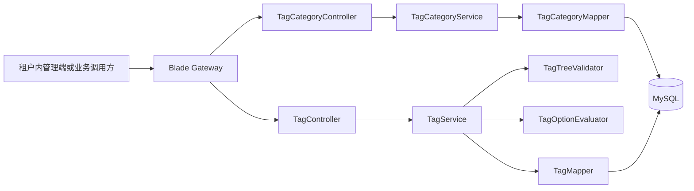
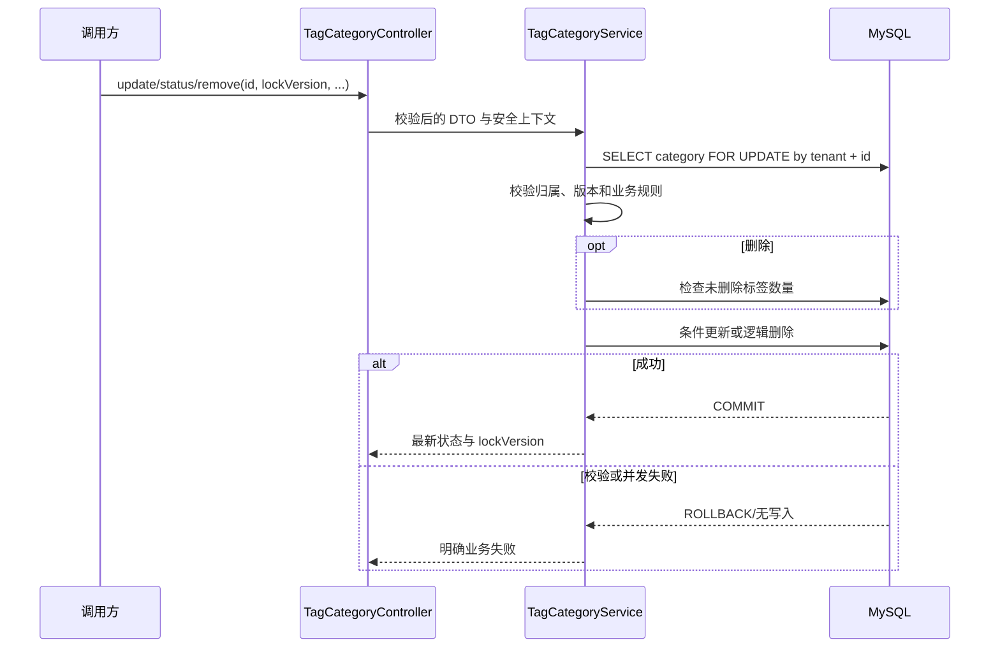
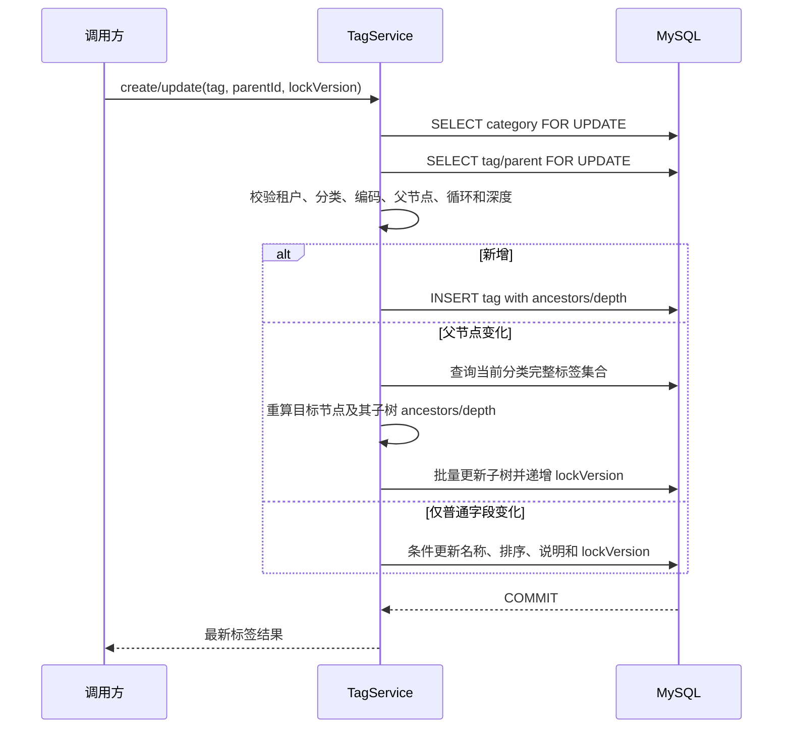

# 标签分类管理详细设计

## 1. 文档信息

| 项目 | 内容 |
| --- | --- |
| 设计编号 | DESIGN-REQ-2026-002 |
| 关联需求 | [REQ-2026-002 标签分类管理](../requirements/REQ-2026-002-tag-category-management.md) |
| 关联数据库设计 | [DB-REQ-2026-002 标签分类管理数据库设计](../database/DB-REQ-2026-002-tag-category-management.md) |
| 文档版本 | 0.3 |
| 文档状态 | 开发中 |
| 技术负责人 | 待指定 |
| 创建/更新日期 | 2026-09-10 |

## 2. 设计摘要

### 2.1 目标

1. 在现有 `blade-system-api` 与 `blade-system` 中建设租户级标签分类和标签管理能力，不新建微服务。
2. 提供分类、标签的分页、详情、树形、有效选项和单记录写操作，确保稳定排序、编码不可变、层级合法和逻辑删除后编码不复用。
3. 以安全上下文中的 tenantId 作为唯一租户来源，管理接口按动作权限控制，其他租户资源统一按不存在处理。
4. 使用资源 `lockVersion` 拒绝陈旧写请求；标签结构变化通过分类级串行化事务保证父子关系和祖先路径一致。

### 2.2 非目标

- 不建设标签与业务资源的关联表、引用统计、批量操作、导入导出、合并、别名、推荐、版本历史或前端页面。
- 不新增跨服务 Feign 契约；第一阶段通过 `blade-system` HTTP API 向具有当前用户与租户上下文的调用方提供数据。
- 不引入 Redis 或本地缓存；分类和标签状态变化提交后直接对后续查询生效。
- 不建设审计或脱敏能力，也不预留相关表、字段、切面、配置和接口。

### 2.3 关键决策

| 决策 | 结论 | 依据 |
| --- | --- | --- |
| 服务归属 | 复用 `blade-system-api` + `blade-system` | 标签属于租户共享基础数据，现有系统服务已承载字典、部门等同类能力 |
| 数据模型 | `blade_tag_category` + `blade_tag` | 分类规则与层级标签职责不同，分别维护状态和并发版本 |
| 编码格式 | 小写 snake_case，正则 `^[a-z][a-z0-9_]{0,63}$` | 稳定、可读、适合作为后续业务引用键；最大长度 64 |
| 标签层级 | `parent_id + ancestors + depth`，最大 8 级 | 不依赖 MySQL 递归 CTE，便于校验循环、移动子树和判断路径有效性 |
| 顶级标签 | `parent_id=0`、`ancestors='0'`、`depth=1` | 复用 `BladeConstant.TOP_PARENT_ID` 语义 |
| 结构并发 | 标签写操作先锁所属分类行，再处理标签行 | 分类作为树聚合锁，避免删除分类、创建标签和移动子树并发交错 |
| 客户端并发 | 分类、标签各自维护 `lock_version` | 陈旧请求明确失败；移动子树时同步递增受影响后代版本 |
| 有效性 | 查询时按分类、祖先节点和自身状态实时计算 | 状态变化不级联改写下级数据，符合需求恢复语义 |
| 删除后编码 | 唯一键不包含 `is_deleted` | 逻辑删除记录继续占用原稳定编码 |
| 数据权限 | 不使用 DataScope | 当前租户内共享，不按创建人或部门裁剪 |

### 2.4 需求映射

| 需求/验收标准 | 设计落点 | 验证方式 |
| --- | --- | --- |
| REQ-001 / AC-001~003 | `TagCategoryController.list/detail`、租户条件、`sort/createTime/id` 稳定排序 | 分类筛选、越租户、同排序值重复查询 |
| REQ-002 / AC-004~008 | 分类创建/编辑 DTO、编码唯一键、选择规则校验、`lockVersion` | 合法创建、重复编码、不可变字段、规则和并发测试 |
| REQ-003 / AC-009~011 | 分类状态事务、有效选项实时过滤、同状态幂等返回 | 停用、重启和重复状态请求测试 |
| REQ-004 / AC-012~014 | 分类删除前锁分类并检查未删除标签、逻辑删除、唯一键保留编码 | 空分类、非空分类和删除后重建测试 |
| REQ-005 / AC-015~018 | 标签分页/详情/树/有效选项、内存树合并和路径有效性计算 | 多级树、越租户、停用分类和停用祖先测试 |
| REQ-006 / AC-019~024 | 标签创建/编辑、分类内唯一键、父节点与循环校验、子树路径重算 | 跨分类同码、非法父节点、循环和不可变字段测试 |
| REQ-007 / AC-025~027 | 标签状态仅更新自身、选项查询检查完整路径、同状态幂等返回 | 父节点停用/启用及重复请求测试 |
| REQ-008 / AC-028~030 | 叶子删除检查、逻辑删除、不级联和唯一键保留编码 | 叶子、非叶子和删除后重建测试 |
| REQ-009 / AC-031~035 | `@PreAuth`、安全上下文 tenantId、租户插件及显式租户条件 | 未登录、无权限、越租户、同租户共享和伪造 tenantId 测试 |

## 3. 改动范围

| 层次 | 模块/路径 | 主要改动 |
| --- | --- | --- |
| API 契约 | `blade-service-api/blade-system-api` | 分类/标签 Entity、DTO、VO、枚举、权限常量和业务错误标识 |
| 服务实现 | `blade-service/blade-system` | Controller、Service、Mapper/XML、Wrapper、层级校验和有效性计算 |
| 公共能力 | `blade-common` | 不新增公共抽象；复用 `TenantEntity`、`BladeConstant.TOP_PARENT_ID`、安全与分页能力 |
| 网关 | `blade-gateway` | 复用 `blade-system` 服务发现路由，不新增静态路由 |
| 配置 | `doc/nacos/blade.yaml` | `blade.tenant.tables` 增加两张标签基础表 |
| 数据库 | `doc/sql/blade` | 设计确认后同步全量脚本及 `blade.mysql.upgrade.5.0.1.tag-category-management.sql` |
| 权限数据 | `blade_scope_api` 与标签菜单配置脚本 | 登记分类、标签的查看、新增、编辑、状态和删除权限，绑定 Saber 页面菜单；不默认绑定角色 |
| 调用方 | Saber 或租户内业务调用方 | 通过网关调用新增 HTTP API；本期无 Feign 依赖变化 |

## 4. 架构与流程

### 4.1 架构图

服务本地路径为 `/tag-category/**` 与 `/tag/**`，经网关访问时使用 `/blade-system/tag-category/**` 与 `/blade-system/tag/**`。

### 4.2 分类写操作时序

同状态请求先校验资源归属。目标状态与当前状态相同时不要求旧版本覆盖数据，不递增 `lockVersion`，直接返回数据库中的当前状态和最新版本；目标状态不同时必须匹配客户端版本。

### 4.3 标签新增与移动时序

移动时通过新父节点的 `ancestors` 是否包含目标标签 ID 判断循环；重算后任一节点 `depth > 8` 时整笔事务失败。客户端不能提交 `ancestors`、`depth`、tenantId 或所属分类变更。

### 4.4 标签树与有效选项流程

1. 按当前 tenantId 与 categoryId 查询分类；不存在、已删除或越租户均返回分类不存在。
2. 管理树查询加载分类下全部未删除标签，按 `sort ASC, create_time ASC, id ASC` 排序后合并父子节点；停用节点仍保留并返回自身状态。
3. 有效选项查询遇到停用分类直接返回空列表。
4. 分类启用时加载未删除标签，构建 `id -> tag` 映射；标签自身及 `ancestors` 对应的全部实际节点均启用才返回。
5. 若发现祖先路径缺失、跨分类或深度不一致，当前节点按无效处理并记录不含正文的结构错误日志，避免异常数据成为有效选项。

## 5. 模块设计

### 5.1 `blade-system-api`

| 类型 | 名称 | 职责 |
| --- | --- | --- |
| Entity | `TagCategory` | 分类编码、名称、选择规则、排序、并发版本及租户基础字段 |
| Entity | `TagDefinition` | 分类归属、父节点、祖先路径、深度、编码、名称、排序和并发版本 |
| DTO | `TagCategoryCreateDTO` | 分类创建输入，不包含 ID、tenantId、状态和并发版本 |
| DTO | `TagCategoryUpdateDTO` | ID、名称、选择规则、排序、说明、`lockVersion`，不包含编码 |
| DTO | `TagCategoryStatusDTO` | ID、目标状态和 `lockVersion` |
| DTO | `TagCategoryDeleteDTO` | ID 和 `lockVersion` |
| DTO | `TagCreateDTO` | categoryId、parentId、编码、名称、排序和说明 |
| DTO | `TagUpdateDTO` | ID、parentId、名称、排序、说明和 `lockVersion`，不包含编码与 categoryId |
| DTO | `TagStatusDTO`、`TagDeleteDTO` | 单标签状态和删除输入 |
| VO | `TagCategoryListVO` | 分类摘要、标签数量、状态、更新时间和版本 |
| VO | `TagCategoryDetailVO` | 分类完整可维护信息 |
| VO | `TagListVO`、`TagDetailVO` | 标签列表和详情信息 |
| VO | `TagTreeVO` | 标签完整管理树节点与 children |
| VO | `TagOptionVO` | ID、编码、名称、parentId、depth、sort |
| VO | `TagCategoryMutationVO`、`TagMutationVO` | 分类或标签的 ID、状态和最新 `lockVersion` |
| Enum | `TagSelectionMode`、`TagStatus` | `SINGLE/MULTIPLE` 与 `DISABLED/ENABLED` 映射 |
| Constant | `TagPermission`、`TagResultCode` | 权限码与模块业务错误标识 |

Entity 继承 `TenantEntity`，Service/ServiceImpl 对应使用 `BaseService`/`BaseServiceImpl`。所有 Long ID 与 `lockVersion` 按项目大数序列化约定以字符串传输，Entity 字段补充 `ToStringSerializer`。

### 5.2 `blade-system`

| 类型 | 名称 | 职责 |
| --- | --- | --- |
| Controller | `TagCategoryController` | 分类 HTTP 契约、参数校验、动作权限和 `R<T>` 响应 |
| Controller | `TagController` | 标签 HTTP 契约、参数校验、动作权限和 `R<T>` 响应 |
| Service | `ITagCategoryService` | 分类查询、创建、编辑、状态和删除事务 |
| Service | `ITagService` | 标签查询、树、有效选项、创建、编辑、状态和删除事务 |
| Validator | `TagTreeValidator` | 父节点、同分类、循环、深度和祖先路径校验 |
| Evaluator | `TagOptionEvaluator` | 根据分类、祖先和自身状态计算有效标签 |
| Mapper/XML | `TagCategoryMapper` | 分类分页、标签数量、行锁和条件写入 |
| Mapper/XML | `TagMapper` | 标签分页、树查询、行锁、子节点检查和子树批量更新 |
| Wrapper | `TagCategoryWrapper`、`TagWrapper` | Entity/聚合结果转换为 VO |

### 5.3 输入与编码规则

1. 编码去除首尾空白后转为小写，必须匹配 `^[a-z][a-z0-9_]{0,63}$`；创建后不可修改。
2. 名称去除首尾空白，长度为 1~100；说明可为空，最长 500；排序为非负整数，默认 0。
3. 单选分类的 `maxSelectCount` 固定为 1；多选分类范围为 1~100。该上限控制配置合理性，不代表业务关联功能已实现。
4. 新建分类和标签状态固定为 `ENABLED(1)`；客户端不能通过创建 DTO 指定初始状态。
5. 标签根节点使用 `parentId=0`；非根父节点必须属于当前 tenantId 和同一 categoryId。
6. 标签最大深度为 8；调整父节点后对子树中每个节点统一验证。

### 5.4 核心规则

| 规则 | 实现位置 | 失败行为 |
| --- | --- | --- |
| 分类编码租户内唯一且删除后不复用 | Service + 分类唯一键 | `TAG_CATEGORY_CODE_DUPLICATE`，不写入 |
| 标签编码在租户与分类内唯一且删除后不复用 | Service + 标签唯一键 | `TAG_CODE_DUPLICATE`，不写入 |
| 编码、tenantId、标签 categoryId 不可修改 | 分离创建/更新 DTO + Service 防御校验 | `TAG_IMMUTABLE_FIELD` |
| 父子必须同租户同分类 | `TagTreeValidator` + 显式查询条件 | `TAG_PARENT_INVALID` |
| 不允许自身/后代成为父节点 | 新父节点祖先路径校验 | `TAG_CYCLE_DETECTED` |
| 最大层级 8 | 创建和移动子树重算 | `TAG_DEPTH_EXCEEDED` |
| 分类非空、标签非叶子不能删除 | 分类锁内计数/子节点查询 | `TAG_CATEGORY_NOT_EMPTY` / `TAG_HAS_CHILDREN` |
| 陈旧请求不能覆盖最新数据 | 行锁后比较 `lockVersion` + 条件更新 | `TAG_CONFLICT` |
| 状态不级联保存 | 只更新目标分类或标签 | 后代保存状态不改变 |
| 有效标签依赖完整启用路径 | `TagOptionEvaluator` | 无效节点不返回，不修改数据 |

## 6. HTTP API 契约

### 6.1 分类接口

| 方法 | 本地路径 | 权限码 | 请求 | 响应 | 幂等/并发 |
| --- | --- | --- | --- | --- | --- |
| GET | `/tag-category/list` | `system:tag-category:view` | Query + `name/code/status` | `R<IPage<TagCategoryListVO>>` | 只读 |
| GET | `/tag-category/detail` | `system:tag-category:view` | `id` query | `R<TagCategoryDetailVO>` | 只读 |
| POST | `/tag-category/create` | `system:tag-category:create` | `TagCategoryCreateDTO` | `R<TagCategoryMutationVO>` | 唯一键防重复 |
| POST | `/tag-category/update` | `system:tag-category:edit` | `TagCategoryUpdateDTO` | `R<TagCategoryMutationVO>` | 必须传 `lockVersion` |
| POST | `/tag-category/status` | `system:tag-category:status` | `TagCategoryStatusDTO` | `R<TagCategoryMutationVO>` | 同状态不写；变更需版本匹配 |
| POST | `/tag-category/remove` | `system:tag-category:delete` | `TagCategoryDeleteDTO` | `R<Boolean>` | 空分类且版本匹配 |

### 6.2 标签接口

| 方法 | 本地路径 | 权限码 | 请求 | 响应 | 幂等/并发 |
| --- | --- | --- | --- | --- | --- |
| GET | `/tag/list` | `system:tag:view` | Query + `categoryId/parentId/name/code/status` | `R<IPage<TagListVO>>` | 只读 |
| GET | `/tag/detail` | `system:tag:view` | `id` query | `R<TagDetailVO>` | 只读 |
| GET | `/tag/tree` | `system:tag:view` | 必填 `categoryId` | `R<List<TagTreeVO>>` | 只读，包含停用节点 |
| GET | `/tag/options` | `system:tag:view` | 必填 `categoryId` | `R<List<TagOptionVO>>` | 只读，仅返回路径有效节点 |
| POST | `/tag/create` | `system:tag:create` | `TagCreateDTO` | `R<TagMutationVO>` | 分类内唯一键防重复 |
| POST | `/tag/update` | `system:tag:edit` | `TagUpdateDTO` | `R<TagMutationVO>` | 分类锁 + 资源版本 |
| POST | `/tag/status` | `system:tag:status` | `TagStatusDTO` | `R<TagMutationVO>` | 同状态不写；变更需版本匹配 |
| POST | `/tag/remove` | `system:tag:delete` | `TagDeleteDTO` | `R<Boolean>` | 仅叶子且版本匹配 |

接口补充：

- 分页参数复用项目 `Query`；页大小上限沿用全局配置，不在本模块另设一套规则。
- 列表稳定排序：分类使用 `sort ASC, create_time ASC, id ASC`；标签使用 `sort ASC, create_time ASC, id ASC`。
- DTO 不定义 tenantId、ancestors、depth、createUser、createDept 等服务端字段；客户端额外字段不得改变资源归属或结构派生字段。
- 详情、树和写操作均以 tenantId + ID 查询。其他租户资源与本租户不存在资源返回相同错误。
- 业务失败通过 `R<T>` 返回模块错误标识；认证和权限失败沿用统一安全响应。

### 6.3 业务错误语义

| 错误标识 | 场景 | 调用方行为 |
| --- | --- | --- |
| `TAG_CATEGORY_NOT_FOUND` | 当前租户不存在分类 | 刷新列表，不展示其他租户线索 |
| `TAG_NOT_FOUND` | 当前租户不存在标签 | 刷新列表或树 |
| `TAG_CATEGORY_CODE_DUPLICATE` | 分类编码已存在或被删除记录占用 | 更换编码 |
| `TAG_CODE_DUPLICATE` | 分类内标签编码已存在或被删除记录占用 | 更换编码 |
| `TAG_SELECTION_RULE_INVALID` | 单选/多选与最大数量不匹配 | 修正选择规则 |
| `TAG_IMMUTABLE_FIELD` | 尝试修改编码、分类或租户归属 | 放弃不可变字段修改 |
| `TAG_PARENT_INVALID` | 父标签不存在、越租户或跨分类 | 重新选择父标签 |
| `TAG_CYCLE_DETECTED` | 父节点为自身或后代 | 重新选择父标签 |
| `TAG_DEPTH_EXCEEDED` | 创建或移动后超过 8 级 | 调整层级 |
| `TAG_CATEGORY_NOT_EMPTY` | 分类仍有未删除标签 | 先逐个处理标签 |
| `TAG_HAS_CHILDREN` | 标签仍有未删除子标签 | 先逐个处理子标签 |
| `TAG_CONFLICT` | `lockVersion` 陈旧 | 刷新详情后重试 |
| `TAG_STATUS_INVALID` | 状态值不是启用或停用 | 修正状态参数 |
| `TAG_CODE_INVALID` | 分类或标签编码不符合格式 | 修正为小写 snake_case 编码 |

实现采用 `48101`~`48114` 作为标签分类模块业务错误码区间，当前仓库未发现冲突；新增错误码时应继续执行全仓冲突检查。

## 7. Feign 契约

本期不涉及。需求要求的租户内管理和有效选项能力均通过 `blade-system` HTTP API 提供，未明确要求其他微服务通过 OpenFeign 读取标签。后续若出现服务间调用，应作为兼容性变更先在 `blade-system-api` 定义 Feign、Fallback 和调用方失败处理，禁止 Service 模块直接依赖 `blade-system` 实现模块。

## 8. 数据设计

- 数据库设计：[DB-REQ-2026-002 标签分类管理数据库设计](../database/DB-REQ-2026-002-tag-category-management.md)
- 基础表：`blade_tag_category`、`blade_tag`，Entity 均继承 `TenantEntity`。
- 租户配置：两张表加入 `blade.tenant.tables`。
- 逻辑删除：分类和标签均受控逻辑删除；唯一键不含 `is_deleted`，编码不复用。
- 层级字段：标签保存 `parent_id`、`ancestors`、`depth`；全部由服务端维护。
- 正式脚本：设计确认后同步全量脚本，并新增 `blade.mysql.upgrade.5.0.1.tag-category-management.sql`。

## 9. 事务、并发与缓存

| 主题 | 设计 |
| --- | --- |
| 分类创建 | 单表本地事务；tenantId 从安全上下文绑定，唯一键作为最终并发保护 |
| 分类编辑 | `SELECT ... FOR UPDATE` 后校验 `lockVersion`，条件更新并递增版本 |
| 分类状态 | 锁分类；同状态直接返回，目标不同则校验版本后更新 |
| 分类删除 | 锁分类后检查未删除标签数，再按 tenantId/id/lockVersion 逻辑删除 |
| 标签创建 | 先锁分类，确认分类未删除，再校验父节点并插入 |
| 标签普通编辑 | 锁分类和标签，校验版本后更新名称、排序、说明 |
| 标签移动 | 锁分类和目标标签/父标签，加载分类树，重算子树路径并在同一事务批量更新 |
| 标签状态 | 锁分类和标签；只改自身状态，不级联后代 |
| 标签删除 | 锁分类和标签，确认无未删除直接子节点后逻辑删除 |
| 跨服务事务 | 不涉及，不使用 Seata |
| 幂等 | 创建由稳定编码唯一键防重；状态同值幂等；编辑、移动和删除要求调用方超时后先刷新资源 |
| 缓存 | 第一阶段不使用缓存，避免状态和层级变化后的短时脏读 |

所有自定义更新 SQL 必须匹配 tenantId、ID、`is_deleted=0` 和当前 `lock_version`。标签移动导致后代的 `ancestors/depth` 变化时，后代 `lock_version`、`update_user`、`update_time` 一并更新，避免旧详情覆盖结构变化。

## 10. 认证、租户与数据权限

- 认证方式：复用 SpringBlade JWT/安全上下文；接口要求有效用户和 tenantId。
- 权限方式：Controller 按表中权限码使用 `@PreAuth(permission = "...")`，不以页面按钮隐藏代替服务端校验。
- 角色授权：数据库只登记权限资源，不默认绑定 `administrator`、租户 `admin` 或新角色；上线前由部署环境确认授权矩阵。
- 租户来源：只使用 `SecureUtil.getTenantId()` 等安全上下文能力；请求 DTO 和查询参数不接受 tenantId。
- 租户防护：MyBatis 租户插件覆盖两张表；自定义分页、行锁、计数、子树更新 SQL 仍显式包含 tenantId 和逻辑删除条件。
- 超级管理员：跨租户管理不在范围内；本模块不提供任意 tenantId 入参，即使管理员身份也绑定当前租户上下文。
- 数据权限：租户内分类和标签对具有查看权限的用户一致可见，不应用部门、创建人 DataScope。
- 敏感数据：本模块不采集密码、Token、密钥、连接串和业务资源内容；不建设脱敏功能。

## 11. 异常与日志

| 场景 | 处理 | 对外结果 | 数据影响 |
| --- | --- | --- | --- |
| 参数、编码或选择规则非法 | Jakarta Validation + Service 校验 | 具体参数/规则错误 | 不改变 |
| 资源不存在或越租户 | 统一 tenantId + ID 查询 | `*_NOT_FOUND` | 不改变 |
| 父节点、循环或深度非法 | 事务内结构校验 | 明确层级错误 | 整体回滚 |
| 分类/标签存在下级 | 删除前锁内检查 | 禁止删除错误 | 不改变 |
| 并发版本冲突 | 拒绝陈旧 `lockVersion` | `TAG_CONFLICT` | 不改变 |
| 唯一键竞争 | 捕获约束异常并转换 | 重复编码错误 | 事务回滚 |
| 数据库异常 | 记录业务标识与异常堆栈 | 统一系统错误 | 事务回滚 |

日志允许记录 requestId、tenantId、operatorId、categoryId、tagId、action、result、errorCode 和耗时。说明文本不进入普通操作日志；禁止记录 Token、连接串和完整请求体。

## 12. 配置、发布与回滚

### 12.1 配置与权限数据

| 位置 | 变更 | 说明 |
| --- | --- | --- |
| `doc/nacos/blade.yaml` | `blade.tenant.tables` 增加 `blade_tag_category`、`blade_tag` | 各环境必须保持一致 |
| `blade_scope_api` | 新增 10 个动作权限资源，ID 为 `220260910000000001`~`220260910000000010` | 分类和标签分别包含 view/create/edit/status/delete，统一绑定标签管理页面，不默认绑定角色 |
| 菜单数据 | 新增 `tag_manage` 页面和 10 个按钮，ID 为 `220260910100000001`~`220260910100000011` | 服务 Saber REQ-2026-010；升级脚本可重复执行，全量安装脚本包含相同固定数据 |

### 12.2 发布顺序

1. 评审确认编码格式、8 级深度、字段长度、错误码和角色授权方案。
2. 同步并评审 MySQL 全量/升级脚本和 API Scope 初始化数据。
3. 执行升级脚本，核对两张表、唯一键和索引。
4. 发布 `blade-system-api` 契约构建产物，再发布 `blade-system` 实现。
5. 发布 Nacos 租户表配置，确认所有实例已加载。
6. 登记权限并按确认的角色矩阵授权，最后开放调用入口。

### 12.3 兼容与回滚

- 新增接口和表不改变现有 `blade-system` API；旧调用方可继续运行。
- 应用回滚时先关闭新增权限入口并回滚 `blade-system`，新增空表可保留。
- Nacos 中的两张租户表配置只在功能完全下线且不存在运行实例访问时移除。
- 表已有业务数据时默认保留；需要物理回滚必须先停止写入、导出数据并验证备份。
- 逻辑删除编码和层级数据不可通过应用回滚自动清理。

## 13. 验证计划

### 13.1 静态与编译验证

- 实现后执行 `mvn clean package -DskipTests -pl blade-service/blade-system -am`。
- 检查 Entity 基类、字段类型、Long 序列化、Mapper XML 和表结构一致。
- 检查所有自定义 SQL 包含 tenantId 与 `is_deleted` 条件，移动子树更新不会越分类或越租户。
- 检查权限码、API Scope、Nacos 租户表和文档链接一致。
- 检查全量和升级脚本 DDL、索引、默认值和注释一致。

### 13.2 用户执行测试范围

- 分类：筛选、稳定排序、创建、编辑、选择规则、状态、非空删除、逻辑删除和编码不复用。
- 标签：分页、详情、完整树、创建、编辑、跨分类同码、非法父节点、循环、8 级边界、移动子树和叶子删除。
- 有效选项：分类停用、父节点停用、路径恢复、异常祖先路径和稳定排序。
- 并发：双编辑、状态重试、分类删除与标签创建、双移动、移动与删除、逻辑删除与同码创建。
- 安全：未登录、逐动作无权限、越租户、伪造 tenantId、同租户跨部门共享和日志泄露。
- SQL：全量创建、存量升级、重复执行保护、索引检查、回滚和租户插件验证。

已完成 API 契约、Controller、Service、Mapper/XML、Wrapper、层级校验、有效选项计算、MySQL 全量/升级脚本、标签菜单与按钮、API Scope 绑定和 Nacos 租户表配置的首轮实现。已在 JDK 21 下执行 `mvn clean package -DskipTests -pl blade-service/blade-system -am` 并通过；菜单脚本已完成静态结构核对，但未运行 Maven 测试、数据库、微服务和真实接口。关联测试文档已创建，全部用例待用户执行。

## 14. 风险、评审与变更

| 编号 | 风险/问题 | 负责人 | 状态/结论 |
| --- | --- | --- | --- |
| DESIGN-ITEM-001 | 标签分类权限默认授予哪些角色 | 待指定 | 开放，上线前确认；设计不默认绑定角色 |
| DESIGN-ITEM-002 | 编码格式和最大长度 | 技术负责人 | 已按用户要求实施最新设计：小写 snake_case、最大 64；待业务验收 |
| DESIGN-ITEM-003 | 标签层级过深增加结构维护和有效性计算成本 | 技术负责人 | 已按用户要求实施最新设计：最大 8 级；待业务验收 |
| DESIGN-ITEM-004 | 多选分类最大可选数量缺少产品上限 | 产品负责人 | 已按用户要求实施最新设计：1~100；待业务验收 |
| DESIGN-ITEM-005 | 目标生产 MySQL 小版本和在线 DDL 策略未指定 | 运维负责人 | 开放；本次仅新增表 |
| DESIGN-ITEM-006 | 当前无明确容量指标，完整树与有效选项按分类全量加载 | 技术负责人 | 第一阶段接受；验收需采集典型分类规模和响应时间 |

| 评审领域 | 结论 | 评审人 | 日期 |
| --- | --- | --- | --- |
| 后端/API | 待评审 | 待指定 | 待指定 |
| 数据库 | 待评审 | 待指定 | 待指定 |
| 安全/租户 | 待评审 | 待指定 | 待指定 |
| 测试可行性 | 待评审 | 待指定 | 待指定 |

| 日期 | 版本 | 变更内容 | 修改人 |
| --- | --- | --- | --- |
| 2026-09-10 | 0.1 | 根据 REQ-2026-002 创建详细设计初稿，明确模块归属、API、层级模型、并发和租户边界 | Codex |
| 2026-09-10 | 0.2 | 记录首轮实现范围、错误码与 Scope ID，并归档 JDK 21 模块编译结果 | Codex |
| 2026-09-10 | 0.3 | 增加 `tag_manage` 页面菜单、10 个按钮、Scope 绑定和全量/升级脚本一致性设计 | Codex |
