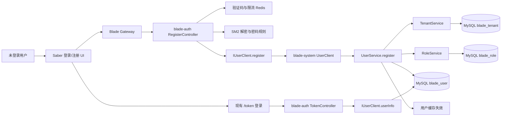
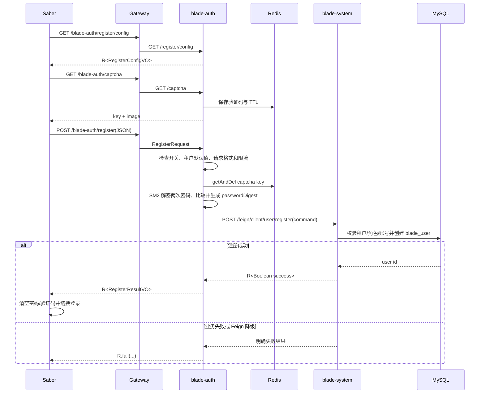
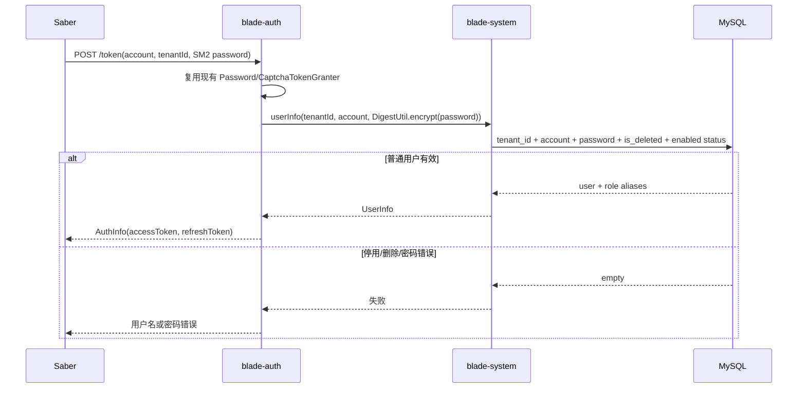

# 用户自助注册详细设计

## 1. 文档信息

| 项目 | 内容 |
| --- | --- |
| 设计编号 | DESIGN-REQ-2026-003 |
| 关联需求 | [REQ-2026-003 用户自助注册](../requirements/REQ-2026-003-user-registration.md) |
| 关联数据库设计 | [DB-REQ-2026-003 用户自助注册数据库设计](../database/DB-REQ-2026-003-user-registration.md) |
| 文档版本 | 0.5 |
| 文档状态 | 开发中 |
| 技术负责人 | 待指定 |
| 创建/更新日期 | 2026-09-15 |

## 2. 设计摘要

### 2.1 目标

1. 在现有 Saber 登录 UI 中增加匿名账号注册入口，支持用户加入已有租户并在注册成功后返回登录界面。
2. 由 `blade-auth` 负责公开入口、注册开关、租户默认值、图形验证码、密码解密、密码规则和频率限制；由 `blade-system` 负责租户、普通角色和用户数据的最终校验与落库。
3. 使用 `blade-user-api` 定义认证服务到用户服务的专用注册 Feign 契约，不复用管理端 `User` 实体入参，也不直接开放 `UserController` 的管理接口。
4. 复用现有 `blade_user` 保存用户，使用租户内账号唯一索引、业务预检查和异常转换保证重复注册及并发注册行为一致。
5. C 端注册用户固定使用目标租户普通用户角色，不创建虚拟部门和岗位，不因共用 Saber UI 获得管理端权限。

### 2.2 非目标

- 不实现新建租户、租户审批、租户试用或租户初始化申请。
- 不实现邮件验证码、短信验证码、手机号/邮箱注册和第三方身份验证。
- 不实现人工审核、待审核状态、注册申请表或审批通知。
- 不实现注册成功自动登录、找回密码、资料完善和多因素认证。
- 不改造现有第三方登录和 `register-guest` 绑定流程。
- 不创建注册申请表、验证码持久化表、用户分组表或 C 端虚拟部门。
- 不建设新的 C 端业务首页；继续由 Saber 现有角色菜单决定登录后的可用页面。
- 不建设注册专用审计或脱敏能力；遵守密码、令牌、密钥和完整敏感请求体不进入日志的通用安全约束。

### 2.3 关键决策

| 决策 | 结论 | 依据 |
| --- | --- | --- |
| 公开入口归属 | `blade-auth` 提供 `/register/config` 和 `/register` | 匿名入口、验证码和密码解密属于认证边界 |
| 用户落库归属 | `blade-system` 通过专用 Feign 注册 | 用户、租户、角色和唯一性均由系统服务最终控制 |
| 外部请求模型 | `RegisterRequest` JSON，不接收 `User` Entity | 禁止匿名用户提交角色、部门、状态和租户技术字段组合 |
| 密码传递 | 前端 SM2 加密；auth 解密并执行 `DigestUtil.encrypt`；Feign 只传摘要 | 避免明文密码跨服务传播，数据库沿用既有摘要格式 |
| 默认租户 | `blade.registration.default-tenant-id`，字符串默认值 `"000000"` | 对应 `blade_tenant.tenant_id` 而非主键 `id`，保留前导零和环境配置能力 |
| 注册角色 | 目标租户内 `role_alias=user` 且未逻辑删除的普通角色 | 不允许回退 `admin` 或 `administrator`，避免权限扩大 |
| 部门/岗位 | `dept_id`、`post_id` 使用现有无归属约定 `-1` | C 端用户不属于管理端组织树，现有第三方注册已使用该语义 |
| 用户状态 | 注册成功写入 `status=1`，登录查询拒绝 `status=0` | 注册后立即启用，停用用户不得登录 |
| 注册开关 | Nacos 全局开关，默认关闭；测试环境显式开启 | 不新增注册状态表，支持发布期间快速关闭 |
| 验证码 | 复用现有 Redis 图形验证码，一次性消费 | 首版不引入邮件或短信依赖 |
| 分布式事务 | 不使用 Seata | auth 无本地注册数据，system 只执行一个本地用户事务 |
| 数据库变更 | 增加 `blade_user(tenant_id, account)` 唯一索引，并将 `name` 扩至 32 位 | 账号最长 32 位且昵称为空时必须等于账号；不新增注册申请表 |

### 2.4 需求映射

| 需求/验收标准 | 设计落点 | 验证方式 |
| --- | --- | --- |
| REQ-001 / AC-001~003 | `RegisterController`、`RegistrationProperties`、Saber 注册入口、网关 `/register/**` 放行 | 开关开闭、直接调用和现有登录回归 |
| REQ-002 / AC-004~007 | auth 默认租户解析；system `ITenantService.getActiveByTenantId` 有效租户校验 | 默认租户、显式租户、无效租户和隔离测试 |
| REQ-003 / AC-008~012 | `RegisterRequest`、SM2 解密、密码规则和非敏感结果映射 | 合法、非法、密码传输和日志检查 |
| REQ-004 / AC-013~016 | `BladeRedis` 一次性验证码和注册限流服务 | 验证码错误/复用/过期、超限和无短信依赖测试 |
| REQ-005 / AC-017~021 | `IUserClient.register`、`UserServiceImpl.register`、普通角色及 `-1` 组织值 | 角色租户归属、失败回滚和无虚拟部门检查 |
| REQ-006 / AC-022~025 | `RegisterResultVO`、Saber 模式切换和密码清理 | 成功回登录、令牌不存在和失败重试测试 |
| REQ-007 / AC-026~030 | 数据库联合唯一索引、Service 预检查和唯一键异常转换 | 同租户、跨租户、逻辑删除和并发测试 |
| REQ-008 / AC-031~034 | 登录 SQL 状态条件、现有 Saber 动态菜单和服务端权限 | 普通用户登录、管理接口越权和停用账号测试 |

## 3. 改动范围

| 层次 | 模块/路径 | 主要改动 |
| --- | --- | --- |
| API 契约 | `blade-service-api/blade-user-api` | 新增注册 Feign Command、Result、错误语义和 `IUserClient.register` |
| 认证服务 | `blade-auth` | 新增注册 Controller、Properties、Service、验证码/限流/SM2 解密编排和公开响应 |
| 用户服务 | `blade-service/blade-system` | 新增 Feign 服务端注册实现、租户/角色/用户校验、注册事务和登录状态过滤；拆出租户开通编排服务 |
| 网关 | `blade-gateway`、`doc/nacos/blade.yaml` | 仅放行精确注册路径，继续拦截 Feign 内部路径 |
| 配置 | `doc/nacos/blade.yaml`、环境覆盖配置 | 注册开关、默认租户、密码规则、验证码和限流参数 |
| 数据库 | `doc/sql/blade` | 同步 `blade_user` 全量/升级唯一索引；执行前检查历史重复账号 |
| 调用方 | `D:/workspace/project/Saber/src/api/user.ts`、`src/page/login` | 注册 API、共用登录 UI、表单状态和成功回登录 |
| 权限数据 | 现有 `blade_role`、菜单和 API Scope | 不新增注册权限；注册用户必须使用租户内普通角色 |

不新增独立服务，不让 `blade-auth` 依赖 `blade-service/blade-system` 实现模块；认证服务只依赖 `blade-user-api`。

## 4. 架构与流程

### 4.1 架构图



公开请求只到达 `blade-auth`。`blade-system` 的注册 Feign 端点使用现有 `/feign/client/user` 内部前缀，不经过网关对外暴露；网关继续按现有 `InnerFilter` 规则阻止外部访问 Feign 保留路径。

### 4.2 注册配置与表单时序



### 4.3 登录兼容时序



### 4.4 主要流程

1. Saber 加载注册配置；注册关闭时不展示可提交的注册入口。
2. 用户填写可选租户、账号、昵称、密码、确认密码和图形验证码；Saber 将租户编号始终作为字符串保存和提交。
3. auth 将空租户解析为配置的 `000000`，显式租户去除首尾空白后仍按完整字符串处理，不转换为租户主键或数值。
4. auth 校验开关、格式、图形验证码、频率和密码，生成只包含摘要的注册命令。
5. system 查询有效租户和目标租户下未删除的 `user` 角色，拒绝任何管理角色回退。
6. system 使用本地事务创建启用用户，设置普通角色、无部门、无岗位，并清理用户缓存。
7. auth 将成功结果映射为不含用户 ID、密码和令牌的响应。
8. Saber 清理密码和验证码，切换到现有登录表单并保留租户编号和账号。

### 4.5 失败处理原则

- 注册开关、验证码、频率、输入和租户/角色业务失败均返回 `R.fail`，不写入用户数据。
- Feign Fallback 必须返回明确失败结果；auth 不得把 `R.fail` 或空数据转换为注册成功。
- 数据库唯一键冲突统一映射为账号已被使用，避免将并发冲突暴露为 SQL 错误。
- system 本地事务失败时回滚用户写入；auth 不使用分布式事务，也不在本地保存半成品注册记录。
- 注册响应失败但 system 已提交时，用户重试会命中账号唯一约束并收到账号已被使用，不能创建第二条账号记录。

## 5. 模块设计

### 5.1 `blade-user-api`

基础包继续使用 `org.springblade.system.user`，不让 API 模块依赖 `blade-system` 实现模块。

| 类型 | 名称 | 职责 |
| --- | --- | --- |
| Command | `UserRegisterCommand` | auth 传给 system 的已验证注册命令，只包含租户、账号、昵称和密码摘要 |
| Feign | `IUserClient` | 增加内部注册方法 `register` |
| Fallback | `IUserClientFallback` | 返回明确的注册服务不可用结果，不返回 `null` |

`UserRegisterCommand` 字段：

| 字段 | 类型 | 来源 | 说明 |
| --- | --- | --- | --- |
| `tenantId` | `String` | auth 解析并初步校验 | 已去除首尾空白的目标租户 |
| `account` | `String` | auth 校验 | 已规范化的登录账号 |
| `name` | `String` | auth 校验 | 昵称为空时已回填账号 |
| `passwordDigest` | `String` | auth 生成 | `DigestUtil.encrypt` 结果，不是明文或 SM2 密文 |

Command 不包含 `confirmPassword`、`captchaKey`、`captchaCode`、`roleId`、`deptId`、`postId`、`status`、`isDeleted` 和用户 ID。注册命令只能由认证服务构造，system 仍需重新校验租户和角色，不把 Feign 调用方视为最终业务授权者。

### 5.2 `blade-auth`

| 类型 | 名称 | 职责 |
| --- | --- | --- |
| Controller | `RegisterController` | 提供公开注册配置和注册提交 API，统一返回 `R<T>` |
| Service | `IRegisterService` / `RegisterServiceImpl` | 开关、租户默认值、输入、验证码、限流、SM2 解密、密码摘要和 Feign 编排 |
| Properties | `RegisterProperties` | 绑定 `blade.registration` 配置，不保存敏感值 |
| Request | `RegisterRequest` | HTTP JSON 请求模型，不使用 `User` Entity |
| VO | `RegisterConfigVO` | 返回页面所需最小配置和规则 |
| VO | `RegisterResultVO` | 返回已注册租户、账号和下一步动作，不返回用户 ID/密码/令牌 |
| Error | `RegisterResultCode` | 统一注册业务错误语义，避免复用登录失败文字表达所有场景 |

处理边界：

1. `RegisterController` 只接受 `@Valid @RequestBody RegisterRequest`，不从 query 参数或 `User` Entity 读取密码。
2. auth 先校验开关和请求结构，再解析租户；空租户使用 `RegisterProperties.defaultTenantId`，默认值为 `000000`。
3. auth 从请求中读取图形验证码，使用现有 `CacheNames.CAPTCHA_KEY` 和 Redis 一次性消费语义；验证码失败不调用 system。
4. auth 使用现有 `TokenUtil.decryptPassword` 解密 `password` 和 `confirmPassword`。任一解密失败、摘要校验失败或两次明文不一致时拒绝请求。
5. auth 在密码明文仍处于内存的最短范围内执行长度、复杂度和账号相同性校验，随后只生成 `passwordDigest` 传给 Feign；日志、异常和响应不得包含明文或密文。
6. auth 使用 Redis 原子计数和 TTL 实现按 IP、租户和账号的失败/提交频率限制；限流失败不调用 system。
7. Feign 返回 `R.fail`、空数据或异常时，auth 统一返回注册服务暂不可用，不能按成功处理。

`RegisterRequest` 字段：

| 字段 | 位置 | 必填 | 说明 |
| --- | --- | :---: | --- |
| `tenantId` | JSON body | 否 | `String`；对应 `blade_tenant.tenant_id`，空值使用默认租户 `000000`，不得数值化或丢失前导零 |
| `account` | JSON body | 是 | 4~32 个字符，注册账号 |
| `name` | JSON body | 否 | 昵称，空值回填账号 |
| `password` | JSON body | 是 | Saber 使用现有 SM2 公钥加密后的密码 |
| `confirmPassword` | JSON body | 是 | Saber 使用现有 SM2 公钥加密后的确认密码 |
| `captchaKey` | JSON body | 是 | 现有图形验证码标识 |
| `captchaCode` | JSON body | 是 | 用户输入的图形验证码 |

### 5.3 `blade-system`

| 类型 | 名称 | 职责 |
| --- | --- | --- |
| Feign 服务端 | `UserClient.register` | 实现 `IUserClient.register`，只接受内部 Command |
| Service | `IUserService.register` | 注册业务入口，建立本地事务边界 |
| ServiceImpl | `UserServiceImpl.register` | 租户、普通角色、账号唯一性和用户字段组装 |
| Mapper/XML | `UserMapper` / `UserMapper.xml` | 用户唯一性预检查和登录查询增加启用状态兼容条件 |
| 依赖服务 | `ITenantService`、`IRoleService` | 统一校验有效租户和普通角色归属 |
| 租户编排 | `ITenantProvisionService` / `TenantProvisionServiceImpl` | 承接租户新增/修改及默认角色、部门、岗位、管理员初始化，避免实体服务双向依赖 |
| 缓存 | `CacheUtil` | 用户写入成功后清理现有用户缓存 |

`UserServiceImpl.register` 不调用管理端 Controller，也不接受前端 `User` 对象。建议从现有 `doSubmit` 中抽出仅供注册使用的受控写入方法，避免把绕过 `TenantGuard` 的内部方法暴露为新的匿名调用点。

租户创建流程包含租户、角色、部门、岗位和管理员五类实体，属于应用编排职责。该流程从 `TenantServiceImpl` 移至 `TenantProvisionServiceImpl`，由编排服务单向依赖各实体 Service；`TenantServiceImpl` 不再依赖 `IUserService`。因此 `UserServiceImpl` 可以依赖 `ITenantService` 完成注册校验，而不会形成 Bean 循环。有效租户规则统一封装在 `ITenantService.getActiveByTenantId`，要求 `tenant_id` 匹配、`status=1`、`is_deleted=0`，用户服务不直接访问 `TenantMapper`。

租户管理入口 `/tenant/submit` 的 HTTP 契约保持不变，由 `TenantController` 调用 `ITenantProvisionService.saveTenant`。新增租户时编排服务在一个本地事务内创建默认角色、部门、岗位、租户和管理员；任一步骤失败均抛出异常回滚。修改已有租户时保存租户并清理 `SYS_CACHE`。租户查询、范围过滤和逻辑删除继续由 `ITenantService` 负责。

system 处理步骤：

1. 校验 Command 非空、租户编号非空、账号和密码摘要格式满足内部约束。
2. 查询 `blade_tenant`，要求 `tenant_id` 匹配、`status=1`、`is_deleted=0`。
3. 查询目标租户下 `role_alias=user` 且未逻辑删除的角色。查询结果必须唯一；缺失或多条均视为租户未配置注册角色。
4. 使用 `tenant_id + account` 做业务预检查；账号比较遵循数据库排序规则并同时保留逻辑删除记录的占用语义。
5. 组装 `User`：写入目标 `tenantId`、账号、昵称、密码摘要、普通角色、无部门、无岗位、`status=1` 和 `isDeleted=0`；不采用 Command 中不存在的受控字段。
6. 使用本地事务保存用户。数据库唯一键冲突转换为“当前账号已被使用”。
7. 提交后清理现有用户缓存；缓存清理失败不得回写密码或完整用户数据到日志。

### 5.4 用户字段和角色规则

| 用户字段 | 注册写入规则 |
| --- | --- |
| `tenantId` | 使用已验证目标租户，不接受客户端原值直接落库 |
| `account` | 使用 auth 规范化后的账号 |
| `name` | 昵称非空使用昵称，否则使用账号 |
| `realName` | 首版不要求真实姓名；Token 创建时以 `realName` 为空回退 `name`，避免把昵称误当实名 |
| `password` | 直接写入 auth 生成的摘要，system 不二次摘要 |
| `roleId` | 使用目标租户唯一有效 `user` 角色 ID |
| `deptId` | 使用无部门约定 `-1`，不创建虚拟部门 |
| `postId` | 使用无岗位约定 `-1` |
| `status` | 固定 `1` |
| `isDeleted` | 固定 `0` |
| `email`/`phone`/`avatar`/`birthday`/`sex`/`code` | 首版不写入 |

普通用户角色的菜单和 API Scope 由权限数据配置决定。注册流程不新增权限，不自动给 `user` 角色授权管理端菜单；管理员、角色、租户、部门和岗位接口仍由现有 `@PreAuth` 和服务端权限链保护。

### 5.5 核心规则

| 规则 | 实现位置 | 失败行为 |
| --- | --- | --- |
| 注册开关关闭不得注册 | `RegisterService` + Gateway | `REGISTRATION_DISABLED`，不调用 system |
| 空租户使用 `000000` | `RegisterProperties` + auth | 目标租户按默认值校验 |
| 显式租户必须已存在且有效 | system `ITenantService.getActiveByTenantId` | `TENANT_INVALID`，不创建租户 |
| 只允许目标租户普通 `user` 角色 | system `RoleService` | `REGISTRATION_ROLE_UNAVAILABLE`，不回退管理员 |
| C 端无部门无岗位 | system 用户组装 | 写入 `-1`，不写 `blade_dept`/`blade_post` |
| 账号租户内永久唯一 | Service 预检查 + 数据库唯一索引 | `ACCOUNT_DUPLICATE` |
| 注册后立即启用 | system 用户组装 | `status=1`，无待审核状态 |
| 禁止停用账号登录 | `UserMapper.getUser` | 按登录失败处理，不签发令牌 |
| 注册失败不留半成品 | system 本地事务 | 回滚用户写入和关联变化 |

## 6. HTTP API 契约

服务本地路径基于 `blade-auth` 根路径；经网关访问时使用 `/blade-auth` 服务前缀。注册接口和配置接口均为匿名公开接口，不能复用管理端 `/blade-system/user/submit`。

| 方法 | 路径 | 权限/身份 | 请求 | 响应 | 幂等/并发 |
| --- | --- | --- | --- | --- | --- |
| GET | `/register/config` | 未登录 | 无；可选客户端版本信息不参与业务判断 | `R<RegisterConfigVO>` | 只读，可缓存短时间 |
| GET | `/captcha` | 未登录 | 无 | 现有 `R<Kv>`，包含验证码 key 和图片 | Redis TTL；每个 key 一次消费 |
| POST | `/register` | 未登录 | JSON `RegisterRequest` | `R<RegisterResultVO>` | 无客户端幂等键；数据库唯一索引保证最终幂等 |

### 6.1 注册配置接口

`RegisterConfigVO` 只返回页面需要的非敏感配置：

| 字段 | 类型 | 说明 |
| --- | --- | --- |
| `enabled` | `Boolean` | 是否允许注册 |
| `defaultTenantId` | `String` | 默认租户，默认 `000000` |
| `captchaEnabled` | `Boolean` | 首版固定为 true |
| `accountMinLength` / `accountMaxLength` | `Integer` | 账号规则，默认 4/32 |
| `passwordMinLength` / `passwordMaxLength` | `Integer` | 密码规则，默认 8/64 |

关闭注册时接口仍可返回 `enabled=false`，不得返回角色 ID、数据库信息、租户列表、Redis Key 或其他内部配置。

### 6.2 注册提交接口

请求使用 `Content-Type: application/json`，不得使用 query 参数承载密码。成功结果：

```json
{
  "tenantId": "000000",
  "account": "demo_user",
  "nextAction": "LOGIN"
}
```

`RegisterResultVO` 不包含用户主键、角色 ID、部门 ID、密码摘要、验证码和任何令牌。业务错误沿用项目 `R<T>` 响应约定，HTTP 层通常返回 200 并通过 `success=false` 表示业务失败；请求体结构错误由统一参数校验处理，网关认证错误只适用于非公开接口。

### 6.3 业务错误语义

| 错误标识 | 场景 | 调用方处理 |
| --- | --- | --- |
| `REGISTRATION_DISABLED` | 注册开关关闭 | 返回登录模式，不自动重试 |
| `REGISTER_REQUEST_INVALID` | 结构、字段或密码规则不合法 | 显示字段错误，刷新验证码后重试 |
| `CAPTCHA_INVALID` | 验证码错误、过期或重复使用 | 清空验证码并重新获取 |
| `REGISTER_RATE_LIMITED` | IP、租户或账号超过频率限制 | 等待窗口结束后再试 |
| `TENANT_INVALID` | 租户不存在、停用或删除 | 提示租户不可用，不创建数据 |
| `REGISTRATION_ROLE_UNAVAILABLE` | 目标租户没有唯一有效普通角色 | 提示联系管理员，不回退管理角色 |
| `ACCOUNT_DUPLICATE` | 租户内账号已存在或逻辑删除占用 | 修改账号；不要盲目重复提交 |
| `REGISTER_SERVICE_UNAVAILABLE` | Feign 超时、Fallback 或 system 不可用 | 提示稍后重试，不视为成功 |
| `REGISTER_FAILED` | 未分类的注册失败 | 统一错误反馈，不暴露内部异常 |

兼容策略：新增 `/register/**` 接口不修改现有 `/token`、`/captcha`、OAuth 和 `register-guest` 的请求语义；新增 Feign 方法要求 auth、API 和 system 版本按发布顺序升级。

## 7. Feign 契约

| 项目 | 内容 |
| --- | --- |
| API 模块 | `blade-service-api/blade-user-api` |
| 服务名 | `AppConstant.APPLICATION_SYSTEM_NAME`（`blade-system`） |
| `API_PREFIX` | `/feign/client/user` |
| Java 签名 | `R<Boolean> register(@RequestBody UserRegisterCommand command)` |
| HTTP | `POST /feign/client/user/register`，仅服务间直连使用 |
| Fallback | `IUserClientFallback.register` 返回 `R.fail("用户注册服务不可用")`，不返回 `null` |
| Sentinel/超时 | 沿用现有 Feign/Sentinel 全局配置；不为注册引入独立长超时 |
| 调用方处理 | auth 必须同时判断 `result != null`、`result.isSuccess()` 和 `result.getData()==true` |

Feign 约束：

1. `UserRegisterCommand` 只在 API 模块定义，auth 和 system 依赖 `blade-user-api`，禁止 auth 依赖 system 实现模块。
2. `/feign/client/user/register` 不加入网关公开放行列表；外部请求命中 Feign 保留路径时继续被 `InnerFilter` 拦截。
3. 该调用没有最终用户令牌，沿用现有 auth 到 system 的服务间直连方式；system 以 Command 字段为业务输入，但仍自行校验租户、角色和账号，不信任调用方传入的管理字段。
4. Fallback、超时和远端业务失败均向 auth 传递明确失败；auth 不将降级结果转换为注册成功。
5. Feign Command 的 `passwordDigest` 仅允许为认证服务生成的现有摘要格式，system 不接受明文密码、SM2 密文或客户端直接提交的 User Entity。

## 8. 数据设计

- 数据库设计：[DB-REQ-2026-003 用户自助注册数据库设计](../database/DB-REQ-2026-003-user-registration.md)。
- 数据实体：复用 `blade-service-api/blade-user-api` 中的 `User`，继承 `TenantEntity`，表为 `blade_user`。
- 数据变更：增加 `uk_blade_user_tenant_account(tenant_id, account)` 联合唯一索引，并将 `name` 从 `VARCHAR(20)` 扩至 `VARCHAR(32)` 以容纳默认昵称；不新增注册申请表、验证码表、租户字段、用户分组表或虚拟部门表。
- 用户字段：`tenant_id` 使用 auth 解析并经 system 验证的目标租户；`role_id` 使用目标租户普通 `user` 角色；`dept_id`、`post_id` 使用 `-1` 无归属语义；`status=1`、`is_deleted=0`。
- 密码字段：`blade_user.password` 只保存 `DigestUtil.encrypt` 摘要；auth 解密和摘要后传递，system 不二次摘要。
- 登录状态：`UserMapper.getUser` 增加启用条件 `COALESCE(status, 1) = 1`，兼容历史 `status` 为空的存量用户；所有用户查询仍要求 `is_deleted=0`。新注册用户始终写入 `status=1`。
- 租户表配置：不新增 `blade.tenant.tables` 项；`blade_user` 已是现有用户租户实体，沿用现有租户插件/服务处理。
- 角色/部门：不新增角色或部门表结构。目标租户必须预先存在未删除的 `role_alias=user` 普通角色；缺少或多条匹配记录均拒绝注册。
- MySQL 脚本：已同步 `doc/sql/blade/blade.mysql.all.create.sql` 和 `doc/sql/blade/blade.mysql.upgrade.5.0.1.user-registration.sql`，真实升级前仍须按 DB 文档执行重复账号检查。

## 9. 事务、并发与缓存

| 主题 | 设计 |
| --- | --- |
| auth 本地事务 | 不涉及；auth 不写 MySQL 注册数据，仅消费验证码、计数限流并调用 system |
| system 本地事务 | `UserServiceImpl.register` 使用 `@Transactional(rollbackFor = Exception.class)`，用户组装、保存和必要的关联校验在本地事务内完成 |
| 跨服务事务 | 不涉及；auth 到 system 的 Feign 调用不使用 Seata。system 只对自身用户库形成原子写入 |
| 并发控制 | Service 先做账号存在性预检查，数据库联合唯一索引作为最终并发约束；唯一键冲突转换为 `ACCOUNT_DUPLICATE` |
| 幂等 | 不新增客户端幂等键；相同租户和账号重复提交返回账号已被使用，最多保存一条用户记录 |
| 角色一致性 | 保存前校验普通角色属于目标租户且未删除；不在注册期间创建角色 |
| 缓存 | 用户保存成功后清理现有 `CacheConstant.USER_CACHE`；缓存清理失败不得回滚已提交用户，也不得记录密码，下一次查询应能回源刷新 |
| 验证码 | 使用 `bladeRedis.getAndDel(CacheNames.CAPTCHA_KEY + captchaKey)` 一次性消费；校验失败也消耗当前验证码 |
| 注册限流 | Redis 原子计数 + TTL，按 IP、租户和账号维度组合 Key；限流检查在 Feign 前执行 |

事务流程：

1. auth 完成所有不依赖用户库的校验后调用 system。
2. system 查询租户和普通角色，执行账号预检查并构造用户实体。
3. system 保存用户；数据库唯一键负责竞争请求的最终裁决。
4. system 返回成功后 auth 返回注册结果；返回失败时 auth 不签发令牌。
5. 若 system 已提交但 auth 在响应阶段失败，客户端重试不会创建第二个用户，而是收到账号已被使用。

## 10. 认证、租户与数据权限

- 认证方式：注册配置、验证码和注册提交均为未登录公开接口；注册完成后仍复用现有 `/token` JWT 登录链路。
- 网关放行：在现有路径匹配约定下仅增加 `/register/**`，不放行 `/blade-system/user/**` 和 `/feign/**`；公开路径必须与管理接口保持最小范围。
- 租户来源：请求 `tenantId` 为空时使用 `RegisterProperties.defaultTenantId`，默认 `000000`；非空时去除首尾空白后交由 system 校验。注册不采用客户端 `Tenant-Id` Header 覆盖请求体中的目标租户。
- 租户校验：system 查询 `blade_tenant`，要求租户编号匹配、`status=1`、`is_deleted=0`；注册流程不得创建、恢复或修改租户。
- 角色来源：system 在目标租户内查询未删除 `role_alias=user` 角色，要求结果唯一；角色 ID、部门 ID、岗位 ID、状态和逻辑删除标识均由服务端生成。
- 部门和岗位：C 端用户不属于管理端组织树，注册写入无部门、无岗位的 `-1` 约定；不新增或挂载虚拟部门。若后续业务要求组织分组，另建需求。
- 权限方式：注册本身不要求角色权限，但普通用户登录后由现有角色、菜单和 API Scope 控制。普通角色不能绑定用户、角色、租户、部门、岗位等管理操作。
- 数据权限：无部门不等于全租户权限；C 端业务接口按具体资源和租户规则校验。注册设计不通过 `dept_id=-1` 赋予任何 DataScope 放行。
- 登录状态：`status=0` 或 `is_deleted=1` 的用户不能登录；`status IS NULL` 仅为兼容历史存量，按启用处理，后续可单独治理为空状态数据。
- 敏感数据：注册请求体不进入业务日志；密码、确认密码、SM2 密文、摘要、验证码和令牌不进入响应、数据库日志或普通缓存。

## 11. 异常与日志

| 场景 | 处理 | 对外结果 | 数据影响 |
| --- | --- | --- | --- |
| 注册开关关闭 | auth 在验证码和 Feign 前拒绝 | `REGISTRATION_DISABLED` | 不改变 |
| 请求结构或字段非法 | Jakarta Validation + 业务校验 | `REGISTER_REQUEST_INVALID` | 不改变 |
| SM2 解密失败或两次密码不一致 | auth 拒绝并消耗验证码 | `REGISTER_REQUEST_INVALID` | 不改变 |
| 验证码错误、过期或重复使用 | Redis 一次性校验失败 | `CAPTCHA_INVALID` | 不改变 |
| 注册请求超限 | Redis 限流拒绝 | `REGISTER_RATE_LIMITED` | 不改变 |
| 租户不存在、停用或删除 | system 查询失败 | `TENANT_INVALID` | 不改变 |
| 普通角色缺失或重复 | system 角色校验失败 | `REGISTRATION_ROLE_UNAVAILABLE` | 不改变 |
| 数据库唯一键冲突 | 捕获并识别 `uk_blade_user_tenant_account` | `ACCOUNT_DUPLICATE` | 不新增重复用户 |
| Feign 超时或 Fallback | auth 识别远端失败 | `REGISTER_SERVICE_UNAVAILABLE` | system 未确认成功时不由 auth 写数据 |
| 数据库或未知异常 | system 回滚本地事务并记录异常 | `REGISTER_FAILED` | 回滚本地注册写入 |

日志要求：

- 可记录 requestId、tenantId、规范化账号的必要业务标识、结果码和耗时，账号日志是否需要脱敏由现有日志策略决定；不得记录密码或其摘要。
- Feign 日志不得打印完整 Request Body；必要时仅记录调用结果、服务名、requestId 和耗时。
- 数据库异常保留服务端堆栈供排查，但对外只返回稳定业务错误，不输出 SQL、连接串、表结构或密钥。
- 注册开关变更、验证码内容、Redis Key 和令牌不写普通业务日志。

## 12. 配置、发布与回滚

### 12.1 Nacos 配置

建议在公共 `blade.yaml` 增加非敏感配置，环境配置覆盖测试开关：

```yaml
blade:
  registration:
    enabled: false
    default-tenant-id: "000000"
    captcha-enabled: true
    account-min-length: 4
    account-max-length: 32
    password-min-length: 8
    password-max-length: 64
    rate-limit:
      ip-window-seconds: 60
      ip-max-attempts: 10
      tenant-window-seconds: 60
      tenant-max-attempts: 30
      account-window-seconds: 600
      account-max-attempts: 3
```

配置说明：

- `enabled` 生产默认 `false`；测试环境待 API、system、gateway 和 Saber 均发布后显式设置为 `true`。
- `default-tenant-id` 默认固定为 `000000`，允许环境配置覆盖，但不允许前端覆盖默认规则。
- `captcha-enabled` 首版必须为 `true`；如果被错误关闭，auth 应拒绝启动注册能力或直接拒绝注册，不得形成无验证码公开注册。
- 普通角色别名固定为 `user`，不作为可由运营人员随意修改的公开配置，避免配置错误导致管理员角色回退。
- 所有阈值为设计建议，最终值在详细设计评审和压测/安全验证后确认；配置不包含密钥、密码、Token 或连接串。

### 12.2 网关与服务配置

- `blade-gateway` 的 `AuthProvider` 增加精确 `/register/**` 默认放行；或者在 `blade.secure.skip-url` 中配置同等精度路径，二者只保留一个正式来源。
- `/captcha/**` 已在现有默认放行列表中，继续复用；不得放行 `/user/**` 或宽泛的 `/system/**`。
- `blade-system` 不需要新增 `blade.tenant.tables` 配置；用户表继续沿用现有租户实体处理。
- `blade-auth`、`blade-system` 使用同一套注册规则版本；若配置动态刷新，规则变更只影响新注册，不修改已注册用户。

### 12.3 发布顺序

1. 在真实数据库执行 DB 文档中的重复账号检查，确认可以增加唯一索引。
2. 执行 `blade_user` 唯一索引升级并校验结构；全量脚本同步该索引。
3. 发布新版 `blade-user-api`，确认 auth 和 system 编译使用同一契约版本。
4. 发布 `blade-system`，验证 Feign 注册服务、普通角色校验、用户写入和登录状态条件。
5. 发布 `blade-auth`，确认配置加载、验证码、密码解密、限流和 Feign Fallback。
6. 发布 gateway，确认注册路径公开、Feign 路径仍被拦截、管理接口仍需令牌。
7. 发布 Saber，共用登录 UI 增加注册模式；注册开关保持关闭进行冒烟检查。
8. 确认目标租户存在普通 `user` 角色后，在测试环境开启注册开关，执行完整验收。

### 12.4 兼容与回滚

- API 兼容：新增 Feign 方法和注册 HTTP 路径不改变现有登录、OAuth、管理用户和第三方注册接口；旧版 system 在新版 auth 调用注册方法期间会触发 Fallback，因此必须在开关关闭状态下完成版本切换。
- 数据库兼容：唯一索引是对现有账号写入的收紧，旧版管理端代码仍可在索引存在时运行；优先保留索引，不随应用回滚删除。
- 配置回滚：首先将 `blade.registration.enabled` 设为 `false`，确认动态配置生效，再回滚 Saber、gateway、auth 和 system。
- 服务回滚：按 Saber -> gateway -> auth -> system -> API 的逆序回滚；回滚期间不开放注册。
- 数据库回滚：仅在确认无注册业务数据、已备份且评估过重复风险时移除唯一索引；不自动删除注册用户和人工处理的历史数据。
- 不可逆事项：已创建的用户和已消耗的验证码不因页面回退自动撤销；账号唯一约束拒绝的重复请求不产生待恢复记录。

## 13. 验证计划

### 13.1 编译与静态检查

- 实现后执行：`mvn clean package -DskipTests -pl blade-service/blade-system -am`，并单独确认 `blade-auth` 与 `blade-user-api` 可编译。
- 检查 `blade-auth` 只依赖 `blade-user-api`，不依赖 `blade-service/blade-system` 实现模块。
- 检查 `IUserClient.register` 的路径、请求模型、Fallback 和 `UserClient` 实现一致；Fallback 不返回 `null`。
- 检查注册 Controller 不接受 `User` Entity，不从 query 参数接收密码，注册入口没有管理端 `@PreAuth` 依赖。
- 检查 auth/system/gateway 的配置前缀、公开路径和默认值一致，生产默认关闭。
- 检查 `blade_user` 全量/升级脚本、唯一索引、历史重复查询和 DB 文档一致。
- 检查 `UserMapper.getUser` 的 `tenant_id`、`is_deleted` 和兼容状态条件，确保停用用户不能登录。
- 检查依赖方向为 `TenantProvisionServiceImpl -> IUserService -> ITenantService`，且 `TenantServiceImpl` 不依赖 `IUserService` 或租户开通编排服务。
- 检查 `SystemApplication` 启动时不存在租户服务与用户服务的循环依赖，且未开启 `spring.main.allow-circular-references`。
- 检查 Saber 注册请求、配置回填和成功结果中的 `tenantId` 均为字符串，`000000` 前导零保持不变；注册成功后清空密码和验证码，并回到现有登录表单。

### 13.2 用户执行测试范围

- HTTP：配置查询、注册开关、默认租户、显式租户、参数错误、验证码、限流、重复账号和成功回登录。
- Feign：system 正常响应、业务失败、超时/Fallback，auth 不误判成功。
- 数据库：同租户同账号、大小写冲突、跨租户同名、逻辑删除账号、唯一键冲突和历史数据迁移。
- 角色：普通角色存在、缺失、重复、跨租户角色，确认不回退管理员。
- C 端组织：用户写入无部门、无岗位；不新增虚拟部门；普通用户登录不因 `-1` 失败。
- 认证：注册用户可用账号密码登录；停用或删除用户不能登录；不自动签发注册 Token。
- 权限：普通用户共用 Saber UI 但不能查看或调用管理菜单、按钮和接口。
- 安全：未登录公开入口、伪造角色/部门/岗位、伪造租户、密码日志、请求体日志、注册限流和 Feign 外部访问拦截。
- 发布：配置动态刷新、开关紧急关闭、API/system 版本并行和回滚后现有登录兼容。

已使用 JDK 21 执行 auth/system 关联模块 Maven 打包，已执行 Saber 类型检查和生产构建；数据库、Nacos、Redis、微服务、权限及真实接口测试未执行，需按关联测试文档归档结果。

## 14. 风险、评审与变更

| 编号 | 风险/问题 | 负责人 | 状态/结论 |
| --- | --- | --- | --- |
| DESIGN-ITEM-001 | 各已有租户是否均配置唯一有效的普通 `user` 角色尚未核对 | 租户管理员 | 开放；缺少角色的租户不得注册 |
| DESIGN-ITEM-002 | 现有 `blade_user` 是否存在同租户重复账号或空值异常尚未在真实数据库检查 | 数据库负责人 | 开放；增加唯一索引前必须取得 SQL 检查证据 |
| DESIGN-ITEM-003 | `dept_id=-1`、`post_id=-1` 在所有 C 端业务接口中的兼容性尚未验证 | 技术负责人 | 开放；注册本身不创建虚拟部门 |
| DESIGN-ITEM-004 | 账号和密码规则仍需产品评审最终确认 | 产品负责人 | 当前按账号 4~32、密码 8~64 且含字母和数字设计 |
| DESIGN-ITEM-005 | 公开注册限流阈值需结合测试环境并发和误伤情况调整 | 安全/运维负责人 | 当前为设计建议值，待验证 |
| DESIGN-ITEM-006 | 普通 `user` 角色现有菜单权限可能不满足 C 端首页需求 | 产品/权限负责人 | 本需求不新建 C 端业务页面，先验证角色权限边界 |
| DESIGN-ITEM-007 | 租户初始化原本位于 `TenantServiceImpl`，与用户注册校验形成实体 Service 双向依赖 | 技术负责人 | 已于 2026-09-15 拆分 `TenantProvisionServiceImpl`，JDK 21 模块打包通过，待启动冒烟验证 |

| 评审领域 | 结论 | 评审人 | 日期 |
| --- | --- | --- | --- |
| 后端/API | 待评审 | 待指定 | 待指定 |
| 数据库 | 待评审 | 待指定 | 待指定 |
| 安全/租户 | 待评审 | 待指定 | 待指定 |
| Saber/UI | 待评审 | 待指定 | 待指定 |
| 测试可行性 | 待评审 | 待指定 | 待指定 |

| 日期 | 版本 | 变更内容 | 修改人 |
| --- | --- | --- | --- |
| 2026-09-14 | 0.1 | 创建用户自助注册详细设计，明确 auth 公开入口、user-api Feign、system 用户落库、普通角色、无部门岗位、唯一索引、配置、发布回滚和验证边界 | Codex |
| 2026-09-14 | 0.2 | 完成注册契约、auth/system 实现、网关放行、Nacos 配置、数据库脚本和 Saber 共用登录 UI；修正昵称字段容量；JDK 21 模块打包、Saber 类型检查和生产构建通过，真实环境验收待执行 | Codex |
| 2026-09-15 | 0.3 | 修正 system 注册租户校验的依赖方向，使用 `TenantMapper` 替代 `ITenantService`，消除 `TenantServiceImpl` 与 `UserServiceImpl` 的 Bean 循环，并补充启动冒烟验证要求 | Codex |
| 2026-09-15 | 0.4 | 将租户初始化拆分至 `TenantProvisionServiceImpl` 应用编排服务，`TenantServiceImpl` 回归租户实体职责，注册恢复通过 `ITenantService` 校验并统一有效租户规则；JDK 21 关联模块打包通过 | Codex |
| 2026-09-15 | 0.5 | 明确注册 `tenantId` 映射 `blade_tenant.tenant_id` 字符串字段；Saber API、配置回填、表单状态和提交均保留字符串及前导零 | Codex |
