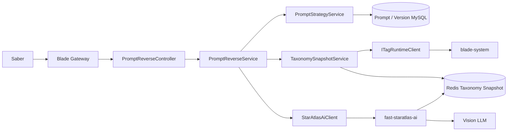
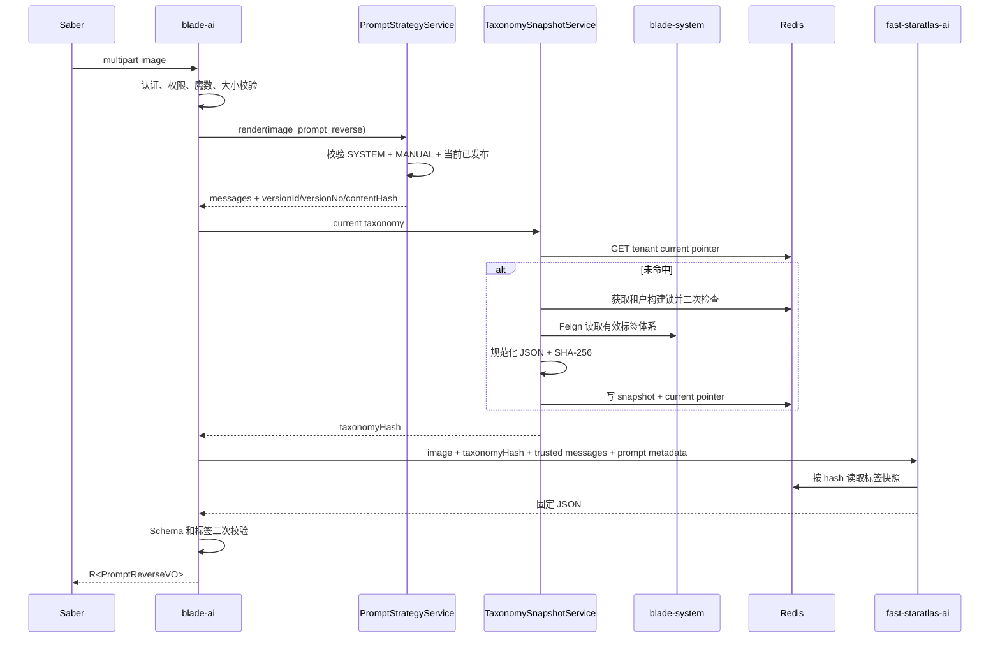

# 图片提示词反推与标签化分析详细设计

## 1. 文档信息

| 项目 | 内容 |
| --- | --- |
| 设计编号 | DESIGN-REQ-2026-004 |
| 关联需求 | [REQ-2026-004 图片提示词反推与标签化分析](../requirements/REQ-2026-004-image-prompt-reverse.md) |
| 关联数据库设计 | 不涉及（复用现有提示词、标签和权限表；Redis 仅保存标签快照） |
| 关联测试文档 | [TEST-REQ-2026-004 图片提示词反推与标签化分析测试文档](../test/TEST-REQ-2026-004-image-prompt-reverse.md) |
| 文档版本 | 0.2 |
| 文档状态 | 开发完成，待验收 |
| 技术负责人 | 待指定 |
| 创建/更新日期 | 2026-09-17 |

## 2. 设计摘要

### 2.1 目标

1. 在 `blade-ai` 增加单图提示词反推入口，复用 SpringBlade 认证、租户和 API Scope。
2. 使用现有提示词管理的 `SYSTEM + MANUAL` 当前发布版本作为分析策略，不建设第二套提示词发布或 Redis 当前指针。
3. 从 `blade-system` 取得当前租户有效标签体系，生成规范化 Redis 快照，并由 fast 按 `taxonomyHash` 读取。
4. 调用 `fast-staratlas-ai` 完成视觉分析，二次校验标签和固定 JSON 后返回统一 `R<PromptReverseVO>`。
5. 保证普通 OWN 用户不能管理保留系统策略，分析结果可通过提示词版本和标签快照追溯。

### 2.2 非目标

- 不在 SpringBlade 内调用视觉模型，不引入 Spring AI。
- 不保存上传图片、分析历史、模型响应或最终提示词。
- 不为分析提示词增加 Redis 内容快照、当前指针或缓存失效逻辑。
- 不新增业务表、对象存储、任务队列、向量库和批量分析能力。
- 不修改现有普通提示词的 OWN/ALL、MANUAL/AUTO 基础语义。

### 2.3 关键决策

| 决策 | 结论 | 依据 |
| --- | --- | --- |
| 分析策略身份 | `promptCode=image_prompt_reverse` | 稳定编码供运行时读取和运维核对 |
| 提示词类型 | `SYSTEM` | 该资源是平台分析策略，不是用户生成结果 |
| 发布方式 | `MANUAL` | 策略变更影响租户全部反推请求，需评测后手工发布 |
| 提示词事实来源 | MySQL 当前发布版本 | 现有发布、停用和回滚即时生效，不引入双写 |
| 策略传递 | `blade-ai` 渲染后随请求传给 fast | 内容体积小，避免 fast 访问提示词数据库或重复缓存 |
| 策略追溯 | `versionId + versionNo + contentHash` | versionId 表示版本身份，contentHash 只核对正文完整性 |
| 标签传递 | Redis 不可变快照 + `taxonomyHash` | 标签规模可增长，避免每次跨服务传输完整体系 |
| 系统策略管理 | 独立权限 + DataScope ALL | 防止普通 OWN 用户修改租户共享运行策略 |
| 外部调用 | Spring `RestClient` + multipart | fast 不是 Nacos 内部服务，不建立 SpringBlade Feign 契约 |

### 2.4 需求映射

| 需求/验收标准 | 设计落点 | 验证方式 |
| --- | --- | --- |
| REQ-001 / AC-001~003 | `PromptReverseController`、`ImageUploadValidator` | 文件、认证、权限接口测试 |
| REQ-002 / AC-004~006 | `TagRuntimeClient`、`TaxonomySnapshotService`、Redis 锁 | 快照命中、并发构建、失效测试 |
| REQ-003 / AC-007~009 | fast 固定 Schema + `PromptReverseResultValidator` | 未知标签、跨分类和数量上限测试 |
| REQ-004 / AC-010~012 | `PromptReverseVO` 及嵌套 VO | JSON 契约和敏感字段检查 |
| REQ-005 / AC-013~015 | `StarAtlasAiClient`、错误映射、日志边界 | 超时、降级和日志测试 |
| REQ-006 / AC-016~020 | `PromptSystemPolicyGuard`、`PromptStrategyService`、`PromptRenderVO.contentHash` | SYSTEM/MANUAL、OWN/ALL、发布和回滚测试 |

## 3. 改动范围

| 层次 | 模块/路径 | 主要改动 |
| --- | --- | --- |
| AI API 契约 | `blade-service-api/blade-ai-api` | 反推结果 VO、权限/错误码；`PromptRenderVO` 增加 `contentHash` |
| System API 契约 | `blade-service-api/blade-system-api` | 有效标签体系 VO、`ITagRuntimeClient` 和非空失败 Fallback |
| AI 服务 | `blade-service/blade-ai` | Controller、反推编排、策略读取、快照服务、fast HTTP 客户端、结果校验 |
| System 服务 | `blade-service/blade-system` | 标签运行时 Feign 服务端、标签变更后的快照指针失效 |
| 提示词管理 | `blade-service/blade-ai` | 保留系统策略保护、SYSTEM/MANUAL 校验、ALL 范围校验 |
| Redis | 现有 Redis | 标签当前指针、不可变快照和租户级构建锁 |
| 配置 | `doc/nacos`、`blade-ai/application.yml` | fast 地址/密钥/超时、图片上限、Redis TTL/锁时长 |
| SQL 数据 | `doc/sql/blade` | 新增 API Scope/按钮权限和系统策略管理权限；不变更表结构 |
| 外部调用方 | fast-staratlas-ai、Saber | 同步 multipart 请求和固定 JSON 契约 |
| 图像解码 | `imageio-webp` | 与 JDK ImageIO 配合，对 PNG/JPEG/WebP 执行真实解码和尺寸核对 |

## 4. 架构与流程

### 4.1 架构图

### 4.2 图片反推时序

### 4.3 标签快照失效流程

1. 标签分类或标签的创建、编辑、状态、移动和删除事务完成。
2. 事务提交后删除 `ai:prompt-reverse:taxonomy:tenant:{tenantId}:current`。
3. 不删除旧 hash 快照，避免进行中请求失去引用；旧快照按 TTL 自然回收。
4. 下一次图片反推在租户锁内重新读取有效标签并生成新 hash。
5. 标签事务回滚时不执行失效，避免未提交数据导致无意义重建。

### 4.4 系统分析策略治理

1. 每个租户在开放反推前创建 `image_prompt_reverse`，类型 `SYSTEM`、发布方式 `MANUAL`。
2. 固定指令描述角色、分析步骤、标签选择规则、防编造规则和 JSON 输出约束。
3. 用户模板只包含服务端控制的小型变量，例如 `schemaVersion`、`outputLanguage` 和 `targetEngine`；图片和标签体系不作为模板变量传入。
4. 管理操作由 `PromptSystemPolicyGuard` 识别 `SYSTEM` 类型和保留编码，要求 `ai:prompt:system-manage` 且 DataScope 为 ALL。
5. 图片反推运行时不应用管理 DataScope；按当前租户和稳定编码读取当前发布版本，与现有 Feign render 语义一致。
6. 发布、停用和回滚继续以现有 MySQL 事务为准；不写分析提示词 Redis 当前指针。

## 5. 模块设计

### 5.1 `blade-ai-api`

| 类型 | 名称 | 职责 |
| --- | --- | --- |
| VO | `PromptReverseVO` | 固定 Schema 根结果 |
| VO | `PromptAnalysisVO` | 摘要、主体、场景、细节和不确定项 |
| VO | `PromptLabelCategoryVO` | 分类编码、名称和命中标签 |
| VO | `PromptLabelSelectionVO` | 标签编码、名称、置信度和理由 |
| VO | `GeneratedPromptVO` | 正向、负向、语言和分段 |
| VO | `PromptStrategyVersionVO` | code、type、versionId、versionNo、contentHash |
| VO | `PromptWarningVO` | 警告编码和文案 |
| 常量 | `PromptPermission.REVERSE` | `ai:prompt:reverse` |
| 常量 | `PromptPermission.SYSTEM_MANAGE` | `ai:prompt:system-manage` |
| 枚举 | `PromptReverseResultCode` | 文件、标签、策略、fast 和输出校验错误 |
| 现有 VO | `PromptRenderVO` | 增加 `contentHash`；预览时为空，运行时取当前版本 hash |

### 5.2 `blade-system-api`

| 类型 | 名称 | 职责 |
| --- | --- | --- |
| VO | `TagTaxonomyVO` | 当前租户全部有效分类 |
| VO | `TagTaxonomyCategoryVO` | categoryCode/name、selectionMode、maxSelectCount、sort、tags |
| VO | `TagTaxonomyItemVO` | tagCode/name、description、parentCode/path、depth、sort |
| Feign | `ITagRuntimeClient` | 返回当前租户有效标签体系，不接收 tenantId |
| Fallback | `ITagRuntimeClientFallback` | 返回 `R.fail(TAG_RUNTIME_UNAVAILABLE)`，禁止返回 null |

### 5.3 `blade-ai` 服务实现

| 类型 | 名称 | 职责 |
| --- | --- | --- |
| Controller | `PromptReverseController` | `/prompt/reverse` multipart 入口、权限和 `R<T>` |
| Service | `PromptReverseService` | 策略、标签、fast 调用和结果校验编排 |
| Service | `PromptStrategyService` | 按保留编码读取/渲染当前版本并返回版本摘要 |
| Component | `PromptSystemPolicyGuard` | SYSTEM、MANUAL、保留编码、SYSTEM_MANAGE 和 ALL 范围校验 |
| Component | `ImageUploadValidator` | 魔数、类型、大小、像素和空文件校验 |
| Component | `TaxonomySnapshotService` | Redis 快照读取、构建、锁和 hash |
| Client | `StarAtlasAiClient` | multipart 调用 fast、API Key、超时和错误映射 |
| Validator | `PromptReverseResultValidator` | Schema、标签存在性、分类归属和选择数量二次校验 |

### 5.4 `blade-system` 服务实现

| 类型 | 名称 | 职责 |
| --- | --- | --- |
| Feign 服务端 | `TagRuntimeClient` | 隐藏的内部标签体系接口 |
| Service | `ITagService.effectiveTaxonomy` | 返回启用分类下路径有效标签 |
| Component | `TagTaxonomyCacheInvalidator` | 标签事务提交后删除租户 current 指针 |

### 5.5 核心规则

| 规则 | 实现位置 | 失败行为 |
| --- | --- | --- |
| 单图且格式合法 | Controller + `ImageUploadValidator` | `PROMPT_REVERSE_IMAGE_INVALID` |
| 标签快照唯一规范化 | `TaxonomySnapshotService` | hash 不一致拒绝使用 |
| 快照构建防击穿 | Redis token 锁 + 二次检查 | 等待后重读或 `TAXONOMY_UNAVAILABLE` |
| 系统策略固定配置 | `PromptStrategyService` | 非 SYSTEM/MANUAL 返回策略错误 |
| 系统策略管理隔离 | `PromptSystemPolicyGuard` | OWN 或缺少权限时拒绝 |
| 运行时只读当前发布版 | 现有 Prompt Mapper/Render Service | 未发布/停用失败 |
| 标签结果受控 | `PromptReverseResultValidator` | 未知、跨分类、超限均失败 |
| JSON Schema 兼容 | Spring VO + fast Pydantic | 不兼容返回输出错误 |

## 6. HTTP API 契约

| 方法 | 本地路径 | 权限/身份 | 请求 | 响应 | 幂等/并发 |
| --- | --- | --- | --- | --- | --- |
| POST | `/prompt/reverse` | `ai:prompt:reverse`、当前租户 | multipart `image` | `R<PromptReverseVO>` | 无写库副作用；重复请求会重复调用模型 |

经网关访问路径为 `/blade-ai/prompt/reverse`。

请求约束：

- `image` 必填且只能有一个文件。
- 首期允许 PNG、JPEG、WebP；服务端按魔数和解码结果校验。
- 文件大小上限统一使用当前环境生效的 Spring `spring.servlet.multipart.max-file-size`，不设置反推业务专属上限；像素总量另设上限防止解压炸弹。
- 不接受 tenantId、promptCode、prompt 正文、taxonomyHash、模型档案和 fast 地址等客户端字段。

响应根字段：`schemaVersion`、`taxonomyHash`、`analysisPrompt`、`analysis`、`labels`、`prompt`、`warnings`。Long ID 按项目约定返回字符串。

### 6.1 业务错误语义

| 错误标识 | 建议码 | 场景 |
| --- | ---: | --- |
| `PROMPT_REVERSE_IMAGE_INVALID` | 48201 | 图片为空、格式、大小或像素非法 |
| `PROMPT_REVERSE_TAXONOMY_EMPTY` | 48202 | 当前租户没有有效标签 |
| `PROMPT_REVERSE_TAXONOMY_UNAVAILABLE` | 48203 | 标签 Feign、Redis 或锁失败 |
| `PROMPT_REVERSE_STRATEGY_INVALID` | 48204 | 系统策略缺失、状态、类型或发布方式错误 |
| `PROMPT_REVERSE_UPSTREAM_UNAVAILABLE` | 48205 | fast 超时、鉴权或不可用 |
| `PROMPT_REVERSE_OUTPUT_INVALID` | 48206 | fast JSON 或标签结果无法通过二次校验 |

建议码实施前继续执行全仓错误码冲突检查。

## 7. Feign 与外部调用契约

### 7.1 标签 Feign

| 项目 | 内容 |
| --- | --- |
| API 模块 | `blade-system-api` |
| 服务名 | `AppConstant.APPLICATION_SYSTEM_NAME` |
| `API_PREFIX` | `/feign/client/tag-runtime` |
| Java 签名 | `R<TagTaxonomyVO> taxonomy()` |
| Fallback | `R.fail(TAG_RUNTIME_UNAVAILABLE)`，不返回 null |
| 调用方处理 | 必须判断 `R.isSuccess()` 和 data，失败时不使用旧标签冒充成功 |

Feign 依赖转发当前认证和租户上下文，请求不接受 tenantId。

### 7.2 fast HTTP 契约

- 目标：`POST {baseUrl}/api/v1/prompts/reverse`。
- 认证：`Authorization: Bearer <sak_...>`，凭证仅来自 Nacos/环境密钥注入。
- Content-Type：`multipart/form-data`。
- 部件：`image` 与 JSON 字符串 `context`。
- `context` 包含 `taxonomyHash`、`messages` 和 `analysisPrompt`；`messages` 只允许 SYSTEM/USER 文本消息，由 `blade-ai` 生成，浏览器无法覆盖。
- `analysisPrompt` 只含 code/promptType/versionId/versionNo/contentHash，不含租户和用户字段；内部请求的 `versionId` 保持数值，SpringBlade 对外响应按项目约定序列化为字符串。
- fast 的模型档案由 fast 服务端配置，SpringBlade 请求不接受也不转发浏览器指定的配置名。
- fast 返回固定 JSON；HTTP 401/422/503 和业务错误均映射为 SpringBlade 明确错误。
- SpringBlade 连接超时、读取超时和请求体大小必须有配置上限，不自动无限重试。

## 8. 数据设计

- 不新增或修改 MySQL 业务表，不创建数据库设计文档。
- 复用 `blade_ai_prompt.prompt_type/publish_mode/current_version_id` 和 `blade_ai_prompt_version.content_hash`。
- `PromptRenderVO` 增加响应字段不涉及表结构变化。
- 权限和菜单只增加初始化数据，写入现有 `blade_scope_api`/`blade_menu` 等表。
- 标签快照只保存在 Redis，不是业务事实来源。

## 9. 事务、并发与缓存

| 主题 | 设计 |
| --- | --- |
| 本地事务 | 图片反推不写库；标签变更沿用自身事务，提交后失效 current 指针 |
| 跨服务事务 | 不使用 Seata；标签读取和模型调用失败不产生业务数据补偿 |
| 并发控制 | 同一租户标签快照构建使用 token 锁和锁内二次检查 |
| 幂等 | 反推请求非幂等；系统策略发布和回滚沿用现有版本/锁语义 |
| 提示词缓存 | 不缓存；每次读取当前发布版本，保证停用和发布即时生效 |
| 标签 current 指针 | `ai:prompt-reverse:taxonomy:tenant:{tenantId}:current`，正常由标签变更即时失效，并使用与快照相同 TTL 作为 Redis 失效失败兜底 |
| 标签不可变快照 | `ai:prompt-reverse:taxonomy:snapshot:{taxonomyHash}`，默认 TTL 24 小时，可配置 |
| 构建锁 | `ai:prompt-reverse:taxonomy:tenant:{tenantId}:lock`，默认 10 秒，value 为唯一 token |
| 标签 generation | `ai:prompt-reverse:taxonomy:tenant:{tenantId}:generation`，标签事务提交后原子递增，构建端仅在 generation 未变化时发布 current |

锁释放必须比较 token 后删除，禁止请求 A 删除请求 B 的锁。具体 Redis API在实现阶段使用现有 `BladeRedis` 能力或等价的原子脚本，不能用非原子的 get/delete 组合。

## 10. 认证、租户与数据权限

- 图片反推入口复用 JWT 和当前租户上下文，使用 `ai:prompt:reverse`。
- 系统策略管理使用 `ai:prompt:system-manage`，同时要求当前角色的提示词资源范围为 ALL。
- 普通 OWN 用户不能创建、复制或修改保留编码；创建入口在编码标准化后执行保护。
- `PromptStrategyService` 的运行时读取不应用管理 DataScope，只绑定当前租户和稳定编码。
- 标签 Feign 使用转发的租户上下文，不允许任意 tenantId。
- fast API Key、图片正文、提示词正文、标签完整快照和最终提示词不得进入普通业务日志。

## 11. 异常与日志

| 场景 | 处理 | 对外结果 | 数据影响 |
| --- | --- | --- | --- |
| 图片非法 | 上传校验失败 | 48201 | 不改变 |
| 系统策略不可用 | 拒绝调用 fast | 48204 | 不改变 |
| 标签快照失败 | Feign/Redis/锁错误 | 48202/48203 | 不改变 |
| fast 失败 | 映射超时、鉴权、上游错误 | 48205 | 不改变 |
| JSON/标签非法 | 二次校验拒绝 | 48206 | 不改变 |

允许日志字段：requestId、tenantId、operatorId、taxonomyHash、promptVersionId、promptVersionNo、fastConfig、耗时、结果和错误码。禁止日志字段：Authorization、API Key、图片字节/Base64、完整 SYSTEM/USER 消息、完整正向/负向提示词和完整标签快照。

## 12. 配置、发布与回滚

### 12.1 配置

| 位置 | 配置项 | 建议默认值 | 敏感 |
| --- | --- | --- | :---: |
| `blade-ai-{profile}.yaml` | `blade.ai.reverse.fast-base-url` | 待环境指定 | 否 |
| 同上 | `blade.ai.reverse.fast-api-key` | 环境/密钥中心注入 | 是 |
| 同上 | `blade.ai.reverse.connect-timeout` | 5s | 否 |
| 同上 | `blade.ai.reverse.read-timeout` | 90s | 否 |
| Spring 公共上传配置 | `spring.servlet.multipart.max-file-size` | 沿用环境现值 | 否 |
| 同上 | `blade.ai.reverse.max-pixels` | 40000000 | 否 |
| 同上 | `blade.ai.reverse.taxonomy-snapshot-ttl` | 24h | 否 |
| 同上 | `blade.ai.reverse.taxonomy-lock-ttl` | 10s | 否 |
| 同上 | `blade.ai.reverse.output-language` | `en` | 否 |
| 同上 | `blade.ai.reverse.target-engine` | 环境按需指定，默认空 | 否 |

### 12.2 发布顺序

1. 评审确认固定 JSON、提示词变量、fast 契约和权限矩阵。
2. 发布 `blade-system-api` 标签契约和 `blade-ai-api` 反推契约。
3. 发布 `blade-system` 标签 Feign 与失效逻辑。
4. 发布 fast 对应能力并配置服务 API Key。
5. 发布 `blade-ai`，配置 Redis 和 fast 参数。
6. 初始化 API Scope/菜单权限；为系统提示词管理员授予 `SYSTEM_MANAGE + ALL`。
7. 为现有租户创建并发布 `image_prompt_reverse`；新租户开通流程同步初始化。
8. 发布 Saber 入口，执行端到端验收后开放权限。

### 12.3 回滚

- 先关闭 Saber 入口和 `ai:prompt:reverse` 授权，再回滚 `blade-ai`。
- fast 和标签 Feign 可后续回滚；未被调用时不影响旧业务。
- Redis 标签快照可保留至 TTL，不影响旧应用。
- 新增权限数据可在功能完全下线后删除；已有提示词版本默认保留。
- 不执行表结构回滚，因为本需求无业务表变更。

## 13. 验证计划

- 文档检查：需求、设计、测试、索引编号和链接一致。
- 编译：`mvn clean package -DskipTests -pl blade-service/blade-ai -am`，必要时补 `blade-system` 模块编译。
- 静态：Fallback 非 null、Long 序列化、权限码、错误码、日志禁区、Redis Key 和外部超时。
- 用户测试：接口、Feign、SYSTEM/MANUAL、OWN/ALL、标签失效、并发锁、fast 正常/超时、固定 JSON 和跨租户。
- 未执行：真实 Redis、fast、视觉模型、网关和 Saber 端到端验证；不能以编译代替。

### 13.1 实际完成情况

- 已完成 `blade-ai-api` 固定响应契约、反推错误码和 `PromptRenderVO.contentHash`。
- 已完成 `blade-system-api` 标签运行时 Feign、非空 Fallback、有效标签体系查询和标签事务提交后 current 指针失效。
- 已完成 Redis 规范化快照、`sha256:` 摘要、`SET NX EX` 构建锁、Lua token 原子释放及 generation 防旧快照晚写回。
- 已完成 PNG/JPEG/WebP 魔数、完整解码、尺寸/像素校验；文件大小统一读取 Spring `MultipartProperties.maxFileSize`。
- 已完成 `SYSTEM + MANUAL` 保留策略保护、独立权限和 ALL DataScope 校验。
- 已完成 fast `image + context` multipart 调用、一次 taxonomy miss 重建重试、严格 JSON 和标签二次校验。
- 已同步 MySQL 全量/升级权限脚本；系统策略正文与所有者仍由租户开通或运维流程明确初始化。
- 已使用 JDK 21 执行相关模块编译并通过；最终打包结果见交付说明。

## 14. 风险、评审与变更

| 编号 | 风险/问题 | 负责人 | 状态/结论 |
| --- | --- | --- | --- |
| DESIGN-ITEM-001 | fast 服务地址、模型档案和真实超时尚未确认 | 待指定 | 开放 |
| DESIGN-ITEM-002 | 新租户系统提示词初始化若遗漏会导致功能不可用 | 待指定 | 必须纳入租户开通检查 |
| DESIGN-ITEM-003 | 标签规模增长后完整快照可能超过模型上下文 | 待指定 | 首期接受，后续候选检索 |
| DESIGN-ITEM-004 | `BladeRedis` 是否满足 token 锁原子释放需实施时核对 | Codex | 已使用 `StringRedisTemplate` 的 `SET NX EX` 和 Lua 比较 token 后删除 |
| DESIGN-ITEM-005 | SYSTEM 类型保护会增加提示词管理行为，需要同步 Saber 错误提示 | 待指定 | 待前端设计同步 |

| 评审领域 | 结论 | 评审人 | 日期 |
| --- | --- | --- | --- |
| 后端/API | 待评审 | 待指定 | 待指定 |
| 安全/租户 | 待评审 | 待指定 | 待指定 |
| 测试可行性 | 待评审 | 待指定 | 待指定 |

| 日期 | 版本 | 变更内容 | 修改人 |
| --- | --- | --- | --- |
| 2026-09-16 | 0.1 | 根据 REQ-2026-004 0.3 创建详细设计，复用更新后的提示词类型、发布方式、版本和 DataScope 能力。 | Codex |
| 2026-09-17 | 0.2 | 记录实际实现：Spring multipart 统一文件上限、WebP 真解码、Redis token 锁、严格 fast Schema、标签事务后失效、系统策略保护和权限初始化。 | Codex |
