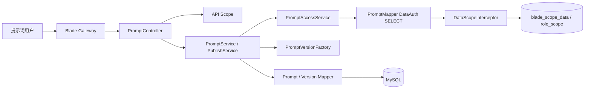
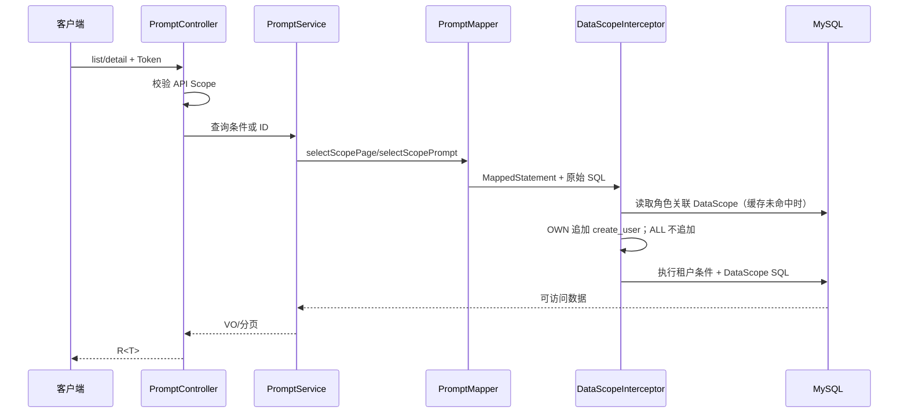
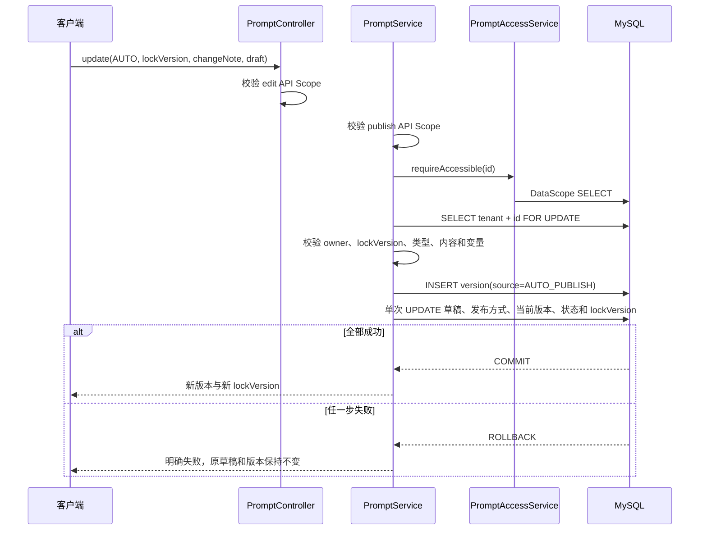

# 提示词类型、发布方式与数据权限增强详细设计

## 1. 文档信息

| 项目 | 内容 |
| --- | --- |
| 设计编号 | DESIGN-REQ-2026-005 |
| 关联需求 | [REQ-2026-005 提示词类型、发布方式与数据权限增强](../requirements/REQ-2026-005-prompt-scope-and-publishing.md) |
| 关联数据库设计 | [DB-REQ-2026-005 提示词类型、发布方式与数据权限增强数据库设计](../database/DB-REQ-2026-005-prompt-scope-and-publishing.md) |
| 文档版本 | 0.3 |
| 文档状态 | 开发中 |
| 技术负责人 | 待指定 |
| 创建/更新日期 | 2026-09-16 |

## 2. 设计摘要

### 2.1 目标

1. 在现有提示词草稿和不可变版本模型上增加稳定的业务类型与发布方式，不重新建设提示词模块。
2. 以 `create_user` 作为本人数据字段，复用 SpringBlade DataScope 的 `OWN` 和 `ALL` 规则覆盖管理查询与写操作。
3. 将自动发布实现为原子事务，保证草稿内容、发布版本和当前版本指针不存在部分成功。
4. 保持 API Scope 与 DataScope 职责分离：API Scope 判断动作是否允许，DataScope 判断目标数据是否可访问。
5. 对无有效数据权限配置的查询采用失败关闭策略，避免配置缺失时扩大数据范围。

### 2.2 非目标

- 不新增提示词专属数据范围字段、角色体系或权限引擎。
- 不实现跨租户提示词查询和修改。
- 不实现部门、部门子级或自定义提示词数据范围。
- 不实现定时发布、审批发布、灰度发布或异步发布。
- 不改变现有模板语法、变量类型和渲染规则。
- 不建设审计、脱敏或提示词正文缓存。

### 2.3 关键决策

| 决策 | 结论 | 依据 |
| --- | --- | --- |
| 类型存储 | 使用 `VARCHAR(32)` 稳定字符串编码 | 类型需要跨 API、数据库和后续业务保持可读、稳定，不使用易漂移的顺序数字 |
| 首期类型 | `GENERAL`、`SYSTEM`、`TEXT`、`IMAGE` | 覆盖当前确认的通用、系统、文本和图像用途；类型表示业务用途，不表示消息角色 |
| 发布方式 | `TINYINT`：`1=MANUAL`、`2=AUTO` | 值域固定、查询简单，与现有状态数值风格一致 |
| 自动发布来源 | 版本 `source_type` 增加 `3=AUTO_PUBLISH` | 区分手工发布、回滚发布和保存触发的自动发布 |
| 所有者字段 | 复用 `TenantEntity.createUser` | 满足本人范围且不重复存储 `owner_user_id` |
| DataScope 接入 | 自定义 Mapper 查询 + `@DataAuth` + `blade_scope_data` | BaseMapper 通用分页无法声明目标 Mapper 方法级 DataScope；自定义方法便于稳定配置 |
| 缺失配置 | PromptAccessService 先校验 Mapper 对应 OWN/ALL 配置，并将 OWN 的当前用户 ID 显式传入 Mapper；Mapper 注解保留拒绝式兜底 | 框架对角色名含 admin 的身份会跳过 OWN，显式 create_user 条件保证任意角色切换 OWN 后仍正确过滤 |
| 写操作保护 | 先执行 DataScope 保护的资源查询，再执行带租户、主键、创建人和并发版本的写 SQL | DataScope 拦截器只改写 `SELECT`，不能假设其自动保护 `UPDATE/DELETE` |
| 版本归属 | 先校验主提示词访问范围，再按 `prompt_id` 查询版本 | 版本的 `create_user/publish_user` 表示版本发布人，不等于提示词所有者 |
| 复制行为 | 复制类型和内容，目标发布方式固定为 `MANUAL`，不复制发布状态和历史 | 避免复制操作隐式触发上线；用户可后续改为自动发布 |
| 手工发布入口 | 仅 `MANUAL` 提示词允许调用独立发布接口 | `AUTO` 通过保存操作发布，避免重复版本和两套触发语义 |

### 2.4 需求映射

| 需求/验收标准 | 设计落点 | 验证方式 |
| --- | --- | --- |
| REQ-001 / AC-001~004 | `PromptType`、Entity/DTO/VO 字段、类型筛选、版本类型快照 | 类型创建、修改、筛选和历史快照测试 |
| REQ-002 / AC-005~008 | `PublishMode`、自动发布事务、动态发布权限校验、版本来源 | 手工/自动发布、权限不足和失败回滚测试 |
| REQ-003 / AC-009~013 | `PromptMapper` DataScope 查询、`PromptAccessService`、角色数据范围配置 | 本人/全部、伪造 ID、版本越权和配置缺失测试 |
| REQ-004 / AC-014~017 | 创建人服务端写入、复制/写操作访问保护、API Scope 组合 | 本人全操作、他人拒绝和管理员缺动作权限测试 |

## 3. 改动范围

| 层次 | 模块/路径 | 主要改动 |
| --- | --- | --- |
| API 契约 | `blade-service-api/blade-ai-api` | Entity、DTO、VO、`PromptType`、`PublishMode`、`VersionSourceType` 和错误语义 |
| 服务实现 | `blade-service/blade-ai` | Controller 查询参数、Service 自动发布、访问保护组件、Mapper/XML、Wrapper、Hash/版本工厂 |
| 数据权限 | `blade-service-api/blade-scope-api`、`blade-system` 现有能力 | 复用现有 DataScope Handler、缓存和角色授权，不修改框架实现 |
| 权限数据 | `blade_scope_data`、`blade_role_scope` | 登记提示词分页和单资源查询的数据权限规则，绑定现有角色 |
| 数据库 | `doc/sql/blade` | 修改提示词主表和版本表、增加索引及升级脚本 |
| 配置 | `doc/nacos/blade.yaml` | 两张表已在租户表清单中，不新增租户表；无新增敏感配置 |
| 前端调用方 | Saber 提示词管理 | 同步类型、发布方式、自动发布说明、筛选和响应字段 |
| Feign 契约 | `IPromptClient` | 请求保持按编码渲染；响应增加提示词类型，调用方需同步 API 产物 |

## 4. 架构与流程

### 4.1 架构图



API Scope 在 Controller 入口判断动作权限。DataScope 在 Mapper 查询阶段对提示词主记录应用 `create_user` 范围。Service 只允许对已通过数据范围查询的资源继续执行写操作。

### 4.2 数据范围查询时序



### 4.3 自动发布更新时序



### 4.4 写操作访问保护流程

1. Controller 使用现有 `@PreAuth(permission=...)` 校验动作权限。
2. Service 调用 `PromptAccessService.requireAccessible(id)`，触发 Mapper 方法级 DataScope 查询。
3. 查询不到时统一按 `PROMPT_NOT_FOUND` 处理，不泄露他人资源是否存在。
4. 需要行锁的发布、停用、回滚和自动发布更新，再按当前租户与 ID 执行原始 `SELECT ... FOR UPDATE`。
5. 锁定记录的 `create_user` 必须与已授权查询结果一致；创建人不可修改。
6. 最终写 SQL 同时匹配 `tenant_id`、`id`、`create_user`、`lock_version` 和 `is_deleted=0`。
7. 受影响行数不为 1 时返回并发冲突，事务回滚。

不直接对 `SELECT ... FOR UPDATE` 使用 DataScope 包装。当前 DataScope Handler 会将原 SQL包装为派生表查询，锁语义不适合作为本需求的事务锁依据。

## 5. 模块设计

### 5.1 `blade-ai-api`

| 类型 | 名称 | 职责 |
| --- | --- | --- |
| Entity | `Prompt` | 新增 `promptType`、`publishMode`；继续使用 `createUser` 作为本人数据字段 |
| Entity | `PromptVersion` | 新增 `promptType` 类型快照；`sourceType` 支持自动发布来源 |
| Enum | `PromptType` | `GENERAL/SYSTEM/TEXT/IMAGE` 稳定类型编码、标签和合法性判断 |
| Enum | `PublishMode` | `MANUAL(1)`、`AUTO(2)` |
| Enum | `VersionSourceType` | `PUBLISH(1)`、`ROLLBACK(2)`、`AUTO_PUBLISH(3)` |
| DTO | `PromptCreateDTO` | 增加 `promptType`、`publishMode`、条件必填 `changeNote` |
| DTO | `PromptUpdateDTO` | 增加 `promptType`、`publishMode`、条件必填 `changeNote` |
| DTO | `PromptPreviewDTO` | 增加 `promptType`，用于枚举校验和后续类型规则扩展 |
| DTO | `PromptCopyDTO` | 请求结构不增加发布方式；复制结果固定为手工发布草稿 |
| VO | `PromptListVO` | 增加类型、类型名称、发布方式和发布方式名称 |
| VO | `PromptDetailVO` | 增加类型与发布方式完整信息 |
| VO | `PromptVersionVO` | 增加发布时类型快照和扩展后的来源类型 |
| VO | `PromptMutationVO` | 增加类型、发布方式和自动发布产生的版本信息 |
| VO | `PromptRenderVO` | 增加当前发布版本的提示词类型 |

`promptType` 使用大写稳定编码。DTO 接受字符串并由枚举校验，不自动接受未知值；响应同时返回编码与中文标签，前端不得仅依赖中文标签判断业务。

### 5.2 `blade-ai` 服务实现

| 类型 | 名称 | 职责 |
| --- | --- | --- |
| Controller | `PromptController` | 增加类型和发布方式查询参数；保持 API Scope 入口 |
| Service | `PromptServiceImpl` | 创建、手工草稿更新、自动发布创建/更新和复制语义 |
| Service | `PromptPublishServiceImpl` | 手工发布、停用、回滚；拒绝对 AUTO 模式执行独立手工发布 |
| Component | `PromptAccessService` | 集中执行 DataScope 可访问查询、锁定后二次一致性校验 |
| Component | `PromptVersionFactory` | 构造手工、自动和回滚版本，统一快照与 hash |
| Mapper/XML | `PromptMapper` | 新增 DataScope 分页和单资源查询；写 SQL增加创建人条件 |
| Mapper/XML | `PromptVersionMapper` | 版本查询保持按租户和 promptId；访问前必须校验主记录 |
| Wrapper | `PromptWrapper`、`PromptVersionWrapper` | 转换类型与发布方式名称、按访问结果计算动作状态 |

### 5.3 DataScope Mapper 方法

| Mapper 方法 | 用途 | DataScope 配置 |
| --- | --- | --- |
| `PromptMapper.selectScopePage` | 列表与筛选分页 | `scope_column=create_user`，按角色配置 OWN/ALL |
| `PromptMapper.selectScopePrompt` | 详情、版本前置校验及全部写操作保护 | `scope_column=create_user`，按角色配置 OWN/ALL |

两个方法在 Mapper 接口声明 `@DataAuth(type = DataScopeEnum.CUSTOM, value = "where 1 = 0")` 作为失败关闭兜底。正常运行时，`blade_scope_data.scope_class` 按完整 MappedStatement ID 命中角色绑定规则并覆盖注解模型：

```text
org.springblade.ai.prompt.mapper.PromptMapper.selectScopePage
org.springblade.ai.prompt.mapper.PromptMapper.selectScopePrompt
```

Service 在调用上述 Mapper 前通过 `PromptAccessService` 和现有 `DataScopeCache` 校验当前角色确实获得 OWN 或 ALL 配置。配置缺失或类型不是 OWN/ALL 时返回 `PROMPT_DATA_SCOPE_UNAVAILABLE`；OWN 时返回当前用户 ID，并由分页和单资源 SQL 显式追加 `create_user = ownerUserId`。该条件与 DataScope 拦截器共同工作，解决管理员角色被框架旁路后无法切换为本人可见的问题。

数据权限行的 `scope_field` 使用 `*`。OWN 使用 `scope_column=create_user`、`scope_type=2`；ALL 使用 `scope_type=1`。角色同一 Mapper 不应同时绑定冲突的 OWN 与 ALL 规则；管理员角色使用 ALL，普通用户角色使用 OWN。

### 5.4 发布方式处理

| 操作 | MANUAL | AUTO |
| --- | --- | --- |
| 创建 | 保存草稿，状态为草稿 | 同一事务创建主记录、插入 V1、切换当前版本 |
| 更新 | 更新草稿，`draft_dirty=1` | 锁主记录，插入新版本并一次更新草稿和当前版本 |
| 独立发布 | 允许 | 拒绝，提示保存即发布 |
| 停用 | 允许 | 允许 |
| 回滚 | 允许，生成回滚版本 | 允许，生成回滚版本；发布方式保持 AUTO |
| 复制 | 复制类型和内容，目标固定 MANUAL 草稿 | 同左，不因来源为 AUTO 而自动发布 |

AUTO 创建或更新时 `changeNote` 必填。MANUAL 创建/更新不要求 `changeNote`，独立发布与回滚继续使用现有必填说明。

### 5.5 核心规则

| 规则 | 实现位置 | 失败行为 |
| --- | --- | --- |
| 类型值域合法 | DTO/Service + `PromptType` | `PROMPT_TYPE_INVALID`，不改变数据 |
| 发布方式值域合法 | DTO/Service + `PublishMode` | `PROMPT_PUBLISH_MODE_INVALID` |
| AUTO 需要发布权限 | `IPermissionHandler.hasPermission` | 无权限错误，事务不开始或回滚 |
| MANUAL 独立发布 | `PromptPublishServiceImpl` | AUTO 调用发布接口返回模式冲突 |
| 创建人不可修改 | DTO 不暴露 + Service 覆盖 + SQL 不更新 | 忽略伪造字段或参数错误 |
| 本人/全部范围 | DataScope Mapper 查询 | 不可访问资源按不存在处理 |
| 版本范围继承主记录 | Service 前置主记录校验 | 禁止直接按版本发布人裁剪 |
| 自动发布原子性 | 本地事务 + 主记录锁 + 单次主表更新 | 任一步失败整体回滚 |
| 复制不自动上线 | Copy Service | 固定生成 MANUAL 草稿 |

## 6. HTTP API 契约

服务本地路径继续使用 `/prompt`，经网关访问为 `/blade-ai/prompt`。

| 方法 | 路径 | 权限 | 请求变化 | 响应变化 | 幂等/并发 |
| --- | --- | --- | --- | --- | --- |
| GET | `/prompt/list` | `ai:prompt:view` | 增加 `promptType`、`publishMode` 查询参数 | 列表增加类型与发布方式 | DataScope 只读分页 |
| GET | `/prompt/detail` | `ai:prompt:view` | 不变 | 详情增加类型与发布方式 | DataScope 单资源查询 |
| POST | `/prompt/create` | `ai:prompt:create` | DTO 增加类型、发布方式、AUTO 条件说明 | AUTO 可直接返回 V1 | 编码唯一；AUTO 本地事务 |
| POST | `/prompt/update` | `ai:prompt:edit` | DTO 增加类型、发布方式、AUTO 条件说明 | AUTO 返回新版本 | `lockVersion` + DataScope |
| POST | `/prompt/copy` | `ai:prompt:copy` | 请求不变 | 返回 MANUAL 草稿 | 新编码唯一；来源需可访问 |
| POST | `/prompt/remove` | `ai:prompt:delete` | 不变 | 不变 | DataScope + `lockVersion` |
| POST | `/prompt/preview` | `ai:prompt:preview` | 增加 `promptType` | 可回显类型 | 无状态，不持久化 |
| POST | `/prompt/publish` | `ai:prompt:publish` | 不变 | 不变 | 仅 MANUAL；行锁 + `lockVersion` |
| POST | `/prompt/disable` | `ai:prompt:disable` | 不变 | 不变 | DataScope + 行锁 |
| GET | `/prompt/version/list` | `ai:prompt:view` | 不变 | 版本增加类型与自动发布来源 | 先校验主记录范围 |
| GET | `/prompt/version/detail` | `ai:prompt:view` | 不变 | 版本增加类型与自动发布来源 | 先校验主记录范围 |
| POST | `/prompt/rollback` | `ai:prompt:rollback` | 不变 | 回滚版本保留目标类型 | DataScope + 行锁 |

接口补充：

- `PromptCreateDTO/PromptUpdateDTO.changeNote` 在 `publishMode=AUTO` 时由 Service 条件校验必填，最大长度沿用 500。
- 列表参数的未知类型或发布方式返回参数错误，不静默忽略。
- 不可访问的提示词和版本统一返回 `PROMPT_NOT_FOUND`，避免泄露资源存在性。
- 类型和发布方式是本需求引入的破坏性契约调整，SpringBlade API、服务实现和 Saber 必须按发布顺序协同升级。
- 提示词正文、变量内容和预览值继续禁止进入普通日志。

### 6.1 业务错误语义

| 错误标识 | 场景 | 调用方处理 |
| --- | --- | --- |
| `PROMPT_TYPE_INVALID` | 未知或禁用类型 | 修正类型，不重试原请求 |
| `PROMPT_PUBLISH_MODE_INVALID` | 未知发布方式 | 修正发布方式 |
| `PROMPT_PUBLISH_MODE_CONFLICT` | AUTO 提示词调用独立发布接口 | 使用保存操作触发自动发布 |
| `PROMPT_AUTO_PUBLISH_NOTE_REQUIRED` | AUTO 保存缺少变更说明 | 补充说明后重试 |
| `PROMPT_NOT_FOUND` | 不存在、越租户或超出 DataScope | 不展示资源存在性 |
| `PROMPT_CONFLICT` | `lockVersion` 陈旧或写入条件失效 | 刷新详情后重试 |

实际错误码顺延登记为 `48012` 至 `48016`，依次对应类型非法、发布方式非法、发布方式冲突、自动发布说明缺失和 DataScope 不可用。

## 7. Feign 契约

| 项目 | 内容 |
| --- | --- |
| API 模块 | `blade-service-api/blade-ai-api` |
| 服务名 | `AppConstant.APPLICATION_AI_NAME` |
| `API_PREFIX` | `/feign/client/prompt` |
| Java 签名 | `R<PromptRenderVO> render(PromptRenderRequest request)`，请求结构不变 |
| 响应调整 | `PromptRenderVO` 增加 `promptType`，值来自当前发布版本快照 |
| Fallback | 继续返回明确的 `R.fail(PROMPT_SERVICE_UNAVAILABLE)`，不返回 `null` |
| 调用方处理 | 重新依赖新 `blade-ai-api`；未知类型不得猜测转换 |

管理 DataScope 不应用于现有内部渲染查询。内部渲染继续按当前租户和稳定编码读取已发布版本，避免将登录用户的本人范围误用于服务运行时读取。本需求不改变该接口的认证和租户传递方式。

## 8. 数据设计

- 数据库设计：[DB-REQ-2026-005](../database/DB-REQ-2026-005-prompt-scope-and-publishing.md)
- `blade_ai_prompt`：新增 `prompt_type`、`publish_mode`，增加创建人和类型查询索引。
- `blade_ai_prompt_version`：新增 `prompt_type` 快照，`source_type` 增加自动发布值。
- 两张表继续继承 `TenantEntity`，无需修改 `blade.tenant.tables`。
- 编码唯一键保持 `tenant_id + prompt_code`，逻辑删除后仍不复用。
- 新增提示词 DataScope 配置记录及角色授权关系；不新增业务表。
- MySQL 全量脚本和独立升级脚本在实现阶段同步。

## 9. 事务、并发与缓存

| 主题 | 设计 |
| --- | --- |
| MANUAL 创建 | 单表事务，服务端写入 tenantId、createUser、类型和发布方式 |
| MANUAL 更新 | DataScope 前置查询；条件更新匹配 tenant、id、owner、lockVersion、isDeleted |
| AUTO 创建 | 一个事务内插入主记录、插入 V1、更新当前版本指针和已发布状态 |
| AUTO 更新 | DataScope 前置查询后锁主记录；插入版本；单次更新草稿、类型、模式、当前版本和锁版本 |
| 手工发布 | 仅 MANUAL；沿用行锁、版本插入和当前指针原子切换 |
| 停用/回滚 | DataScope 前置查询 + 行锁；回滚不改变主记录发布方式 |
| 跨服务事务 | 不涉及，不使用 Seata |
| 并发控制 | `SELECT FOR UPDATE` 串行发布类操作；`lockVersion` 检测陈旧客户端 |
| 幂等 | 创建依赖编码唯一键；更新/发布超时后客户端先刷新，不盲目重放 |
| 缓存 | 提示词正文不新增缓存；DataScope 使用现有系统缓存，权限数据变更后清理 `SYS_CACHE` |

自动发布更新不能先执行现有 `updateDraft` 再执行 `updatePublishedState`，否则会产生两次 `lock_version` 变化和中间状态。应新增一次性主表更新 SQL，在版本插入成功后只更新主表一次。

## 10. 认证、租户与数据权限

- 认证方式：复用 SpringBlade JWT、安全上下文和现有 Feign Token Relay。
- API Scope：继续使用提示词现有查看、新增、编辑、复制、删除、预览、发布、停用和回滚权限。
- AUTO 动态权限：创建/更新入口先通过 create/edit 权限；Service 再通过 `IPermissionHandler.hasPermission(ai:prompt:publish)` 校验发布权限。
- 租户来源：只接受 `SecureUtil.getTenantId()`；DTO 不增加 tenantId、createUser 或 publishUser。
- 创建人：创建时显式使用 `SecureUtil.getUserId()` 写入，禁止后续修改；插入后不得为空。
- DataScope：`selectScopePage`、`selectScopePrompt` 由现有 DataScopeInterceptor 改写查询。
- OWN：Service 向 Mapper 传入当前用户 ID，原始 SQL 显式过滤 `create_user`；普通角色仍会同时经过 DataScope 拦截器过滤。ALL：不追加创建人条件。
- 版本查询：先使用 `selectScopePrompt` 校验主记录，再查询版本表。
- 写操作：DataScope 只自动保护 SELECT；Service 访问保护和写 SQL条件共同保护更新、删除、发布、停用与回滚。
- 超级管理员：本需求仅处理当前租户，不提供请求参数选择任意租户。
- 权限缓存：初始化或调整 `blade_scope_data/blade_role_scope` 后清理现有 `SYS_CACHE`，确保下一次请求读取最新范围。
- 多角色约束：同一用户的角色不应针对同一 Mapper 同时绑定互相冲突的 OWN 与 ALL；管理员角色统一绑定 ALL，普通角色统一绑定 OWN。

### 10.1 DataScope 初始化

每个受保护 Mapper 方法建立 OWN 和 ALL 两条规则：

| Mapper | 范围 | `scope_type` | `scope_column` | `scope_field` |
| --- | --- | ---: | --- | --- |
| `...PromptMapper.selectScopePage` | 本人 | 2 | `create_user` | `*` |
| `...PromptMapper.selectScopePage` | 全部 | 1 | `-` | `*` |
| `...PromptMapper.selectScopePrompt` | 本人 | 2 | `create_user` | `*` |
| `...PromptMapper.selectScopePrompt` | 全部 | 1 | `-` | `*` |

存量 `role_alias=user` 角色绑定 OWN，`admin` 和 `administrator` 绑定 ALL。新建租户和后续新增角色必须通过角色授权流程维护相同规则，不在提示词代码中判断角色别名。

## 11. 异常与日志

| 场景 | 处理 | 对外结果 | 数据影响 |
| --- | --- | --- | --- |
| 类型或发布方式非法 | 枚举校验 | 明确业务错误 | 不改变 |
| AUTO 缺少发布权限 | Service 动态权限校验 | 403/无权限 | 不改变 |
| DataScope 查询不到资源 | 按不存在处理 | `PROMPT_NOT_FOUND` | 不改变 |
| DataScope 配置缺失 | 注解拒绝式兜底 | 无可访问数据/权限错误 | 不改变 |
| 自动发布校验失败 | 发布级内容校验 | 模板错误 | 整体回滚 |
| 自动发布持久化失败 | 本地事务回滚 | 统一数据库错误 | 草稿和版本均不改变 |
| 并发冲突 | 条件更新影响行数不为 1 | `PROMPT_CONFLICT` | 回滚 |
| 多角色范围冲突 | 权限配置检查发现同 Mapper 多范围 | 阻止错误授权发布 | 不改变业务数据 |

日志允许记录 tenantId、operatorId、promptId、promptCode、promptType、publishMode、versionNo、action、result、errorCode、requestId 和耗时。禁止记录固定指令、用户模板、变量定义全文、预览值、Token、密钥和连接串。

## 12. 配置、发布与回滚

### 12.1 配置影响

- Nacos：两张提示词表已加入租户表配置，不新增表名。
- DataScope：通过 MySQL 初始化 `blade_scope_data` 和 `blade_role_scope`，不新增 Nacos 配置。
- 类型与发布方式：首期使用代码枚举，不依赖运行时字典修改，避免数据库值域与代码行为漂移。
- 缓存：权限初始化或授权变更后清理 `blade:sys` 相关 DataScope 缓存。

### 12.2 发布顺序

1. 评审确认类型值域、发布方式、历史数据归属和 DataScope 角色范围。
2. 备份提示词表，执行升级脚本，完成字段、索引、历史默认值和 DataScope 初始化。
3. 发布新版 `blade-ai-api` 公共契约。
4. 发布 `blade-ai` 服务实现，确认 Mapper DataScope 查询和自动发布事务可用。
5. 清理 DataScope 系统缓存并验证普通用户 OWN、管理员 ALL。
6. 发布 Saber 类型和发布方式交互。
7. 在开放 AUTO 前执行权限组合和失败回滚测试。

### 12.3 兼容与回滚

- 本需求不承诺旧 API 行为兼容，API、服务和 Saber 采用协调发布。
- 数据库新增列均有默认值，紧急代码回滚时可暂时保留列和索引；旧代码不会写 AUTO 来源。
- 权限回滚时先暂停提示词写入口，再删除新增角色范围绑定和 DataScope 记录并清理缓存。
- 应用回滚不自动删除新版本；`source_type=3` 的历史版本必须保留。
- 物理删除类型/发布方式列会丢失业务配置，只能在已备份且确认回滚窗口内执行。

## 13. 验证计划

### 13.1 编译与静态检查

- 实现后执行：`mvn clean package -DskipTests -pl blade-service/blade-ai -am`。
- 检查 `blade-ai` 已经通过父模块获得 `blade-scope-api` 和 DataScope Starter 能力。
- 检查 Mapper 方法注解、`scope_class` 全限定 ID 和初始化 SQL 完全一致。
- 检查 Entity、DTO、VO、Wrapper、枚举与 MySQL 字段一致。
- 检查所有提示词写 SQL包含 tenant、id、owner、lockVersion 和逻辑删除条件。
- 检查需求、详细设计、数据库设计和索引链接及版本一致。

### 13.2 用户执行测试范围

- 类型：合法/非法类型、类型筛选、历史版本类型不变。
- 发布方式：MANUAL 草稿、AUTO 创建、AUTO 更新、模式切换、AUTO 调用独立发布。
- 权限：普通用户本人全部动作、他人 ID/版本 ID 越权、管理员全部数据、动作权限不足。
- DataScope：OWN/ALL、配置缺失、缓存刷新、多角色授权冲突。
- 事务：AUTO 版本插入失败、主表更新失败、并发更新时整体回滚。
- SQL：全量、升级、索引、历史默认值、创建人空值预检和回滚。
- 前端：类型/模式筛选、AUTO 变更说明、立即上线提示和错误恢复。

已完成 `blade-ai-api`、`blade-ai`、MySQL 全量/升级脚本和 Saber 调用方实现；在 JDK 21 下执行 `mvn clean package -DskipTests -pl blade-service/blade-ai -am` 成功。未运行 Maven 测试、MySQL、Nacos、微服务或真实接口；正式用例见 [TEST-REQ-2026-005](../test/TEST-REQ-2026-005-prompt-scope-and-publishing.md)。

## 14. 风险、评审与变更

| 编号 | 风险/问题 | 负责人 | 状态/结论 |
| --- | --- | --- | --- |
| DESIGN-ITEM-001 | DataScope 框架按 Mapper 和角色读取首条规则，多角色绑定冲突时缺少显式优先级 | 权限负责人 | 开放；同一 Mapper 的角色授权必须保持同一有效范围，实施时增加 SQL 核验 |
| DESIGN-ITEM-002 | 超级管理员是否需要跨租户查看未确认 | 产品/安全 | 当前设计限定当前租户；跨租户另立需求 |
| DESIGN-ITEM-003 | 存量提示词 `create_user` 为空时无法确定本人归属 | 产品/运维 | 上线前提供明确归属映射；未处理数据不得开放 OWN |
| DESIGN-ITEM-004 | AUTO 保存同时要求 edit/create 与 publish 权限，需要确认 Saber 权限提示方式 | 产品/前端 | 待评审 |
| DESIGN-ITEM-005 | 类型值域未来扩展时需保持旧编码稳定，不能重命名已持久化编码 | 技术负责人 | 采用稳定字符串枚举，删除类型需独立迁移 |

| 评审领域 | 结论 | 评审人 | 日期 |
| --- | --- | --- | --- |
| 后端/API | 待评审 | 待指定 | 待指定 |
| 数据库 | 待评审 | 待指定 | 待指定 |
| 权限/租户 | 待评审 | 待指定 | 待指定 |
| 测试可行性 | 待评审 | 待指定 | 待指定 |

| 日期 | 版本 | 变更内容 | 修改人 |
| --- | --- | --- | --- |
| 2026-09-16 | 0.1 | 根据 REQ-2026-005 0.4 建立类型、发布方式、DataScope 和自动发布事务详细设计初稿 | Codex |
| 2026-09-16 | 0.2 | 完成 API、Service、Mapper、自动发布事务、DataScope 失败关闭、SQL 和 Saber 实现，并记录 JDK 21 构建结果 | Codex |
| 2026-09-16 | 0.3 | 修复管理员切换 OWN 时被拒绝的问题，OWN 范围改为由 PromptAccessService 解析并向 Mapper 显式传入当前用户 ID | Codex |
