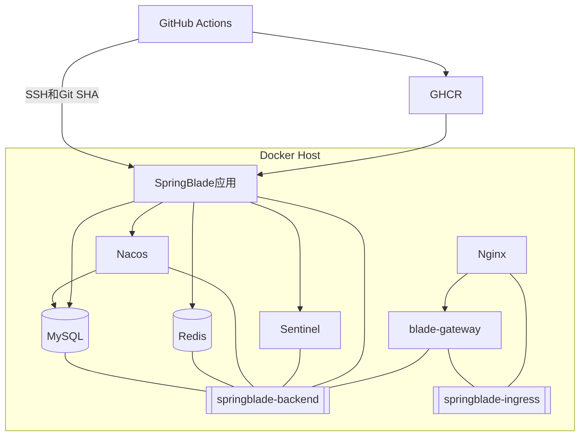

# Docker Compose 分层部署与 GitHub Actions 发布详细设计

## 1. 文档信息

| 项目 | 内容 |
| --- | --- |
| 设计编号 | DESIGN-REQ-2026-006 |
| 关联需求 | [REQ-2026-006](../requirements/REQ-2026-006-compose-deployment.md) |
| 关联数据库设计 | 不涉及；不改变业务表结构 |
| 文档版本 | 0.3 |
| 文档状态 | 开发中 |
| 技术负责人 | Codex |
| 创建/更新日期 | 2026-09-17 |

## 2. 设计摘要

### 2.1 目标

1. MySQL、Redis、Nacos、Sentinel 分别使用独立目录和独立 Compose project。
2. 中间件持久化数据绑定到宿主机 `data` 或 `logs` 目录，便于备份、检查和迁移。
3. 中间件和应用通过 Docker external network 与固定网络别名通信，不使用固定容器 IP。
4. Nginx 与数据层网络隔离，仅网关同时连接后端网络和入口网络。
5. 使用 Git SHA 构建 10 个不可变 GHCR 镜像，并通过 SSH 仅更新应用栈。

### 2.2 非目标

- 不实现 Kubernetes、Swarm、跨主机编排和自动扩缩容。
- 不提供 MySQL、Redis、Nacos、Sentinel 集群高可用。
- 不拆分共享业务数据库，不引入 Flyway 或 Liquibase。
- 不在流水线中自动执行生产 SQL、修改 Nacos 配置或迁移中间件数据。
- 不部署 Seata Server、MinIO、消息队列、Elasticsearch 和监控平台。

### 2.3 需求映射

| 需求/验收标准 | 设计落点 | 验证方式 |
| --- | --- | --- |
| REQ-001 / AC-001~002 | 独立中间件目录、Compose project、绑定挂载、双网络与别名 | Compose config、容器、目录、网络检查 |
| REQ-002 / AC-003~004 | 10 个服务 Dockerfile | Dockerfile 静态检查、镜像 inspect |
| REQ-003 / AC-005~006 | 公共启动配置、Nacos生产配置、应用环境变量 | 编译、环境覆盖、敏感信息扫描 |
| REQ-004 / AC-007~009 | GitHub Actions、应用部署脚本 | Actions、发布与回滚演练 |
| REQ-005 / AC-010~011 | [部署教程](../guide/docker-compose-github-actions-deployment.md) | 文档复核和新环境演练 |

## 3. 改动范围

| 层次 | 目标路径 | 主要内容 |
| --- | --- | --- |
| 公共启动 | `blade-common` | Nacos、Sentinel地址及namespace可由环境变量覆盖 |
| 服务镜像 | 各可部署模块 `Dockerfile` | 非root运行、仅复制应用JAR、profile外置 |
| 生产配置 | `doc/nacos/blade-prod.yaml` | MySQL、Redis使用环境变量占位符 |
| 中间件 | `script/docker/middleware/` | MySQL、Redis、Nacos、Sentinel独立目录与Compose |
| 应用 | `script/docker/app/` | 10个SpringBlade服务、环境模板、部署脚本 |
| 入口 | `script/docker/ingress/` | Nginx入口，只访问网关 |
| CI/CD | `.github/workflows/deploy.yml` | Maven打包、GHCR发布、SSH部署 |
| 文档 | `doc/requirements`、`design`、`test`、`guide` | 需求、设计、测试和部署说明 |

## 4. 部署架构



## 5. 服务器目录

目标服务器根目录为 `/opt/springblade`：

```text
/opt/springblade/
├── middleware/
│   ├── deploy.sh
│   ├── mysql/
│   │   ├── compose.yml
│   │   ├── .env
│   │   ├── conf/my.cnf
│   │   ├── init/init-databases.sh
│   │   ├── init/nacos.mysql-schema.sql
│   │   ├── sql/blade/
│   │   ├── data/
│   │   └── backup/
│   ├── redis/
│   │   ├── compose.yml
│   │   ├── .env
│   │   ├── conf/redis.conf
│   │   ├── data/
│   │   └── backup/
│   ├── nacos/
│   │   ├── compose.yml
│   │   ├── .env
│   │   ├── conf/application.properties
│   │   ├── data/
│   │   └── logs/
│   └── sentinel/
│       ├── compose.yml
│       ├── .env
│       ├── data/
│       └── logs/
├── app/
│   ├── compose.yml
│   ├── deploy.sh
│   └── .env
└── ingress/
    ├── compose.yml
    ├── nginx.conf
    └── .env
```

真实 `.env` 权限为 `600`，`backup` 目录权限为 `700`。`data`、`logs` 和 `backup` 不进入Git。

## 6. Compose Project与依赖

| 服务 | Compose project | 网络别名 | 持久化 |
| --- | --- | --- | --- |
| MySQL | `springblade-mysql` | `springblade-mysql` | `./data`、`./backup` |
| Redis | `springblade-redis` | `springblade-redis` | `./data`、`./backup` |
| Nacos | `springblade-nacos` | `springblade-nacos` | `./data`、`./logs` |
| Sentinel | `springblade-sentinel` | `springblade-sentinel` | 无必要业务状态，保留本地目录 |
| 应用 | `springblade-app` | 各服务名 | 无状态 |
| Nginx | `springblade-ingress` | `nginx` | 配置文件只读挂载 |

不同 Compose project 之间不能使用 `depends_on`。根部署脚本必须按以下顺序启动并等待健康：

1. 创建 `springblade-backend` 和 `springblade-ingress`。
2. 启动 MySQL，等待 `mysqladmin ping` 成功。
3. 启动 Redis，等待带密码执行 `PING` 成功。
4. 启动 Nacos，等待数据库连接和服务端口可用。
5. 启动 Sentinel。
6. 启动应用并检查网关HTTP存活。
7. 启动 Nginx。

## 7. 网络与通信

### 7.1 网络划分

| 网络 | 接入服务 | 用途 |
| --- | --- | --- |
| `springblade-backend` | 四个中间件、全部应用、网关 | 数据访问、注册发现、限流和服务间调用 |
| `springblade-ingress` | Nginx、网关 | 公网入口到网关 |

应用服务通过 Nacos 获得其他服务的容器内地址。全部应用必须加入 `springblade-backend`，保证容器重建、IP变化后仍可通过注册发现通信。

### 7.2 固定访问地址

| 调用方 | 目标 | 地址 |
| --- | --- | --- |
| Nacos | MySQL | `springblade-mysql:3306` |
| 应用 | MySQL | `springblade-mysql:3306` |
| 应用 | Redis | `springblade-redis:6379` |
| 应用 | Nacos | `springblade-nacos:8848` |
| Nacos客户端 | Nacos gRPC | `springblade-nacos:9848` |
| 应用 | Sentinel | `springblade-sentinel:8858` |
| Nginx | Gateway | `blade-gateway:80` |

禁止在配置中使用容器静态IP、宿主机公网IP或宿主机端口作为同机容器间访问地址。

### 7.3 宿主机端口

| 服务 | 容器端口 | 宿主机绑定 | 用途 |
| --- | ---: | --- | --- |
| MySQL | 3306 | `127.0.0.1:3306` | 本机管理和备份 |
| Redis | 6379 | `127.0.0.1:6379` | 本机管理 |
| Nacos Server | 8848 | `127.0.0.1:8848` | 本机管理 |
| Nacos gRPC | 9848 | `127.0.0.1:9848` | 客户端调试 |
| Nacos Console | 8080 | `127.0.0.1:18080` | 控制台 |
| Sentinel | 8858 | `127.0.0.1:8858` | 控制台 |
| Gateway | 80 | `127.0.0.1:8080` | 存活检查和本机调试 |
| Nginx | 80/443 | `0.0.0.0:80/443` | 公网入口 |

Nacos Console使用宿主机 `18080`，避免与网关调试端口 `8080` 冲突。中间件端口不得在腾讯云安全组中向公网开放。

## 8. 持久化设计

| 服务 | 宿主机目录 | 容器目录 |
| --- | --- | --- |
| MySQL | `mysql/data` | `/var/lib/mysql` |
| MySQL配置 | `mysql/conf/my.cnf` | `/etc/mysql/conf.d/springblade.cnf` |
| MySQL初始化脚本 | `mysql/init/init-databases.sh` | `/docker-entrypoint-initdb.d/10-init-databases.sh` |
| Nacos Schema源文件 | `mysql/init/nacos.mysql-schema.sql` | `/opt/springblade/bootstrap/nacos.mysql-schema.sql` |
| Redis | `redis/data` | `/data` |
| Redis配置 | `redis/conf/redis.conf` | `/usr/local/etc/redis/redis.conf` |
| Nacos数据 | `nacos/data` | `/home/nacos/data` |
| Nacos日志 | `nacos/logs` | `/home/nacos/logs` |
| Nacos配置 | `nacos/conf/application.properties` | `/home/nacos/conf/application.properties` |

部署前通过目标镜像检查实际运行 UID/GID，再设置目录所有权，不使用 `chmod 777`。配置文件使用只读挂载。

MySQL迁移优先使用 `mysqldump` 或经验证的物理备份。直接复制 `mysql/data` 时必须停止 MySQL，并保证源和目标镜像版本、文件系统权限及启动参数兼容。Redis和Nacos目录迁移也必须在对应服务停止后进行。

Sentinel Dashboard不以本地文件作为可靠规则存储。当前 `data` 与 `logs` 目录仅用于统一目录结构；需要规则持久化时使用Nacos数据源并作为独立需求实施。

## 9. 运行时配置

公共启动参数按以下顺序取值：

1. JVM参数。
2. 环境变量。
3. profile默认值。

应用生产环境使用：

```dotenv
BLADE_NACOS_ADDR=springblade-nacos:8848
BLADE_NACOS_NAMESPACE=prod
BLADE_SENTINEL_ADDR=springblade-sentinel:8858
BLADE_DATASOURCE_URL=jdbc:mysql://springblade-mysql:3306/blade
BLADE_REDIS_HOST=springblade-redis
BLADE_REDIS_PORT=6379
```

Nacos使用：

```dotenv
MYSQL_SERVICE_HOST=springblade-mysql
MYSQL_SERVICE_PORT=3306
MYSQL_SERVICE_DB_NAME=nacos_config
MYSQL_SERVICE_USER=nacos
```

用户名、密码、Token、私钥和AI凭据只写入服务器 `.env`，不得进入仓库、镜像、文档或日志。
Nacos 3首次启动时使用随机强密码初始化`nacos`管理员，管理员密码与服务鉴权Token分开管理。

## 10. 数据初始化

- MySQL首次空 `data` 目录启动时创建 `blade`、`nacos_config` 及最小权限账号。
- Nacos Schema由MySQL初始化脚本显式导入，仅用于新的空 `nacos_config`；Schema源文件不得直接作为entrypoint的`.sql`脚本重复执行。
- `blade.mysql.all.create.sql` 不自动挂载执行，只允许部署人员确认 `blade` 为空库后显式导入。
- 已有数据库先完成可恢复备份，再按当前版本选择准确的升级脚本。
- 初始化脚本只在MySQL数据目录为空时由官方entrypoint执行。

## 11. 应用与入口

应用栈包含gateway、auth、admin、develop、report、resource、desk、log、system、ai。镜像格式为 `${REGISTRY}/${IMAGE_NAMESPACE}/${service}:${IMAGE_TAG}`，只将网关映射到宿主机回环地址。

网关同时加入 `springblade-backend` 和 `springblade-ingress`。Nginx只加入 `springblade-ingress`，通过 `blade-gateway:80` 转发请求，不能解析或访问中间件网络别名。

## 12. 发布与回滚

### 12.1 首次部署

1. 安装Docker Engine、Compose v2和`curl`。
2. 创建服务器目录、用户权限和两个external network。
3. 按MySQL、Redis、Nacos、Sentinel顺序部署中间件。
4. 初始化新的业务数据库。
5. 在Nacos创建`prod` namespace并导入公共配置。
6. 准备应用环境文件和GHCR只读登录。
7. 部署应用并验证注册发现、数据库和Redis连接。
8. 部署Nginx入口。

### 12.2 日常发布

GitHub Actions完成Maven打包、10个SHA镜像推送和SSH部署。应用部署只执行应用Compose的`pull`与`up -d --remove-orphans`，不得操作中间件目录和project。

### 12.3 回滚

在应用目录执行 `sh deploy.sh <上一稳定SHA>`。回滚只切换应用镜像，不自动回滚MySQL、Nacos配置、外部AI服务和前端。

## 13. 安全边界

- 中间件端口仅绑定 `127.0.0.1`，公网只开放Nginx的80/443。
- 腾讯云安全组不开放3306、6379、8848、9848、18080和8858。
- 通过SSH隧道访问Nacos和Sentinel控制台。
- `.env`权限为`600`，备份目录权限为`700`。
- 应用和中间件镜像不包含生产凭据。
- 容器不使用`privileged`，应用使用非root UID。
- 日志不得输出密码、Token、私钥和完整连接串。
- Nacos官方启动脚本启用xtrace，Compose通过`BASH_XTRACEFD`将追踪输出定向到`/dev/null`，重建后以实际密钥值反查容器日志确认无泄露。

## 14. 验证计划

- 分别校验四个中间件、应用和入口Compose。
- 检查绑定挂载均位于对应服务目录，不存在Docker命名数据卷。
- 检查两个external network、固定别名和网关双网络连接。
- 检查Nginx无法访问`springblade-backend`中的中间件。
- 检查Nacos可通过别名连接MySQL，应用可连接全部依赖。
- 检查中间件重建后数据目录保持，应用发布不改变中间件容器和目录。
- 检查备份、恢复、Git SHA发布与回滚。

0.3已在腾讯云单机环境完成四个中间件的首次部署、重建和持久化验证；应用、入口、GHCR、备份恢复与回滚仍待执行，当前不能标记为整体验收完成。

## 15. 风险与变更

| 编号 | 风险/问题 | 处理 |
| --- | --- | --- |
| DESIGN-ITEM-001 | 单机Compose存在主机级单点 | 当前接受，后续按容量和可用性需求升级 |
| DESIGN-ITEM-002 | 绑定目录权限错误会导致容器启动失败 | 部署前按实际镜像UID/GID设置并验证 |
| DESIGN-ITEM-003 | 直接复制MySQL数据目录存在一致性和版本风险 | 优先逻辑备份，物理迁移必须停库并验证版本 |
| DESIGN-ITEM-004 | 独立Compose不能跨project使用`depends_on` | 根部署脚本按顺序启动并执行健康等待 |
| DESIGN-ITEM-005 | Nacos Console与Gateway原计划均使用宿主机8080 | Nacos Console固定映射到18080 |

| 日期 | 版本 | 变更内容 | 修改人 |
| --- | --- | --- | --- |
| 2026-09-17 | 0.1 | 建立分层Compose、纯镜像、配置外置和Actions设计 | Codex |
| 2026-09-17 | 0.2 | 中间件拆分为独立目录和Compose，改用本地目录持久化、双网络与固定别名 | Codex |
| 2026-09-17 | 0.3 | 记录真实中间件部署结果，并修正MySQL初始化挂载、Nacos JDBC认证和健康检查 | Codex |
