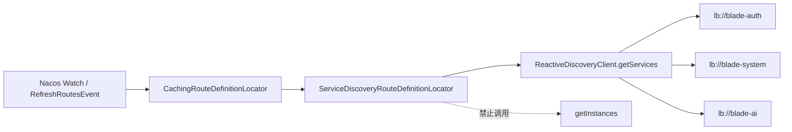
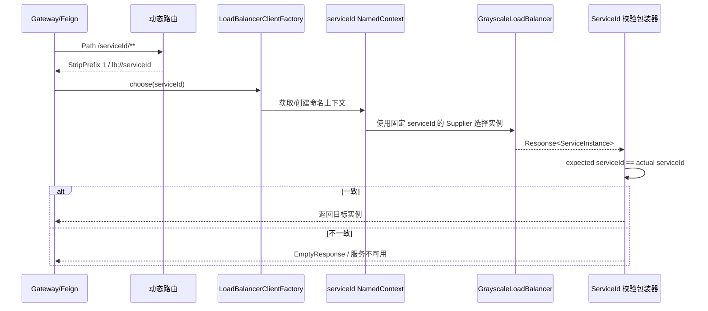

# 跨服务动态路由与负载均衡隔离详细设计

## 1. 文档信息

| 项目 | 内容 |
| --- | --- |
| 设计编号 | DESIGN-REQ-2026-007 |
| 关联需求 | [REQ-2026-007](../requirements/REQ-2026-007-loadbalancer-isolation.md) |
| 关联数据库设计 | 不涉及 |
| 关联测试 | [TEST-REQ-2026-007](../test/TEST-REQ-2026-007-loadbalancer-isolation.md) |
| 文档版本 | 0.2 |
| 文档状态 | 开发中 |
| 技术负责人 | Codex |
| 创建/更新日期 | 2026-09-21 / 2026-09-22 |

## 2. 设计摘要

### 2.1 目标

1. 禁用 Spring Cloud Gateway 内置 `DiscoveryClientRouteDefinitionLocator`，切断路由刷新阶段对所有服务 `getInstances()` 的并发调用。
2. 通过 `ReactiveDiscoveryClient.getServices()` 为每个服务生成 `lb://serviceId` 动态路由。
3. 保留第一版公共防御：移除根上下文共享负载均衡器，保证每个 `serviceId` 使用独立 NamedContext，并校验实例归属。

### 2.2 非目标

- 不修改 Blade Tool、Spring Cloud 或 Nacos 依赖版本。
- 不改变 Gateway 对外路径、Feign 契约、业务接口和数据库。
- 不建设审计或脱敏能力；只遵守不记录敏感数据的通用安全底线。

### 2.3 需求映射

| 需求/验收标准 | 设计落点 | 验证方式 |
| --- | --- | --- |
| REQ-001 / AC-001、AC-002 | Gateway 本地动态路由 Locator、关闭内置 Locator | 路由定义检查、三服务跨 Watch 周期测试 |
| REQ-002 / AC-003 | 实例归属包装器 | 错误实例注入测试 |
| REQ-002 / AC-004 | 本地动态路由与 Spring 默认负载均衡实现 | 关闭 Blade 开关启动及路由测试 |

## 3. 改动范围

| 层次 | 模块/路径 | 主要改动 |
| --- | --- | --- |
| 公共能力 | `blade-common/.../loadbalancer` | 自动配置过滤、命名客户端配置、实例归属校验 |
| 自动配置资源 | `blade-common/src/main/resources/META-INF` | 注册过滤器和本地自动配置 |
| Gateway | `blade-gateway/.../route/ServiceDiscoveryRouteDefinitionLocator` | 仅从服务名生成动态路由，不读取实例列表 |
| Feign 调用方 | `blade-auth`、`blade-service`、`blade-ops` | 无业务代码改动，传递依赖后自动生效 |
| 配置 | `blade-gateway/src/main/resources/bootstrap.yml` | 关闭内置 `discovery.locator`，本地 Locator 由组件扫描装配 |
| 数据库 | `doc/sql/blade` | 不涉及 |

## 4. 架构与流程





## 5. 模块设计

| 类型 | 名称 | 职责 |
| --- | --- | --- |
| RouteDefinitionLocator | `ServiceDiscoveryRouteDefinitionLocator` | 对服务名去空、去重，为每个 `serviceId` 生成固定 Path、StripPrefix 与 `lb://` 路由 |
| ImportFilter | `BladeLoadBalancerAutoConfigurationImportFilter` | 只排除第三方根自动配置，保留依赖类与属性 |
| AutoConfiguration | `BladeLoadBalancerIsolationAutoConfiguration` | 根上下文只登记默认命名客户端配置 |
| Client Configuration | `BladeLoadBalancerClientConfiguration` | 在每个 `serviceId` 子上下文创建独立负载均衡器 |
| LoadBalancer Wrapper | `ServiceIsolatedGrayscaleLoadBalancer` | 委托灰度规则并校验实例归属，异常时失败关闭 |

核心约束：

1. `ServiceDiscoveryRouteDefinitionLocator.getRouteDefinitions()` 只能调用 `getServices()`；不得调用 `getInstances()`，实例选择留给实际请求的 LoadBalancer。
2. 路由 ID 沿用内置实现的 `ReactiveDiscoveryClient` 简单类名加 `serviceId` 风格，路由 URI 为 `lb://serviceId`。
3. Path 为 `/{serviceId}/**`，`StripPrefix` 固定移除一段，保持现有外部访问路径与下游路径。
4. `BladeLoadBalancerClientConfiguration` 不添加组件或配置类注解，避免进入根组件扫描；由 `LoadBalancerClientFactory` 显式注册。
5. `LoadBalancerClientSpecification` 名称以 `default.` 开头，使配置应用到全部服务命名上下文。
6. `serviceId` 使用 `LoadBalancerClientFactory.getName(environment)` 从当前命名上下文读取，禁止从请求路径或全局可变状态推断。
7. 归属不一致只记录期望和实际服务标识，不记录实例地址、请求头、Token 或请求体。

## 6. HTTP 与 Feign 契约

HTTP 路径、参数、`R<T>` 响应及 Feign Java 签名均不变。正常请求保持兼容；无实例或归属校验失败时由 Spring Cloud Gateway/OpenFeign 沿用服务不可用与降级语义，调用方不得将其视为业务成功。

## 7. 数据、事务、缓存与权限

- 数据库与 Entity：不涉及。
- 本地及分布式事务：不涉及；路由在业务事务开始前完成。
- 业务缓存：不涉及；路由刷新不依赖 LoadBalancer 实例缓存，实际请求仍沿用 Spring Cloud 实例缓存。
- 认证、租户、数据权限：不改变现有规则。
- 审计、脱敏：不涉及；不得记录敏感信息。

## 8. 配置兼容性

Gateway 配置显式设置：

```yaml
spring:
  cloud:
    gateway:
      server:
        webflux:
          discovery:
            locator:
              enabled: false
```

该开关只禁止内置 `DiscoveryClientRouteDefinitionLocator`；本地 `ServiceDiscoveryRouteDefinitionLocator` 由 Gateway 组件扫描注册。继续沿用 `blade.loadbalancer.enabled`、`blade.loadbalancer.version` 和 `blade.loadbalancer.prior-ip-pattern`：

- `enabled=true` 或缺省：使用本地隔离配置和 Blade 灰度规则。
- `enabled=false`：公共负载均衡隔离配置不注册，Spring Cloud 默认 `RoundRobinLoadBalancer` 生效；Gateway 本地动态路由不受该开关影响。
- 不新增 Nacos Data ID 或环境变量。

## 9. 异常与日志

| 场景 | 处理 | 对外结果 |
| --- | --- | --- |
| 服务列表为空 | 当前刷新不生成发现路由 | 对应路径无路由 |
| 服务列表查询失败 | 将错误交给 Gateway 路由刷新链，不用旧服务实例拼装新路由 | 本次刷新失败，记录框架错误 |
| serviceId 为空 | 命名上下文创建失败并明确报错 | 应用启动或首次调用失败 |
| 无可用实例 | 透传 `EmptyResponse` | 服务不可用/Feign 降级 |
| 实例归属不一致 | ERROR 记录 expected/actual serviceId，返回 `EmptyResponse` | 服务不可用，不转发 |

## 10. 发布与回滚

本轮发布顺序：构建 Gateway 镜像 → 仅重建上海 Gateway → 检查路由定义与 Bean → 连续验证 auth/system/ai 至少三个 30 秒 Watch 周期 → 保留证据并决定是否合入 `develop`。东京和硅谷服务无需重启。第一版公共防御已包含在当前基线中，不需要重新发布业务服务。

回滚方式：Gateway 回滚至发布前镜像并恢复原配置。线上 A/B 已证明关闭 LoadBalancer 缓存或设置 `BLADE_LOADBALANCER_ENABLED=false` 不能缓解当前故障，不再将其作为回滚措施。数据库与 Nacos 配置无不可逆变更。

## 11. 验证计划与实现记录

- 编译：`mvn -pl blade-gateway -am -DskipTests compile`，随后执行 Gateway 打包。
- 依赖：确认仍为单一 `blade-starter-loadbalancer` 和 `spring-cloud-loadbalancer` 版本。
- 产物：确认 Gateway JAR 包含本地 Locator，`bootstrap.yml` 已关闭内置 Locator；`blade-common` 第一版防御产物保持完整。
- 静态行为：本地 Locator 源码和字节码不得引用 `getInstances`。
- 运行时：确认内置 `DiscoveryClientRouteDefinitionLocator` Bean 不存在，本地 Locator 存在；并发交替访问 `blade-system`、`blade-auth` 与 `blade-ai`，跨越至少三个 Watch 周期持续成功。
- Feign：由至少一个调用两个不同服务的调用方验证无交叉路由。
- 测试执行结果记录在关联测试文档；编译不替代真实环境验收。

实际完成范围：第一版公共自动配置过滤、命名客户端隔离和实例归属校验已实现并上线；JDK 21 下 Gateway、auth、system 及依赖共 11 个模块曾打包成功。线上复查确认第一版组件均已加载但故障仍存在；关闭 LoadBalancer 缓存时 100 次请求中 99 次异常，关闭 Blade 自定义负载均衡时 90 次请求全部异常，据此排除两者为根因。本轮已新增只读取服务名的 Gateway Locator 并关闭内置 Locator，JDK 21 下 Gateway 及依赖 3 个模块编译成功；新镜像打包和真实环境验证待执行。

## 12. 风险、评审与变更

| 编号 | 风险/问题 | 状态/结论 |
| --- | --- | --- |
| DESIGN-ITEM-001 | Boot 自动配置过滤器未进入最终 JAR 会导致第三方配置继续生效 | 构建后检查资源与类 |
| DESIGN-ITEM-002 | 仅验证 Gateway 不能覆盖 Feign 多服务调用 | 测试文档保留独立用例 |
| DESIGN-ITEM-003 | 后续升级到官方修复版可能形成重复配置 | 升级时先比较源码并移除本地兼容层 |
| DESIGN-ITEM-004 | 本地 Locator 若仍间接调用实例查询会重新引入污染链 | 源码、字节码和运行时调用行为三层检查 |
| DESIGN-ITEM-005 | 自定义路由与内置路由同时装配会产生重复路由 | 配置显式关闭内置 Locator，运行时检查 Bean 与路由数量 |

| 日期 | 版本 | 变更内容 | 修改人 |
| --- | --- | --- | --- |
| 2026-09-21 | 0.1 | 初稿与实现设计 | Codex |
| 2026-09-22 | 0.2 | 补充线上 A/B 结论，新增仅按服务名生成 Gateway 动态路由的设计 | Codex |
