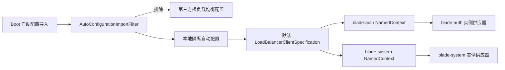
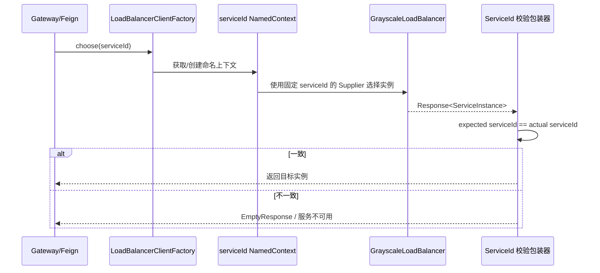

# 跨服务负载均衡实例隔离详细设计

## 1. 文档信息

| 项目 | 内容 |
| --- | --- |
| 设计编号 | DESIGN-REQ-2026-007 |
| 关联需求 | [REQ-2026-007](../requirements/REQ-2026-007-loadbalancer-isolation.md) |
| 关联数据库设计 | 不涉及 |
| 关联测试 | [TEST-REQ-2026-007](../test/TEST-REQ-2026-007-loadbalancer-isolation.md) |
| 文档版本 | 0.1 |
| 文档状态 | 开发中 |
| 技术负责人 | Codex |
| 创建/更新日期 | 2026-09-21 / 2026-09-22 |

## 2. 设计摘要

### 2.1 目标

1. 移除第三方 `BladeLoadBalancerConfiguration` 在根上下文创建的共享负载均衡器。
2. 保证每个 `serviceId` 在独立 Spring Cloud LoadBalancer NamedContext 中创建实例供应器。
3. 复用 `GrayscaleLoadBalancer` 选择规则，并通过包装器增加实例归属校验。

### 2.2 非目标

- 不修改 Blade Tool、Spring Cloud 或 Nacos 依赖版本。
- 不改变 Gateway 路由、Feign 契约、业务接口和数据库。
- 不建设审计或脱敏能力；只遵守不记录敏感数据的通用安全底线。

### 2.3 需求映射

| 需求/验收标准 | 设计落点 | 验证方式 |
| --- | --- | --- |
| REQ-001 / AC-001、AC-002 | 公共自动配置、命名客户端配置 | 多服务并发路由测试 |
| REQ-002 / AC-003 | 实例归属包装器 | 错误实例注入测试 |
| REQ-002 / AC-004 | 条件配置与 Spring 默认实现 | 关闭开关启动测试 |

## 3. 改动范围

| 层次 | 模块/路径 | 主要改动 |
| --- | --- | --- |
| 公共能力 | `blade-common/.../loadbalancer` | 自动配置过滤、命名客户端配置、实例归属校验 |
| 自动配置资源 | `blade-common/src/main/resources/META-INF` | 注册过滤器和本地自动配置 |
| Gateway | `blade-gateway` | 无业务代码改动，传递依赖后自动生效 |
| Feign 调用方 | `blade-auth`、`blade-service`、`blade-ops` | 无业务代码改动，传递依赖后自动生效 |
| 配置 | `doc/nacos` | 不涉及，沿用 `blade.loadbalancer.*` |
| 数据库 | `doc/sql/blade` | 不涉及 |

## 4. 架构与流程

## 5. 模块设计

| 类型 | 名称 | 职责 |
| --- | --- | --- |
| ImportFilter | `BladeLoadBalancerAutoConfigurationImportFilter` | 只排除第三方根自动配置，保留依赖类与属性 |
| AutoConfiguration | `BladeLoadBalancerIsolationAutoConfiguration` | 根上下文只登记默认命名客户端配置 |
| Client Configuration | `BladeLoadBalancerClientConfiguration` | 在每个 `serviceId` 子上下文创建独立负载均衡器 |
| LoadBalancer Wrapper | `ServiceIsolatedGrayscaleLoadBalancer` | 委托灰度规则并校验实例归属，异常时失败关闭 |

核心约束：

1. `BladeLoadBalancerClientConfiguration` 不添加组件或配置类注解，避免进入根组件扫描；由 `LoadBalancerClientFactory` 显式注册。
2. `LoadBalancerClientSpecification` 名称以 `default.` 开头，使配置应用到全部服务命名上下文。
3. `serviceId` 使用 `LoadBalancerClientFactory.getName(environment)` 从当前命名上下文读取，禁止从请求路径或全局可变状态推断。
4. 归属不一致只记录期望和实际服务标识，不记录实例地址、请求头、Token 或请求体。

## 6. HTTP 与 Feign 契约

HTTP 路径、参数、`R<T>` 响应及 Feign Java 签名均不变。正常请求保持兼容；无实例或归属校验失败时由 Spring Cloud Gateway/OpenFeign 沿用服务不可用与降级语义，调用方不得将其视为业务成功。

## 7. 数据、事务、缓存与权限

- 数据库与 Entity：不涉及。
- 本地及分布式事务：不涉及；路由在业务事务开始前完成。
- 业务缓存：不涉及；Spring Cloud 内部实例缓存保持原实现。
- 认证、租户、数据权限：不改变现有规则。
- 审计、脱敏：不涉及；不得记录敏感信息。

## 8. 配置兼容性

沿用 `blade.loadbalancer.enabled`、`blade.loadbalancer.version` 和 `blade.loadbalancer.prior-ip-pattern`：

- `enabled=true` 或缺省：使用本地隔离配置和 Blade 灰度规则。
- `enabled=false`：本地配置不注册，Spring Cloud 默认 `RoundRobinLoadBalancer` 生效。
- 不新增 Nacos Data ID 或环境变量。

## 9. 异常与日志

| 场景 | 处理 | 对外结果 |
| --- | --- | --- |
| serviceId 为空 | 命名上下文创建失败并明确报错 | 应用启动或首次调用失败 |
| 无可用实例 | 透传 `EmptyResponse` | 服务不可用/Feign 降级 |
| 实例归属不一致 | ERROR 记录 expected/actual serviceId，返回 `EmptyResponse` | 服务不可用，不转发 |

## 10. 发布与回滚

发布顺序：公共模块构建 → Gateway 镜像 → 验证动态路由 → auth/system 等 Feign 调用方镜像 → 全链路验证。新旧实例可短时并存，但旧 Gateway 仍有串服务风险，不应长期保留。

回滚方式：回滚应用镜像至上一版本，并临时设置 `BLADE_LOADBALANCER_ENABLED=false` 使用 Spring 默认实现。数据库与配置无不可逆变更。

## 11. 验证计划与实现记录

- 编译：`mvn clean package -DskipTests -pl blade-gateway,blade-auth,blade-service/blade-system -am`。
- 依赖：确认仍为单一 `blade-starter-loadbalancer` 和 `spring-cloud-loadbalancer` 版本。
- 产物：确认 `blade-common` JAR 包含自动配置 imports、filter 注册和四个实现类。
- 运行时：并发交替访问 `blade-system` 与 `blade-auth`，确认持续同时成功。
- Feign：由至少一个调用两个不同服务的调用方验证无交叉路由。
- 测试执行结果记录在关联测试文档；编译不替代真实环境验收。

实际完成范围：公共自动配置过滤、命名客户端隔离和实例归属校验已实现；JDK 21 下 Gateway、auth、system 及依赖共 11 个模块打包成功，JAR 资源与依赖树检查通过。真实 Nacos 并发路由、Feign 和配置关闭场景尚待执行。

## 12. 风险、评审与变更

| 编号 | 风险/问题 | 状态/结论 |
| --- | --- | --- |
| DESIGN-ITEM-001 | Boot 自动配置过滤器未进入最终 JAR 会导致第三方配置继续生效 | 构建后检查资源与类 |
| DESIGN-ITEM-002 | 仅验证 Gateway 不能覆盖 Feign 多服务调用 | 测试文档保留独立用例 |
| DESIGN-ITEM-003 | 后续升级到官方修复版可能形成重复配置 | 升级时先比较源码并移除本地兼容层 |

| 日期 | 版本 | 变更内容 | 修改人 |
| --- | --- | --- | --- |
| 2026-09-21 | 0.1 | 初稿与实现设计 | Codex |
