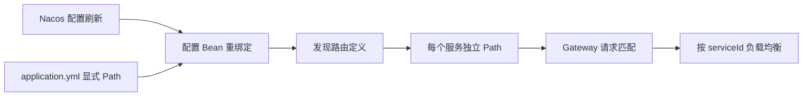
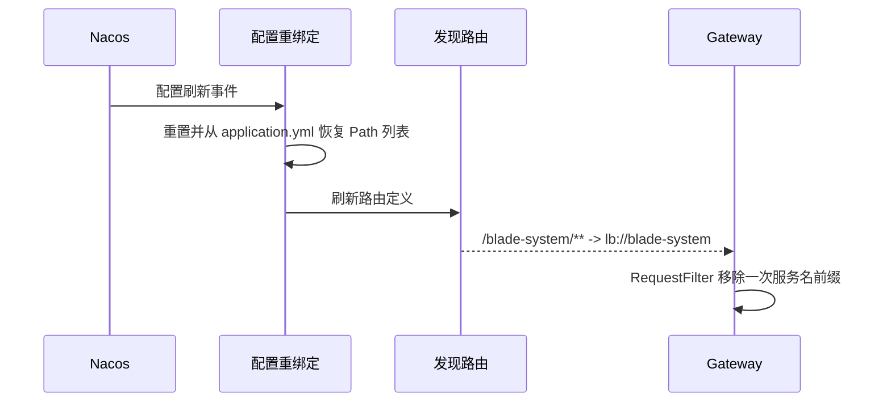

# 跨服务动态路由隔离详细设计

## 1. 文档信息

| 项目 | 内容 |
| --- | --- |
| 设计编号 | DESIGN-REQ-2026-007 |
| 关联需求 | [REQ-2026-007](../requirements/REQ-2026-007-loadbalancer-isolation.md) |
| 关联数据库设计 | 不涉及 |
| 关联测试 | [TEST-REQ-2026-007](../test/TEST-REQ-2026-007-loadbalancer-isolation.md) |
| 文档版本 | 0.4 |
| 文档状态 | 开发中 |
| 技术负责人 | Codex |
| 创建/更新日期 | 2026-09-21 / 2026-09-28 |

## 2. 设计摘要与需求映射

Gateway 5.0.2 在 `GatewayDiscoveryClientAutoConfiguration` 创建 `DiscoveryLocatorProperties` 时填入默认 Path 和 RewritePath。当前 Spring Cloud Context 5.0.2 的 `ConfigurationPropertiesRebinder` 在 Nacos 配置刷新时先将配置 Bean 属性重置为其无参构造默认值；该类的谓词和过滤器默认列表为空。现有外部配置只显式启用发现路由，没有声明谓词，重绑定后的路由定义因此不含 Path。`RouteDefinitionRouteLocator` 对空谓词列表按匹配所有请求处理，首条发现路由接走其他服务请求。

| 需求/验收标准 | 设计落点 | 验证方式 |
| --- | --- | --- |
| REQ-001 / AC-001、AC-002 | Gateway `application.yml` 显式绑定发现路由 Path 谓词 | 启动与配置刷新后的路由构建日志、交替只读请求 |
| REQ-001 / AC-003 | 保留按目标 serviceId 的路由与实例选择 | 无实例、未知路径的失败语义 |
| REQ-001 / AC-004 | 保留内置发现 Locator 与既有刷新机制 | 注册和下线隔离测试服务 |

## 3. 模块范围与配置

仅修改 `blade-gateway/src/main/resources/application.yml`，显式提供内置 Locator 的 Path 谓词：

```yaml
spring:
  cloud:
    gateway:
      server:
        webflux:
          discovery:
            locator:
              predicates:
                - name: Path
                  args:
                    pattern: "'/' + serviceId + '/**'"
```

表达式与 Gateway 5.0.2 自动配置默认表达式一致。Bean 首次创建时与配置刷新重绑定时均能从配置恢复相同条件；路由 ID 和 `lb://serviceId` 继续由内置 `DiscoveryClientRouteDefinitionLocator` 生成。`bootstrap.yml` 的 `discovery.locator.enabled=true`、Nacos Data ID 和依赖版本保持原样。本次不恢复已回退的负载均衡隔离代码，也不新增路由生成器。

当前 `RequestFilter` 在路由命中后、负载均衡前移除一次服务名前缀。内置 RewritePath 在启动初期对该结果不再匹配，刷新后即使过滤器列表被重置也不改变下游路径。本修复只要求 Path 谓词稳定，未来若删除 `RequestFilter`，必须重新设计前缀裁剪，不能直接依赖该结论。

## 4. 架构与时序


```mermaid
flowchart LR
    N[Nacos 配置刷新] --> R[配置 Bean 重绑定]
    C[application.yml 显式 Path] --> R
    R --> D[发现路由定义]
    D --> P[每个服务独立 Path]
    P --> G[Gateway 请求匹配]
    G --> L[按 serviceId 负载均衡]
```


```mermaid
sequenceDiagram
    participant N as Nacos
    participant C as 配置重绑定
    participant R as 发现路由
    participant G as Gateway
    N->>C: 配置刷新事件
    C->>C: 重置并从 application.yml 恢复 Path 列表
    C->>R: 刷新路由定义
    R-->>G: /blade-system/** -> lb://blade-system
    G->>G: RequestFilter 移除一次服务名前缀
```

## 5. 契约、数据与安全

- HTTP API：`/{serviceId}/**` 对外路径、参数位置、`R<T>` 响应和错误语义不变；匿名与授权路径沿用现有规则。该修复不新增写操作，幂等与并发业务规则不涉及。
- Feign：API 模块、服务名、签名、Fallback、Sentinel 和超时均不变；Feign 直连不经过本次 Gateway 路由。
- 数据：Entity、MySQL、租户表、逻辑删除、缓存及历史数据不涉及；数据库设计和 SQL 脚本不涉及。
- 事务：请求路由发生在业务事务之前，本地及分布式事务不涉及。
- 权限与租户：不修改认证头、Token、角色、租户 ID 或数据权限；错误路由不得绕过现有服务端校验。
- 审计、脱敏：不涉及，需求未提出；诊断日志不记录密码、Token、密钥、查询串或请求体。

## 6. 失败处理与日志

| 场景 | 处理 | 对外结果 |
| --- | --- | --- |
| 未知服务路径 | 不命中任何已发现服务 Path | 保持无路由响应 |
| 服务无实例 | 不选择其他服务实例 | 保持服务不可用语义 |
| 配置刷新后路由无 Path | 验证视为阻断，不发布修复结论 | 禁止将首次启动成功当作验收 |

诊断分支保留 `LoadBalancerDiagnosticFilter` 和 `RouteDefinitionRouteLocator=DEBUG`，用于核对原始路径、路由 ID、匹配 Path 及最终服务。正式合入前评估并移除临时 INFO/DEBUG 日志，避免长期产生高频日志。

## 7. 发布、回滚与验证

1. 使用 JDK 21 编译 Gateway 及依赖模块；确认镜像 JAR 中 `application.yml` 含显式 Path 表达式。
2. 只发布 Gateway 镜像；auth、system 和数据库无需重启或迁移。旧版 Gateway 不应与新版长期并行承接相同入口流量。
3. 由用户确认启动与 Nacos 刷新后的每次发现路由重建均有 `applying {pattern=/blade-*/**} to Path`，跨至少三个约 30 秒周期交替访问 auth/system/ai，并核对后端没有收到其他服务的路径。
4. 失败时回滚 Gateway 镜像；回滚会恢复已知的错误路由风险，应在隔离测试入口处理并保留错误证据。配置无不可逆项。

已执行：对依赖字节码、网关源码和 WSL 日志完成静态定位；修复配置已编写，JDK 21 模块编译和 SnakeYAML 解析通过。修复后的真实环境验收状态见关联测试文档，构建成功不等于接口或刷新验收成功。

## 8. 风险与变更记录

| 编号 | 风险/问题 | 状态/结论 |
| --- | --- | --- |
| DESIGN-ITEM-001 | 配置优先级覆盖显式 Path 列表 | 部署后必须以运行时重建日志确认 |
| DESIGN-ITEM-002 | 仅检查启动阶段会漏掉 Nacos 刷新后的丢失 | 验证至少三个实际刷新周期 |
| DESIGN-ITEM-003 | 旧 prod Nacos 静态路由使用旧前缀和 `StripPrefix=1` | 当前不生效；若以后迁移为新前缀，不得与现有 `RequestFilter` 双重裁剪 |

| 日期 | 版本 | 变更内容 | 修改人 |
| --- | --- | --- | --- |
| 2026-09-21 | 0.1 | 初次设计跨服务路由隔离 | Codex |
| 2026-09-24 | 0.3 | 归档前序验证分支的实现与动态刷新风险 | Codex |
| 2026-09-28 | 0.4 | 根据 Nacos 重绑定后的路由日志改为显式 Path 配置 | Codex |
