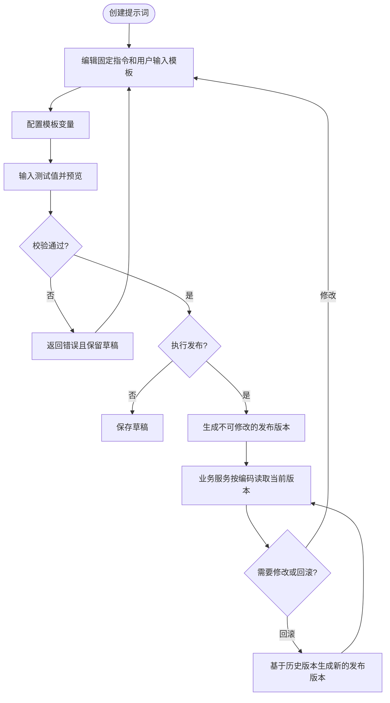
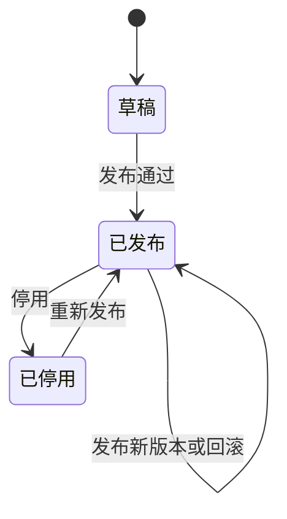

# 提示词管理需求文档

## 1. 文档信息

| 项目 | 内容 |
| --- | --- |
| 需求名称 | 提示词管理 |
| 需求编号 | REQ-2026-001 |
| 文档版本 | 0.3 |
| 所属模块 | AI 提示词管理、内部业务调用 |
| 目标版本/迭代 | SpringBlade 5.x / AI 能力第一阶段 |
| 文档状态 | 开发中 |
| 产品负责人 | 用户 |
| 技术负责人 | 待指定 |
| 创建日期 | 2026-09-08 |
| 最后更新日期 | 2026-09-09 |
| 关联事项 | [需求索引](../requirements-index.md)；[数据库设计](../database/DB-REQ-2026-001-prompt-management.md)；[详细设计](../design/DESIGN-REQ-2026-001-prompt-management.md)；[测试文档](../test/TEST-REQ-2026-001-prompt-management.md) |

## 2. 摘要与目标

### 2.1 摘要

当前项目缺少统一的提示词管理能力，提示词内容、运行时输入和发布版本容易分散在业务代码或配置中，无法稳定预览、发布和回滚。本需求建设后端提示词管理能力，使管理员能够维护固定指令、用户输入模板和变量定义，并通过受控发布版本供其他业务服务调用。

### 2.2 需求目标

1. 统一管理提示词名称、稳定编码、固定指令、用户输入模板和变量定义。
2. 支持草稿编辑、无模型调用的渲染预览、发布、停用、版本历史和回滚。
3. 保证业务服务只能使用当前租户已发布且未停用的提示词版本。
4. 对提示词管理、发布和运行时读取建立明确的权限、租户和校验边界。
5. 为后续模型调试、效果评估和更多 AI 能力保留可扩展边界，但不纳入本期。

### 2.3 非目标

- 本期不建设前端页面及交互原型。
- 本期不做标签和复杂分类管理。
- 本期不调用任何大模型，不提供在线对话或调试运行，不产生模型费用。
- 本期不提供 Token 统计、成本统计、效果评分、A/B 测试或自动优化。
- 本期不提供多级审批流、灰度发布或定时发布。
- 本期不单独配置模型供应商、模型参数和结构化输出 Schema。
- 本期只设计和维护 MySQL，不提供其他数据库方言脚本。
- 本期不建设提示词专属审计或通用审计能力；后续如有需要，应建立独立需求统一设计。

## 3. 用户故事与范围

### 3.1 用户故事

| 故事编号 | 优先级 | 用户故事 | 典型场景 |
| --- | --- | --- | --- |
| US-001 | Must | 作为提示词管理员，我希望统一创建和编辑提示词，以便业务规则不再散落在代码中。 | 新增或优化业务提示词 |
| US-002 | Must | 作为提示词管理员，我希望使用示例变量预览最终消息，以便发布前发现模板错误。 | 草稿校验与评审 |
| US-003 | Must | 作为发布人员，我希望发布、停用和回滚提示词版本，以便稳定控制线上行为。 | 上线、故障恢复 |
| US-004 | Must | 作为业务服务，我希望通过稳定编码取得当前发布版本并完成变量渲染，以便不依赖数据库 ID 或草稿内容。 | 合同审核、摘要等业务调用 |
| US-005 | Must | 作为租户管理员，我希望只能管理和调用本租户提示词，以避免跨租户数据泄露。 | 多租户环境 |
| US-006 | Should | 作为管理员，我希望复制已有提示词创建新草稿，以减少相似场景的重复录入。 | 创建相似提示词 |

### 3.2 范围内

- 提示词列表、搜索、详情和状态查看。
- 提示词草稿的新增、编辑、复制和受控删除。
- 固定指令与用户输入模板的组合管理。
- 模板变量定义、自动识别和一致性校验。
- 使用测试变量进行渲染预览，返回最终消息结构。
- 提示词发布、停用、版本历史、版本查看和回滚。
- 业务服务按稳定编码读取并渲染当前发布版本。
- 租户隔离和操作权限。

### 3.3 范围外

- 标签、分类树、收藏、评分和推荐。
- 前端页面、编辑器样式和交互布局。
- 真实模型调用、流式响应、会话历史和模型响应存储。
- 提示词使用效果、Token、耗时和成本分析。
- 跨租户共享提示词、平台公共模板市场和导入导出。

## 4. 业务流程

### 4.1 主流程

1. 管理员创建提示词草稿并设置租户内唯一的稳定编码。
2. 管理员维护固定指令、用户输入模板和变量定义。
3. 系统校验模板变量，并使用测试值生成预览结果。
4. 具备发布权限的用户填写变更说明并发布版本。
5. 业务服务通过提示词编码和运行时变量取得当前发布版本的渲染结果。
6. 后续修改产生新草稿；新版本发布前，业务服务继续使用原发布版本。
7. 发生问题时，发布人员基于历史版本执行回滚并形成新的发布记录。

### 4.2 业务流程图

### 4.3 异常与替代流程

| 编号 | 触发条件 | 系统行为 | 数据是否改变 |
| --- | --- | --- | :---: |
| EX-001 | 提示词编码在当前租户已存在 | 拒绝保存并返回唯一性错误 | 否 |
| EX-002 | 模板存在未声明或无法解析的变量 | 拒绝发布；预览返回变量错误 | 草稿可保存 |
| EX-003 | 必填变量未提供 | 预览或运行时渲染失败，并列出缺失变量 | 否 |
| EX-004 | 无发布权限的用户请求发布、停用或回滚 | 拒绝操作 | 否 |
| EX-005 | 业务调用不存在、未发布或已停用的提示词 | 返回明确业务失败，不回退到草稿或其他租户数据 | 否 |
| EX-006 | 发布时草稿已被其他人更新 | 拒绝覆盖并提示刷新后重试 | 否 |
| EX-007 | 删除已发布或存在历史发布记录的提示词 | 拒绝删除，提示使用停用 | 否 |
| EX-008 | 回滚目标版本不存在或不属于当前提示词 | 拒绝回滚 | 否 |

## 5. 功能需求与验收标准

### 5.1 REQ-001 提示词查询

- 关联用户故事：US-001、US-003
- 优先级：Must
- 系统应支持分页查询提示词，并按名称、编码和状态筛选。
- 列表应返回当前版本、发布状态、更新时间和创建/更新责任人等管理信息。
- 详情应返回当前草稿、当前发布版本摘要和可执行操作状态，但不得泄露其他租户数据。

验收标准：

- `AC-001`：Given 当前租户存在多条提示词，When 按名称、编码或状态查询，Then 仅返回符合条件的当前租户数据。
- `AC-002`：Given 提示词不存在或属于其他租户，When 查询详情，Then 返回不存在或无访问权限，且不泄露资源内容。

### 5.2 REQ-002 草稿新增、编辑、复制与删除

- 关联用户故事：US-001、US-006
- 优先级：Must
- 新提示词必须设置名称和租户内稳定且唯一的编码，创建后默认为草稿。
- 已发布内容不可直接覆盖；修改已发布提示词时应形成新的草稿版本。
- 复制操作应复制内容和变量定义，但必须生成新的提示词身份，且不复制发布状态和历史版本。
- 仅从未发布且未被业务引用的草稿允许删除；其他情况应使用停用。

验收标准：

- `AC-003`：Given 编码在当前租户未使用，When 创建合法提示词，Then 生成可继续编辑的草稿。
- `AC-004`：Given 提示词已有发布版本，When 编辑内容，Then 原发布版本保持不变并生成或更新草稿。
- `AC-005`：Given 复制一条提示词，When 提供新的名称和编码，Then 新资源为独立草稿且无历史发布记录。
- `AC-006`：Given 提示词已有发布记录，When 请求删除，Then 系统拒绝且数据不改变。

### 5.3 REQ-003 提示词内容组成

- 关联用户故事：US-001、US-004
- 优先级：Must
- 一条提示词由固定指令和用户输入模板组成，不将两者建模为互斥的提示词类型。
- 固定指令用于描述角色、目标、规则、限制和输出要求。
- 用户输入模板用于组织运行时输入，并允许引用模板变量。
- 固定指令与用户输入模板可以单独为空，但不得同时为空。
- 运行时应按固定指令、用户消息的顺序输出最终消息结构。

验收标准：

- `AC-007`：Given 固定指令和用户输入模板至少一个非空，When 保存草稿，Then 系统保留两部分内容及其顺序。
- `AC-008`：Given 两部分内容均为空，When 保存或发布，Then 系统拒绝并返回明确错误。

### 5.4 REQ-004 模板变量管理

- 关联用户故事：US-001、US-002、US-004
- 优先级：Must
- 模板变量统一使用 `{{variableName}}` 语法，变量名称应稳定且区分大小写。
- 第一阶段支持单行文本、多行文本、数字和布尔值。
- 变量定义支持显示名称、类型、是否必填、默认值、示例值、最大长度和输入说明。
- 系统应识别模板中引用的变量，并校验未声明变量、重复定义、非法名称和未使用变量。
- 未使用变量可以保存草稿，但发布时应作为警告返回；未声明变量必须阻止发布。

验收标准：

- `AC-009`：Given 模板包含合法变量，When 系统解析，Then 返回去重后的变量引用及其定义状态。
- `AC-010`：Given 模板引用未声明变量，When 预览或发布，Then 返回具体变量名称并阻止发布。
- `AC-011`：Given 必填变量缺失且无默认值，When 运行时渲染，Then 渲染失败且不产生不完整消息。
- `AC-012`：Given 输入不符合变量类型或长度，When 预览或运行时渲染，Then 返回对应校验错误。

### 5.5 REQ-005 渲染预览

- 关联用户故事：US-002
- 优先级：Must
- 预览只执行模板校验与变量替换，不调用大模型。
- 预览应支持尚未保存的草稿内容和测试变量，不要求先持久化。
- 预览结果应分别返回最终固定指令、最终用户消息、完整消息顺序、未解析变量、错误和警告。
- 预览测试值不得写入提示词定义；本期不保存预览历史。

验收标准：

- `AC-013`：Given 合法模板和完整测试变量，When 执行预览，Then 返回变量替换后的固定指令和用户消息。
- `AC-014`：Given 草稿尚未保存，When 提交草稿内容进行预览，Then 系统可返回预览且不新增或修改提示词数据。
- `AC-015`：Given 变量缺失或非法，When 执行预览，Then 返回结构化错误且不调用模型或保存测试值。

### 5.6 REQ-006 发布与停用

- 关联用户故事：US-003
- 优先级：Must
- 发布前必须完成内容、变量、状态和并发校验，并要求填写变更说明。
- 每个提示词在同一租户同一时刻只能有一个当前发布版本。
- 发布成功后形成不可修改的版本快照，并原子切换当前发布版本。
- 发布新版本前，业务服务继续使用原发布版本；发布失败不得影响原版本。
- 停用后管理数据和历史版本保留，但新的业务调用必须失败。

验收标准：

- `AC-016`：Given 草稿校验通过且用户具备发布权限，When 发布，Then 生成不可修改版本并切换为当前版本。
- `AC-017`：Given 发布校验或持久化失败，When 操作结束，Then 原当前版本保持可用且不出现部分发布。
- `AC-018`：Given 提示词已停用，When 业务服务请求运行时内容，Then 返回已停用错误。
- `AC-019`：Given 提示词已停用，When 管理员查看详情和历史版本，Then 数据仍可查询。

### 5.7 REQ-007 版本历史与回滚

- 关联用户故事：US-003
- 优先级：Must
- 系统应记录版本号、内容快照、变量快照、变更说明、发布人和发布时间。
- 历史发布版本不可编辑或删除。
- 回滚不直接修改历史记录，应基于目标历史版本生成新的发布版本。
- 回滚必须执行与普通发布相同的权限、租户、并发和完整性校验。

验收标准：

- `AC-020`：Given 提示词发布过多个版本，When 查询版本历史，Then 按版本返回不可修改的完整快照和发布信息。
- `AC-021`：Given 选择合法历史版本并具备回滚权限，When 执行回滚，Then 生成新版本并切换当前发布版本。
- `AC-022`：Given 回滚失败，When 操作结束，Then 当前发布版本和历史版本均不改变。

### 5.8 REQ-008 业务运行时读取与渲染

- 关联用户故事：US-004
- 优先级：Must
- 业务调用必须使用稳定提示词编码，不依赖数据库 ID。
- 系统只允许读取当前租户已发布且未停用的当前版本。
- 运行时输入只用于本次渲染，本期不写入提示词定义或调用历史。
- 渲染失败必须返回明确原因，禁止静默返回空内容、草稿或其他版本。
- 内部调用失败或服务降级时必须返回明确失败结果，调用方不得将其视为正常提示词。

验收标准：

- `AC-023`：Given 当前租户存在已发布提示词，When 业务服务按编码提交合法变量，Then 返回当前发布版本的最终消息结构。
- `AC-024`：Given 编码不存在、未发布、已停用或变量非法，When 业务调用，Then 返回可区分的失败结果且无跨租户回退。
- `AC-025`：Given 提示词存在新草稿但未发布，When 业务调用，Then 继续使用原当前发布版本。

### 5.9 REQ-009 权限与租户隔离

- 关联用户故事：US-003、US-005
- 优先级：Must
- 管理和运行时数据均按当前登录或内部调用上下文中的租户隔离，客户端不得自行指定或篡改资源租户。
- 权限动作至少包括查看、新增、编辑、复制、删除、预览、发布、停用和回滚。
- 发布、停用和回滚应属于高风险操作，由明确授权的管理员或提示词管理员执行。

验收标准：

- `AC-026`：Given 用户无对应操作权限，When 请求管理操作，Then 系统拒绝且数据不改变。
- `AC-027`：Given 用户尝试访问其他租户提示词，When 查询、编辑、发布或运行时调用，Then 系统拒绝且不泄露资源是否存在及正文。

## 6. 业务规则与状态

### 6.1 业务规则

| 规则编号 | 规则 | 违反时行为 |
| --- | --- | --- |
| BR-001 | 提示词编码在租户内唯一且创建后保持稳定 | 拒绝重复或非法修改 |
| BR-002 | 固定指令与用户输入模板不得同时为空 | 拒绝保存或发布 |
| BR-003 | 模板变量使用 `{{variableName}}`，未声明变量不得发布 | 返回变量错误 |
| BR-004 | 已发布版本不可修改或删除 | 创建新草稿或拒绝操作 |
| BR-005 | 每个提示词同时只能有一个当前发布版本 | 发布事务失败并保留原版本 |
| BR-006 | 草稿不影响业务运行时读取 | 继续返回原发布版本 |
| BR-007 | 停用提示词禁止新的业务运行时读取 | 返回停用错误 |
| BR-008 | 回滚生成新版本，不覆盖历史版本 | 拒绝原地修改 |
| BR-009 | 预览不调用模型且不保存测试变量 | 返回渲染结果或错误 |
| BR-010 | 管理与运行时访问都必须限制在当前租户 | 拒绝越租户访问 |

### 6.2 状态与迁移

| 状态 | 含义 | 允许操作 |
| --- | --- | --- |
| 草稿 | 尚未发布，或已发布提示词的新编辑版本 | 编辑、预览、发布、受控删除 |
| 已发布 | 存在当前业务使用版本 | 查看、创建新草稿、停用、回滚 |
| 已停用 | 保留数据但禁止运行时调用 | 查看历史、重新发布符合规则的版本 |

## 7. 认证与访问边界

| 操作 | 登录/内部身份 | 权限要求 | 资源边界 |
| --- | --- | --- | --- |
| 查询、详情、预览 | 已登录用户 | 对应查看/预览权限 | 当前租户 |
| 新增、编辑、复制、删除 | 已登录用户 | 对应写权限 | 当前租户 |
| 发布、停用、回滚 | 已登录用户 | 高风险管理权限 | 当前租户 |
| 运行时读取 | 可信内部调用身份 | 运行时读取权限或内部服务契约 | 当前租户 |

服务端必须从安全上下文取得租户与用户身份，不信任客户端提交的资源归属字段。权限控制不能只依赖未来前端隐藏按钮。

## 8. 页面与交互要求

本需求为后端需求，暂不定义 Saber 页面、组件和交互细节。后续前端需求应基于本文 API 能力和业务规则单独建立。

## 9. 质量要求与影响

### 9.1 非功能要求

| 类别 | 要求 | 验证标准 |
| --- | --- | --- |
| 一致性 | 发布、停用和回滚不得产生部分状态 | 故障场景下当前版本保持确定 |
| 安全 | 严格执行权限、租户隔离和敏感日志限制 | 无权限、越租户及日志检查 |
| 可用性 | 运行时失败必须明确，不返回空值冒充成功 | 不存在、停用、降级场景可区分 |
| 兼容性 | 数据库范围仅为 MySQL；Long ID 对外保持精度安全 | 数据库设计和响应检查 |
| 可维护性 | 提示词通过稳定编码调用，发布版本不可变 | 版本和调用行为检查 |

### 9.2 数据与接口影响

| 影响项 | 是否涉及 | 需求层说明 |
| --- | :---: | --- |
| 新增数据实体 | 是 | 提示词、版本及必要的变量定义；字段在数据库设计中确定 |
| 新增管理 API | 是 | 查询、草稿、预览、发布、停用、版本和回滚 |
| 新增内部调用契约 | 是 | 按编码读取并渲染当前发布版本 |
| MySQL 脚本 | 是 | 全量与升级脚本在数据库设计阶段确定 |
| Nacos/租户配置 | 是 | 租户表配置及可能的服务配置在详细设计阶段确定 |
| 历史数据迁移 | 否 | 当前无既有提示词数据 |
| 外部模型依赖 | 否 | 本期不调用模型 |

### 9.3 风险与开放问题

| 编号 | 类型 | 内容 | 状态 |
| --- | --- | --- | --- |
| ITEM-001 | 问题 | 提示词管理最终落在独立 AI 服务还是现有业务服务，由详细设计结合调用范围确定 | 已解决：独立 `blade-ai-api` 与 `blade-ai` |
| ITEM-002 | 问题 | 发布权限默认仅管理员还是支持独立提示词管理员角色，需要评审确认 | 开放 |
| ITEM-003 | 风险 | 变量替换若未区分指令和用户数据边界，可能引入提示词注入风险，详细设计需给出隔离规则 | 已解决：固定消息角色、单次字面量替换，不递归执行 |
| ITEM-004 | 风险 | 并发编辑和发布可能覆盖草稿，详细设计需确定版本校验策略 | 已解决：`lockVersion` 条件更新与发布行锁 |

## 10. 评审与变更

### 10.1 评审清单

- [ ] 固定指令、用户输入模板和变量定义的边界已确认。
- [ ] 草稿、发布、停用和回滚规则已确认。
- [ ] 预览不调用模型、不保存测试值的范围已确认。
- [ ] 运行时按稳定编码读取当前发布版本的规则已确认。
- [ ] 权限和租户隔离要求已确认。
- [ ] 非目标和开放问题已确认。
- [ ] 每项 Must 需求均有可执行验收标准。

### 10.2 评审结论

| 评审领域 | 结论 | 评审人 | 日期 | 备注 |
| --- | --- | --- | --- | --- |
| 产品范围 | 待评审 | 待指定 | 待指定 | - |
| 技术可行性 | 待评审 | 待指定 | 待指定 | - |
| 测试可验收性 | 待评审 | 待指定 | 待指定 | - |

### 10.3 变更记录

| 日期 | 版本 | 变更内容 | 修改人 |
| --- | --- | --- | --- |
| 2026-09-08 | 0.1 | 建立提示词管理后端功能需求初稿 | Codex |
| 2026-09-09 | 0.1 | 补充详细设计和数据库设计关联链接，需求内容未变 | Codex |
| 2026-09-09 | 0.2 | 移除提示词专属审计范围，通用审计改为后续独立需求 | Codex |
| 2026-09-09 | 0.3 | 进入开发阶段，关联实际实现、数据库脚本和测试文档，更新已解决技术问题 | Codex |
