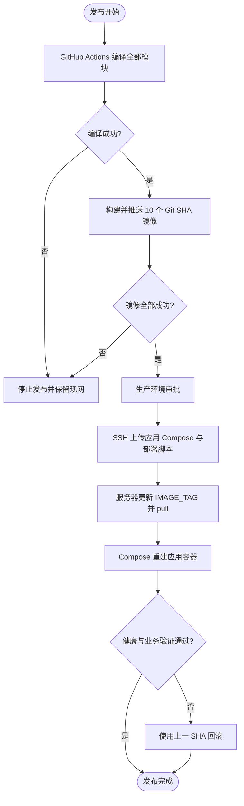

# Docker Compose 分层部署与 GitHub Actions 发布需求文档

## 1. 文档信息

| 项目 | 内容 |
| --- | --- |
| 需求名称 | Docker Compose 分层部署与 GitHub Actions 发布 |
| 需求编号 | REQ-2026-006 |
| 文档版本 | 0.3 |
| 所属模块 | Docker 镜像、基础设施、应用部署、CI/CD |
| 目标版本/迭代 | SpringBlade 5.0.1 |
| 文档状态 | 开发中 |
| 产品负责人 | 用户 |
| 技术负责人 | Codex |
| 创建日期 | 2026-09-17 |
| 最后更新日期 | 2026-09-17 |
| 关联事项 | [详细设计](../design/DESIGN-REQ-2026-006-compose-deployment.md)、[测试文档](../test/TEST-REQ-2026-006-compose-deployment.md)、[部署教程](../guide/docker-compose-github-actions-deployment.md) |

## 2. 摘要与目标

### 2.1 摘要

现有单一 Compose 同时管理 Nacos、Redis、Nginx 和全部微服务，应用发布可能影响有状态基础设施，且镜像固化了 `test` profile、固定容器 IP 和内网地址。本需求将 MySQL、Redis、Nacos、Sentinel、应用和入口拆分为独立 Compose project；中间件按服务使用独立目录和宿主机 `data` 绑定挂载，并由 GitHub Actions 构建不可变微服务镜像、推送 GHCR、远程更新应用栈。

### 2.2 需求目标

1. MySQL、Redis、Nacos、Sentinel 分别使用独立目录和 Compose project，与业务微服务保持独立生命周期。
2. 每个业务镜像只包含运行时基础镜像和对应 JAR，不携带中间件、生产配置或密钥。
3. 生产运行参数通过环境变量和 Nacos 外置，消除固定 IP 与固定 namespace。
4. GitHub Actions 使用 Git SHA 镜像标签完成可审计发布，并能回滚到历史标签。
5. 提供从服务器目录、网络、权限、基础设施初始化、Nacos 配置导入到发布回滚的完整教程。

### 2.3 非目标

- 不建设 Kubernetes、服务网格、跨主机自动调度或自动扩缩容。
- 不将当前共享 `blade` Schema 拆分为每个微服务独立数据库。
- 不自动迁移已有生产数据库，不自动执行升级 SQL。
- 不建设审计或脱敏功能；部署过程仅遵守不提交、不打印敏感值的安全底线。

## 3. 用户故事与范围

| 故事编号 | 优先级 | 用户故事 | 典型场景 | 依赖 |
| --- | --- | --- | --- | --- |
| US-001 | Must | 作为运维人员，我希望中间件与应用独立部署，以便应用发布不影响持久化数据。 | 生产发版、应用回滚 | Docker Compose v2 |
| US-002 | Must | 作为开发人员，我希望一次提交生成全部微服务镜像，以便使用统一版本发布。 | Git tag 或手工触发 Actions | GHCR、JDK 21、Maven |
| US-003 | Must | 作为运维人员，我希望通过 Git SHA 回滚应用，以便快速恢复上一稳定版本。 | 新版本异常 | 历史镜像仍保留 |
| US-004 | Should | 作为部署人员，我希望有完整教程，以便新服务器可重复部署。 | 首次部署 | Linux、Docker、SSH |

### 3.1 范围内

- 独立 `mysql`、`redis`、`nacos`、`sentinel`、`app`、`ingress` Compose。
- 每个中间件使用独立服务目录，持久化数据绑定到宿主机 `data` 或 `logs` 目录。
- 后端与入口使用独立 external network，通过固定网络别名通信，不使用固定容器 IP。
- 10 个现有微服务 Dockerfile 的纯运行时改造。
- Nacos、Sentinel、数据库、Redis和安全密钥的环境变量化。
- GHCR 镜像发布、SSH 部署、不可变标签与回滚脚本。
- 需求、设计、测试和部署教程。

### 3.2 范围外

- Saber 前端构建与发布；前端应使用独立流水线。
- MySQL、Redis、Nacos 集群高可用方案；当前模板为单机参考实现。
- 云数据库、云 Redis、Harbor 等供应商专属配置。

## 4. 业务流程

| 编号 | 触发条件 | 系统行为 | 用户提示 | 数据是否改变 |
| --- | --- | --- | --- | :---: |
| EX-001 | Maven 或镜像构建失败 | Actions 停止，不执行 SSH 部署 | 工作流失败日志 | 否 |
| EX-002 | 基础设施不可用 | 应用启动失败或保持重启，基础设施卷不被删除 | Compose 状态与服务日志 | 否 |
| EX-003 | 新镜像异常 | 使用上一 SHA 再次执行应用部署脚本 | 回滚后的容器状态 | 否 |
| EX-004 | 已有 MySQL 数据库 | 不执行全量初始化 SQL | 教程要求使用升级脚本 | 否 |

## 5. 功能需求与验收标准

### 5.1 REQ-001 分层 Compose

- 优先级：Must
- 处理规则：四个中间件、业务应用和入口分别使用独立 Compose project；应用部署不得停止、重建或清理中间件目录。
- `AC-001`：Given 中间件已运行，When 更新应用镜像标签并执行应用部署，Then MySQL、Redis、Nacos、Sentinel 容器及其宿主机持久化目录保持不变。
- `AC-002`：Given 全部服务位于同一主机，When 创建 `springblade-backend` 与 `springblade-ingress` external network，Then 应用通过固定网络别名访问中间件，Nginx 只能通过入口网络访问网关，服务重建后不依赖固定 IP。

### 5.2 REQ-002 纯微服务镜像

- 优先级：Must
- 处理规则：镜像仅复制对应 JAR，使用非 root UID，环境 profile 不写入 Dockerfile。
- `AC-003`：Given 任一服务完成 Maven 打包，When 构建镜像，Then 镜像包含运行时基础镜像和单个应用 JAR，不包含 MySQL、Redis、Nacos 或生产 `.env`。
- `AC-004`：Given 容器启动，When 检查进程身份与参数，Then Java 进程使用非 root UID，profile 来自运行环境。

### 5.3 REQ-003 配置外置化

- 优先级：Must
- 处理规则：Nacos/Sentinel 地址、namespace、凭据、数据库、Redis、Token 与 AI 凭据均由部署环境提供。
- `AC-005`：Given `prod` profile 且未显式指定 namespace，When 服务启动，Then 默认使用 `prod` namespace；显式环境变量能够覆盖地址和 namespace。
- `AC-006`：Given 仓库代码和镜像，When 扫描部署文件，Then 不包含真实密码、Token、私钥或生产连接串。

### 5.4 REQ-004 GitHub Actions 发布

- 优先级：Must
- 处理规则：Actions 编译一次，按现有 Dockerfile 发布 10 个 GHCR 镜像，以提交 SHA 前 12 位作为标签，生产部署使用 GitHub Environment 和 SSH。
- `AC-007`：Given tag 推送或手工触发，When工作流成功，Then GHCR 中存在同一 SHA 的全部服务镜像。
- `AC-008`：Given服务器已配置 `.env` 和 GHCR 拉取权限，When部署任务执行，Then仅应用栈切换到新 SHA。
- `AC-009`：Given上一稳定 SHA，When再次执行部署脚本，Then应用栈回到对应镜像版本。

### 5.5 REQ-005 部署教程

- 优先级：Must
- `AC-010`：Given一台新 Linux 服务器，When按教程准备 Docker、环境文件、基础设施、Nacos配置和 GitHub 变量，Then能够完成首次部署所需的全部可执行步骤。
- `AC-011`：Given已有数据库，When阅读升级章节，Then明确禁止重复执行全量脚本，并能找到升级、备份和回滚说明。

## 6. 业务规则

| 规则编号 | 规则 | 适用范围 | 违反时行为 |
| --- | --- | --- | --- |
| BR-001 | 应用镜像标签必须不可变，生产不使用 `latest` | 镜像与部署 | 阻止发布或无法精确回滚 |
| BR-002 | `.env` 只存在服务器和本地环境，不提交 Git | 全部部署栈 | 视为安全缺陷 |
| BR-003 | 全量建库脚本只允许由部署人员对确认的新空库显式执行 | MySQL 初始化 | 停止操作并改用升级脚本 |
| BR-004 | 日常应用发布不得停止或清理任何中间件 Compose project 和宿主机持久化目录 | 应用与基础设施 | 停止操作，避免基础设施中断或数据丢失 |

## 7. 认证与访问边界

- GitHub Actions 通过仓库 `GITHUB_TOKEN` 推送 GHCR，通过生产 Environment 保存 SSH 密钥。
- 生产服务器使用最小权限部署账号；私有 GHCR 镜像使用只读包权限登录。
- MySQL、Redis、Nacos、Sentinel 默认绑定回环地址；Nacos Console 使用宿主机 `18080`，避免与网关调试端口 `8080` 冲突。
- 中间件和业务微服务加入 `springblade-backend`；Nginx 与网关加入 `springblade-ingress`；仅网关同时加入两个网络。
- 业务微服务不直接暴露宿主机端口，仅网关回环端口和入口 Nginx 对外提供访问。
- 审计、脱敏功能不涉及；不得采集或输出部署密钥和完整连接串。

## 8. 页面与交互要求

不涉及业务页面。GitHub Actions 页面用于查看构建、审批和发布结果，Nacos 控制台用于首次导入配置。

## 9. 质量要求与影响

| 类别 | 要求 | 验证标准 |
| --- | --- | --- |
| 安全 | 镜像和仓库不含生产凭据，容器非 root 运行 | 文件扫描、镜像检查 |
| 可用性 | 应用发布不影响基础设施，失败可按 SHA 回滚 | Compose 容器 ID、宿主机数据目录、回滚测试 |
| 兼容性 | 保留 `dev` 本地默认地址，prod/test 可通过环境变量覆盖 | 编译和启动参数检查 |
| 可维护性 | Compose 可执行 `config` 校验，教程与文件路径一致 | 静态验证 |

| 影响项 | 是否涉及 | 需求层说明 | 关联设计 |
| --- | :---: | --- | --- |
| 新增/修改数据实体 | 否 | 不改变业务表结构 | 不涉及数据库设计 |
| 新增/修改 API | 否 | 不改变 HTTP/Feign 契约 | [详细设计](../design/DESIGN-REQ-2026-006-compose-deployment.md) |
| 历史数据处理 | 否 | 已有环境只执行现有升级脚本 | [部署教程](../guide/docker-compose-github-actions-deployment.md) |
| 配置或部署变化 | 是 | Compose、Dockerfile、Nacos 配置与 Actions 全面调整 | [详细设计](../design/DESIGN-REQ-2026-006-compose-deployment.md) |
| 外部依赖 | 是 | Docker Compose v2、GHCR、SSH | [部署教程](../guide/docker-compose-github-actions-deployment.md) |

| 编号 | 类型 | 内容 | 负责人 | 截止日期 | 状态/结论 |
| --- | --- | --- | --- | --- | --- |
| ITEM-001 | 风险 | 单机 Compose 不提供跨主机高可用 | 用户 | 待指定 | 已接受，超出当前范围 |
| ITEM-002 | 依赖 | 真实生产环境、域名、TLS证书和防火墙规则待部署方准备 | 用户 | 待指定 | 开放 |

## 10. 评审与变更

- [x] 摘要、目标、非目标和范围已明确。
- [x] Must 需求均有验收标准。
- [x] 数据库、配置、发布和回滚影响已识别。
- [x] 不涉及审计、脱敏和业务权限变化。
- [x] 真实服务器中间件部署、重建和持久化验证已完成。
- [ ] GHCR、应用、入口、备份恢复和生产业务验收待执行。

| 日期 | 版本 | 变更内容 | 原因 | 影响范围 | 修改人 |
| --- | --- | --- | --- | --- | --- |
| 2026-09-17 | 0.1 | 建立分层 Compose、纯镜像、Actions与教程需求基线 | 用户要求开始改造 | Docker、公共启动配置、Nacos、CI/CD、文档 | Codex |
| 2026-09-17 | 0.2 | 中间件改为独立目录和 Compose，使用本地目录持久化并拆分后端与入口网络 | 用户确认部署目录和通信方案 | Compose、目录、网络、端口、测试与教程 | Codex |
| 2026-09-17 | 0.3 | 完成真实服务器四个中间件部署并修正首次初始化缺陷 | 用户要求仅部署中间件 | MySQL、Redis、Nacos、Sentinel、教程和测试归档 | Codex |
