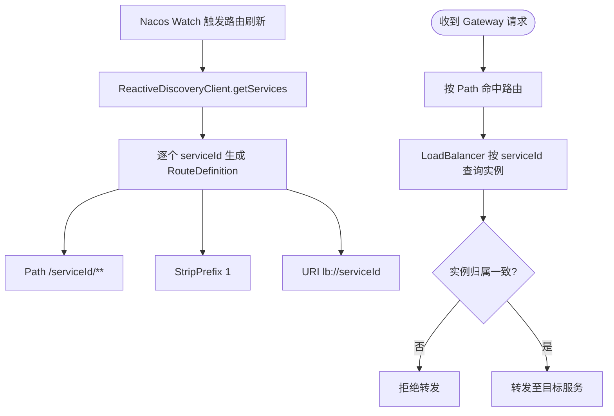

# 跨服务动态路由与负载均衡隔离需求文档

## 1. 文档信息

| 项目 | 内容 |
| --- | --- |
| 需求名称 | 跨服务动态路由与负载均衡隔离 |
| 需求编号 | REQ-2026-007 |
| 文档版本 | 0.2 |
| 所属模块 | Gateway、Feign、`blade-common` |
| 目标版本/迭代 | SpringBlade 5.0.1 开发阶段 |
| 文档状态 | 开发中 |
| 产品负责人 | 用户 |
| 技术负责人 | Codex |
| 创建日期 | 2026-09-21 |
| 最后更新日期 | 2026-09-22 |
| 关联事项 | [详细设计](../design/DESIGN-REQ-2026-007-loadbalancer-isolation.md)、[测试文档](../test/TEST-REQ-2026-007-loadbalancer-isolation.md)；数据库不涉及 |

## 2. 摘要与目标

### 2.1 摘要

三机部署验证发现 Gateway 的 `blade-auth`、`blade-system`、`blade-ai` 路由会同时指向同一个服务，并按约 30 秒周期整体切换。第一版负载均衡 NamedContext 隔离与实例归属保护已部署，但关闭 LoadBalancer 缓存或关闭 Blade 自定义负载均衡后故障仍稳定复现。根因范围据此收敛到 Spring Cloud Gateway 内置反应式发现路由刷新链：它从服务名并发查询各服务实例，再从实例生成路由；刷新期间受污染的实例会被转换层重新标记为请求的 `serviceId`，使后续归属保护无法识别。需求要求 Gateway 路由刷新只依据服务名生成 `lb://serviceId` 路由，不再读取实例列表，同时保留第一版负载均衡隔离作为公共防御措施。

### 2.2 需求目标

1. Gateway 动态路由刷新只读取 `ReactiveDiscoveryClient.getServices()`，不得并发查询各服务的 `getInstances()`。
2. 为每个服务生成独立的 `lb://serviceId` 路由，保留 `/{serviceId}/**` 匹配和服务名前缀移除。
3. 每个 `serviceId` 继续使用独立的负载均衡命名上下文和实例供应器。
4. 保留现有灰度版本、优先 IP 选择及实例归属失败关闭能力。

### 2.3 非目标

- 不修改 Nacos 实例数据、Nginx 路由、服务端口或业务 HTTP 接口。
- 不新增静态服务地址，不以绕过服务发现作为解决方案。
- 不修改服务端或 Feign 契约；本轮根因修复仅重新发布 Gateway。
- 不涉及数据库、租户、权限、审计或脱敏功能。

## 3. 用户故事与范围

| 故事编号 | 优先级 | 用户故事 | 典型场景 | 依赖 |
| --- | --- | --- | --- | --- |
| US-001 | Must | 作为平台调用方，我希望请求始终发送到目标服务，以避免跨服务误路由。 | Gateway 动态路由、Feign 服务调用 | Nacos 服务发现 |
| US-002 | Must | 作为运维人员，我希望发现实例归属不一致时直接失败并记录服务标识，以避免静默串服务。 | 注册刷新、并发首次访问、异常缓存 | 统一日志 |

### 3.1 范围内

- 禁用 Spring Cloud Gateway 内置反应式发现路由 Locator。
- 在 Gateway 内按服务名生成动态路由，不在路由刷新阶段查询实例。
- 排除会在根上下文创建共享负载均衡器的第三方自动配置。
- 在公共模块登记按 `serviceId` 创建的命名客户端配置。
- 复用 Blade 灰度选择规则，并增加实例归属校验。
- 覆盖 Gateway 和 Feign 多服务并发调用验证。

### 3.2 范围外

- Nacos、Spring Cloud、Blade Tool 的整体版本升级。
- Sentinel 日志目录和健康检查白名单异常，作为独立问题处理。

## 4. 业务流程

| 编号 | 触发条件 | 系统行为 | 对外结果 | 数据是否改变 |
| --- | --- | --- | --- | :---: |
| EX-001 | 服务列表为空或查询失败 | 不生成错误服务路由，不回退到其他服务 | 对应路由不可用 | 否 |
| EX-002 | 目标服务没有实例 | 不选择其他服务兜底 | 服务不可用 | 否 |
| EX-003 | 选中实例归属其他服务 | 记录期望与实际服务标识并拒绝转发 | 服务不可用 | 否 |

## 5. 功能需求与验收标准

### 5.1 REQ-001 Gateway 动态路由隔离

- 关联用户故事：`US-001`
- 优先级：Must
- 处理规则：Gateway 路由刷新只消费服务名，为每个非空且去重后的 `serviceId` 生成固定路由；实例查询延迟到请求转发阶段处理。

- `AC-001`：Given Nacos 注册 `blade-auth`、`blade-system` 与 `blade-ai`，When Gateway 刷新动态路由，Then 分别生成 `lb://blade-auth`、`lb://blade-system` 与 `lb://blade-ai`，且刷新阶段不调用任一服务的 `getInstances()`。
- `AC-002`：Given Nacos Watch 每 30 秒刷新，When 连续跨越至少三个 Watch 周期交替请求三个服务，Then 每个请求只到达目标服务，不发生整体切换或交叉路由。

### 5.2 REQ-002 负载均衡实例隔离与失败关闭

- 关联用户故事：`US-002`
- 优先级：Must
- 处理规则：负载均衡器必须在目标服务的 NamedContext 内创建；选中实例必须再次校验 `ServiceInstance.serviceId`，不一致时返回空选择结果并记录期望、实际服务标识，不记录地址、凭据或请求体。

- `AC-003`：Given 负载均衡组件返回归属错误的实例，When 执行转发，Then 请求不得到达错误服务并返回服务不可用。
- `AC-004`：Given `blade.loadbalancer.enabled=false`，When Gateway 使用自定义动态路由并创建负载均衡上下文，Then 使用 Spring Cloud 默认负载均衡器，路由刷新仍不查询实例且应用可正常启动。

## 6. 业务规则

| 规则编号 | 规则 | 适用范围 | 违反时行为 |
| --- | --- | --- | --- |
| BR-001 | 路由刷新只能调用 `getServices()`，禁止按服务并发调用 `getInstances()` | Gateway | 路由实现不予发布 |
| BR-002 | 每个服务路由必须使用 `lb://serviceId`、`/{serviceId}/**` 和移除一段前缀 | Gateway | 路由定义校验失败 |
| BR-003 | 实例 `serviceId` 必须等于请求目标 `serviceId`，忽略大小写 | Gateway、Feign | 拒绝转发 |
| BR-004 | 禁止无实例时回退到其他服务 | Gateway、Feign | 返回服务不可用 |
| BR-005 | 灰度版本和优先 IP 规则保持现有语义 | 已启用灰度的调用 | 按现有规则返回空结果 |

状态迁移不涉及。

## 7. 认证与访问边界

本需求不改变认证、租户、数据权限、API Scope 或资源归属规则。错误路由必须在认证与业务处理前被阻断；日志不得记录 Token、密钥、连接串或完整请求体。

## 8. 页面与交互要求

不涉及页面。调用成功响应保持原接口行为；无实例或归属校验失败沿用 Spring Cloud 服务不可用语义。

## 9. 质量要求与影响

| 类别 | 要求 | 验证标准 |
| --- | --- | --- |
| 可靠性 | 动态路由刷新与多服务并发调用不得串用目标服务 | 跨越至少三个 Watch 周期连续请求无串服务 |
| 安全 | 错误实例必须失败关闭 | 错误服务无请求日志 |
| 兼容性 | 保留现有灰度和优先 IP 配置 | 原配置无需迁移 |

| 影响项 | 是否涉及 | 需求层说明 | 关联设计 |
| --- | :---: | --- | --- |
| 新增/修改数据实体 | 否 | 不涉及数据库 | 不涉及 |
| 新增/修改 API | 否 | HTTP 与 Feign 签名不变 | [详细设计](../design/DESIGN-REQ-2026-007-loadbalancer-isolation.md) |
| 配置或部署变化 | 是 | Gateway 关闭内置发现 Locator 并启用本地实现；公共防御配置保留 | [详细设计](../design/DESIGN-REQ-2026-007-loadbalancer-isolation.md) |
| 外部依赖 | 是 | 继续使用 Blade Tool 5.0.1 与 Spring Cloud 5.0.2 | [详细设计](../design/DESIGN-REQ-2026-007-loadbalancer-isolation.md) |

## 10. 风险、评审与变更

| 编号 | 类型 | 内容 | 状态/结论 |
| --- | --- | --- | --- |
| ITEM-001 | 风险 | 命名客户端配置若被根上下文扫描会再次引入共享状态 | 通过独立非组件配置类和构建检查控制 |
| ITEM-002 | 风险 | 仅编译不能替代真实 Nacos 并发验证 | 保持开发中，待真实环境执行 |
| ITEM-003 | 已确认问题 | 内置 `DiscoveryClientRouteDefinitionLocator` 在刷新阶段对服务执行并发 `getInstances()` | 禁用内置实现，以只读服务名的本地 Locator 替代 |
| ITEM-004 | 已排除项 | LoadBalancer 缓存或 Blade 自定义负载均衡导致串服务 | 两组线上 A/B 分别出现 99/100 与 90/90 次异常，均排除 |

- [x] 目标、范围、异常流程与验收标准明确。
- [x] 数据库、API、认证、租户和配置影响已识别。
- [x] 每项 Must 需求均有可执行验收标准。
- [ ] 新 Gateway 镜像跨越至少三个 Watch 周期验收完成。
- [ ] 真实环境 Feign 验收完成。

| 日期 | 版本 | 变更内容 | 原因 | 影响范围 | 修改人 |
| --- | --- | --- | --- | --- | --- |
| 2026-09-21 | 0.1 | 初稿并进入开发 | 修复跨服务负载均衡实例串用 | Gateway、Feign、公共配置 | Codex |
| 2026-09-22 | 0.2 | 根据线上复查新增 Gateway 动态路由隔离要求，保留第一版公共防御 | 第一版修复已部署但故障仍按 Nacos Watch 周期复现 | Gateway、公共配置与验收范围 | Codex |
