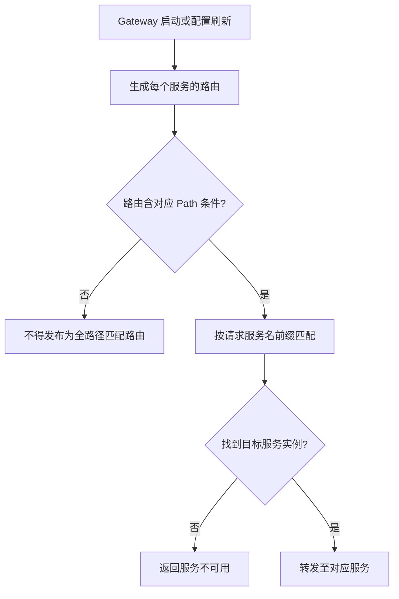

# 跨服务动态路由隔离需求文档

## 1. 文档信息

| 项目 | 内容 |
| --- | --- |
| 需求名称 | 跨服务动态路由隔离 |
| 需求编号 | REQ-2026-007 |
| 文档版本 | 0.4 |
| 所属模块 | blade-gateway、Nacos 服务发现 |
| 目标版本/迭代 | SpringBlade 5.0.1 验证阶段 |
| 文档状态 | 开发中 |
| 产品负责人 | 用户 |
| 技术负责人 | Codex |
| 创建日期 | 2026-09-21 |
| 最后更新日期 | 2026-09-28 |
| 关联事项 | [详细设计](../design/DESIGN-REQ-2026-007-loadbalancer-isolation.md)、[测试文档](../test/TEST-REQ-2026-007-loadbalancer-isolation.md)；数据库不涉及 |

## 2. 摘要与目标

WSL 容器中的 Gateway 在 Nacos 配置刷新后丢失自动发现路由的 Path 条件，`blade-system` 请求可能被 `blade-auth` 路由接走并返回 404；本地静态路由环境不复现。目标是让每条自动发现路由在启动及每次刷新后仍只匹配自己的服务名前缀，不改变 HTTP 与 Feign 契约。

- 必须保证跨多个刷新周期，`/{serviceId}/**` 只进入该 `serviceId` 的路由。
- 必须继续支持 Nacos 服务发现带来的路由增删，不维护固定容器地址。
- 未匹配到路由或实例时不得转发到其他服务。
- 本次不建设审计、脱敏，也不修改负载均衡算法；通用日志仍不得包含密码、Token、密钥或完整敏感请求体。

## 3. 用户故事与范围

| 故事编号 | 优先级 | 用户故事 | 典型场景 | 依赖 |
| --- | --- | --- | --- | --- |
| US-001 | Must | 作为平台调用方，我希望不同服务的入口持续转发至目标服务。 | 登录页同时请求 auth 与 system | Nacos 服务发现、Gateway |

范围内：Gateway 自动发现路由的匹配条件及刷新兼容性、只读诊断和回归验证。范围外：业务 Controller、Feign 签名、数据库、租户与权限规则、Nacos 实例数据和依赖整体升级。

## 4. 流程与异常

```mermaid
flowchart TD
    A[Gateway 启动或配置刷新] --> B[生成每个服务的路由]
    B --> C{路由含对应 Path 条件?}
    C -- 否 --> D[不得发布为全路径匹配路由]
    C -- 是 --> E[按请求服务名前缀匹配]
    E --> F{找到目标服务实例?}
    F -- 否 --> G[返回服务不可用]
    F -- 是 --> H[转发至对应服务]
```

| 编号 | 触发条件 | 预期行为 | 数据是否改变 |
| --- | --- | --- | :---: |
| EX-001 | 路由刷新后请求其他服务路径 | 不命中错误服务路由 | 否 |
| EX-002 | 目标服务无实例 | 返回服务不可用，不从其他服务选择实例 | 否 |
| EX-003 | 未知服务路径 | 保持无路由语义，不回退到任一已注册服务 | 否 |

## 5. 功能需求与验收标准

### 5.1 REQ-001 动态路由匹配隔离

- 关联用户故事：`US-001`；优先级：Must。
- 处理规则：启动、Nacos 配置刷新及服务发现周期刷新后，每个路由必须保留与目标 `serviceId` 对应的 Path 条件；服务名前缀只裁剪一次。
- `AC-001`：Given auth、system、ai 均已注册，When Gateway 启动并生成发现路由，Then 三条路由分别携带自己的 `/{serviceId}/**` 条件。
- `AC-002`：Given Gateway 已启动，When Nacos 配置刷新且经过至少三个服务发现周期，Then 路由重建仍携带各自 Path 条件，交替只读请求持续命中正确服务。
- `AC-003`：Given 某服务无实例或请求未知服务路径，When 请求经 Gateway 到达，Then 不转发到其他服务，且不产生业务写入。
- `AC-004`：Given 新服务注册或原服务下线，When 服务发现刷新，Then 对应路由可增删且既有路由的 Path 不变化。

## 6. 业务规则与边界

| 规则编号 | 规则 | 适用范围 | 违反时行为 |
| --- | --- | --- | --- |
| BR-001 | 发现路由必须以服务名前缀限制匹配范围 | Gateway | 拒绝发布无条件路由 |
| BR-002 | 请求路由与实际选择实例须属于同一目标服务 | Gateway | 失败关闭，不串服务 |
| BR-003 | 路由刷新不得改变已有 HTTP 路径和响应模型 | API 调用方 | 视为兼容性缺陷 |

本需求不新增页面、身份、角色、租户资源或数据权限。公开接口维持原有匿名访问规则，其余接口维持现有认证与授权。审计、脱敏不涉及，依据是当前验收只要求路由隔离。

## 7. 影响与验收状态

| 影响项 | 是否涉及 | 说明 |
| --- | :---: | --- |
| HTTP API / Feign 契约 | 否 | 路径、参数和 `R<T>` 不变 |
| MySQL / 历史数据 | 否 | 不涉及数据变更，数据库设计不涉及 |
| Nacos / 部署 | 是 | 保留现有 Data ID；需发布 Gateway 镜像并跨刷新周期验证 |
| 调用方 | 是 | Saber 登录页并行访问 auth/system 可观察路由结果 |

2026-09-28 已观察：容器镜像 `29f51c698b59` 启动初期构建的发现路由带 Path 与 RewritePath；首次收到 Nacos 配置刷新后，重建日志只剩路由 ID，不再装配两种条件，此后约每 30 秒重复。`/blade-system/tenant/info` 被 `blade-auth` 路由接走并返回 404。本地 dev 使用显式静态 Path 路由，交替只读请求 20 轮均为 200；该结果不能替代容器验收。修复配置已编写，真实容器验证待执行，状态保持开发中。

## 8. 风险与变更记录

| 编号 | 风险/问题 | 状态/结论 |
| --- | --- | --- |
| ITEM-001 | 只验证启动时路由会漏掉配置刷新后的谓词丢失 | 必须跨越至少三个实际刷新周期 |
| ITEM-002 | 旧 prod Nacos 网关键不被当前 Gateway 5.0.2 绑定 | 当前仍由内置自动发现路由生效；不把旧静态配置当作验证依据 |
| ITEM-003 | 历史 007 分支将故障归因于负载均衡或并发实例查询 | 新请求日志证明路由选择先于实例选择出错；旧方案未并入当前基线，不直接恢复 |

| 日期 | 版本 | 变更内容 | 原因 | 影响范围 | 修改人 |
| --- | --- | --- | --- | --- | --- |
| 2026-09-21 | 0.1 | 初次登记跨服务路由问题 | 容器环境交叉路由 | Gateway、Feign | Codex |
| 2026-09-24 | 0.3 | 归档前序验证分支及未完成的动态刷新风险 | 旧修复尚无完整运行时证据 | Gateway | Codex |
| 2026-09-28 | 0.4 | 根据逐请求和刷新日志修正根因与验收范围 | 发现路由谓词在配置重绑定后消失 | Gateway | Codex |
