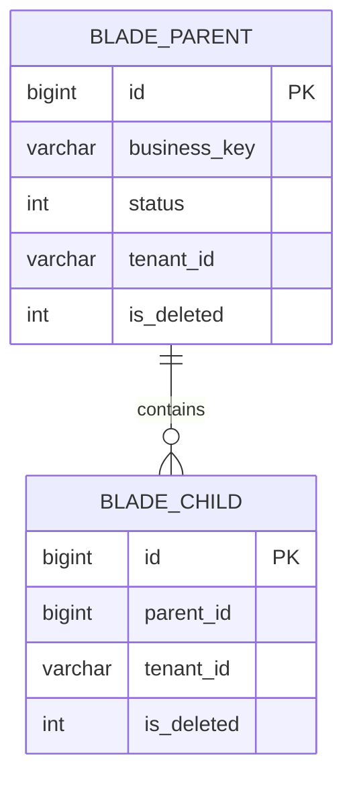

# 数据库设计文档模板

> 复制后将标题改为“[模块/功能]数据库设计”，文件名使用 `DB-REQ-YYYY-NNN-short-name.md`。本模板仅覆盖 SpringBlade 当前维护的 MySQL。

## 0. 使用说明

- 必填：文档信息、变更范围、ER 图、字段、约束与索引、SQL 迁移、回滚和验证。
- 数据库文档只描述数据模型与迁移，API 和业务流程引用需求及详细设计。
- 表结构必须与 Entity 基类、MyBatis-Plus、租户配置和 `doc/sql/blade` 中的 MySQL 脚本一致。
- 未确认的长度、默认值、枚举和索引记录为开放问题，不得猜测。

## 1. 文档信息

| 项目 | 内容 |
| --- | --- |
| 数据库设计编号 | DB-REQ-YYYY-NNN |
| 关联需求 | [需求文档链接] |
| 关联详细设计 | [详细设计链接] |
| 文档版本 | 0.1 |
| 文档状态 | 草稿 / 评审中 / 已确认 / 已迁移 / 已验证 / 已废弃 |
| 数据库 | MySQL |
| 负责人 | 待指定 |
| 创建/更新日期 | YYYY-MM-DD |

## 2. 目标与范围

- 设计目标：[新增或调整的数据能力]
- 数据边界：[租户级 / 全局级 / 关系表]
- 范围外：[本次不处理的数据和历史兼容事项]

| 表名 | 变更类型 | 租户表 | Entity 基类 | 说明 |
| --- | --- | :---: | --- | --- |
| `blade_xxx` | 新增 / 修改 / 删除 | 是 / 否 | `TenantEntity` / `BaseEntity` / 无 | [填写] |

## 3. 数据模型

### 3.1 ER 图

> 必须展示主表、子表和关联表的基数；单表需求也保留实体框图。



### 3.2 关系说明

| 关系 | 基数 | 约束方式 | 删除/停用行为 |
| --- | --- | --- | --- |
| `blade_parent` -> `blade_child` | 1:N | 业务校验 / 外键（按项目现状） | [填写] |

## 4. 表结构

### 4.1 SpringBlade 约定

- 表名使用 `blade_` 前缀和小写下划线命名。
- 主键使用 `BIGINT`，由应用侧雪花算法生成，不使用 `AUTO_INCREMENT`。
- 租户业务实体继承 `TenantEntity`，使用 `tenant_id VARCHAR(12)`，并加入 `blade.tenant.tables`。
- 普通业务实体继承 `BaseEntity`；轻量关系表按现有模块决定是否带基础字段。
- 框架基础字段为 `create_user`、`create_dept`、`create_time`、`update_user`、`update_time`。
- ER 实体框、字段清单和 DDL 使用一致的字段顺序：`id` 首位，随后优先列出核心业务字段，再列 `tenant_id`，最后列框架基础字段；关联 ID、业务编码、名称、内容、版本和状态控制等业务信息不得被租户字段提前打断。
- 状态使用 `status`；逻辑删除使用 `is_deleted`，`0` 未删除，`1` 已删除。
- 使用 `InnoDB`、`utf8mb4`，排序规则沿用当前 MySQL 脚本。

### 4.2 `[blade_xxx]` 字段

| 序号 | 字段 | MySQL 类型 | 允许空 | 默认值 | 键/索引 | 说明 |
| ---: | --- | --- | :---: | --- | --- | --- |
| 1 | `id` | `BIGINT` | 否 | 无 | PK | 雪花主键 |
| 2 | `[business_key]` | `[VARCHAR(...)]` | [是/否] | [填写] | [UK/IDX/无] | 核心业务标识 |
| 3 | `[business_field]` | `[VARCHAR(...)]` | [是/否] | [填写] | [UK/IDX/无] | 其他业务字段 |
| 4 | `status` | `INT` | 是 | [填写] | [IDX/无] | 业务状态 |
| 5 | `tenant_id` | `VARCHAR(12)` | 否 | `'000000'` / 无 | IDX | 仅租户表保留，排在业务字段之后 |
| 6 | `create_user` | `BIGINT` | 是 | NULL | 无 | 创建人 |
| 7 | `create_dept` | `BIGINT` | 是 | NULL | 无 | 创建部门 |
| 8 | `create_time` | `DATETIME` | 是 | NULL | [IDX/无] | 创建时间 |
| 9 | `update_user` | `BIGINT` | 是 | NULL | 无 | 修改人 |
| 10 | `update_time` | `DATETIME` | 是 | NULL | 无 | 修改时间 |
| 11 | `is_deleted` | `INT` | 否 | `0` | [IDX/无] | 逻辑删除 |

补充要求：大文本使用 `TEXT`；JSON 数据优先以 `TEXT` 存储并由应用层校验；枚举字段必须列出值域；敏感字段必须说明存储和日志边界，加密、脱敏等能力仅在需求明确要求时设计。

## 5. 约束与索引

| 名称 | 类型 | 字段顺序 | 支撑规则/查询 |
| --- | --- | --- | --- |
| `uk_blade_xxx_key` | UNIQUE | `tenant_id, business_key` | 租户内业务键唯一 |
| `idx_blade_xxx_tenant_status` | INDEX | `tenant_id, status` | 租户内状态列表 |

- 唯一索引使用 `uk_`，普通索引使用 `idx_`。
- 联合索引顺序必须对应真实查询条件，不批量创建推测性索引。
- 唯一键涉及逻辑删除时，必须明确删除后能否复用，并验证重复删除场景。

## 6. SQL 与迁移

### 6.1 脚本影响

| 脚本 | 是否修改 | 内容 |
| --- | :---: | --- |
| `doc/sql/blade/blade.mysql.all.create.sql` | 是/否 | 全量建表或初始化数据 |
| `doc/sql/blade/[upgrade-script].sql` | 是/否 | 存量环境升级 |

### 6.2 迁移流程


### 6.3 DDL/数据处理

```sql
-- 在此放置经评审的 MySQL DDL 或引用正式升级脚本。
```

- 历史数据处理：[无 / 回填规则、批次和失败处理]
- 重复执行策略：[可重复 / 执行前检查 / 仅允许一次]
- 锁表与耗时风险：[填写]

### 6.4 回滚

- 代码回滚前提：[旧代码是否兼容新结构]
- 数据库回滚步骤：[删除新增对象 / 恢复字段 / 使用备份]
- 不可逆数据：[无 / 明确说明]

## 7. 隔离、一致性与安全

- 租户隔离：租户字段来源、`blade.tenant.tables` 配置和越租户拒绝行为。
- 逻辑删除：默认查询过滤、恢复和业务键复用规则。
- 并发一致性：唯一约束、乐观锁、事务或幂等策略。
- 敏感数据：存储、脱敏、导出和日志边界。

## 8. 验证清单

- [ ] 全量脚本可创建目标表，升级脚本可作用于存量结构。
- [ ] Entity 字段、类型、基类和表结构一致。
- [ ] 主键、唯一约束、索引、默认值和字段注释正确。
- [ ] 租户、逻辑删除、状态和审计字段行为正确。
- [ ] 正常、重复、越租户、并发和回滚场景已覆盖。
- [ ] SQL 不包含真实账号、密码、Token 或生产数据。

## 9. 开放问题与变更记录

| 编号 | 问题/风险 | 负责人 | 状态/结论 |
| --- | --- | --- | --- |
| DB-ITEM-001 | [填写] | 待指定 | 开放 |

| 日期 | 版本 | 变更内容 | 修改人 |
| --- | --- | --- | --- |
| YYYY-MM-DD | 0.1 | 初稿 | [填写] |
