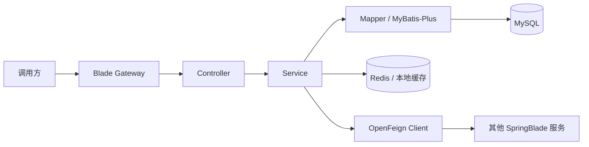
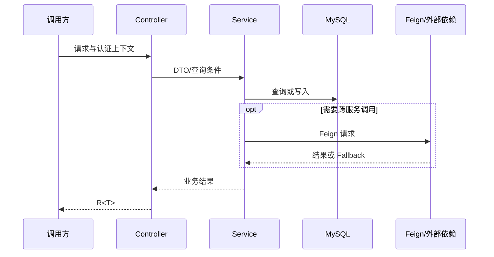

# 详细设计文档模板

> 复制后将标题改为“[功能名称]详细设计”，文件名使用 `DESIGN-REQ-YYYY-NNN-short-name.md`。本模板面向 SpringBlade 后端服务。

## 0. 使用说明

- 必填：需求映射、模块范围、架构图、关键时序图、HTTP/Feign 契约、数据影响、事务、权限租户、发布回滚和验证。
- 需求文档回答做什么，本文件回答怎么实现；字段和 SQL 细节引用数据库设计。
- 不涉及的章节写明“不涉及”及原因，避免保留空占位内容。

## 1. 文档信息

| 项目 | 内容 |
| --- | --- |
| 设计编号 | DESIGN-REQ-YYYY-NNN |
| 关联需求 | [需求文档链接] |
| 关联数据库设计 | [数据库设计链接 / 不涉及] |
| 文档版本 | 0.1 |
| 文档状态 | 草稿 / 评审中 / 已确认 / 开发中 / 已实现 / 已废弃 |
| 技术负责人 | 待指定 |
| 创建/更新日期 | YYYY-MM-DD |

## 2. 设计摘要

### 2.1 目标

1. [需要实现的后端能力]
2. [需要保证的兼容性、安全性或稳定性]

### 2.2 非目标

- [本次不实现的能力]

### 2.3 需求映射

| 需求/验收标准 | 设计落点 | 验证方式 |
| --- | --- | --- |
| REQ-001 / AC-001 | [模块、服务或接口] | [编译、接口或人工验证] |

## 3. 改动范围

| 层次 | 模块/路径 | 主要改动 |
| --- | --- | --- |
| API 契约 | `blade-service-api/blade-xxx-api` | Entity、DTO、VO、Feign、Fallback |
| 服务实现 | `blade-service/blade-xxx` | Controller、Service、Mapper、Wrapper |
| 公共能力 | `blade-common` | [不涉及 / 常量、缓存等] |
| 配置 | `doc/nacos` | [不涉及 / 服务、租户、限流配置] |
| 数据库 | `doc/sql/blade` | [不涉及 / MySQL 全量及升级脚本] |
| 调用方 | [服务模块] | [Feign 或 HTTP 调用调整] |

## 4. 架构与流程

### 4.1 架构图

### 4.2 关键时序图

### 4.3 主要流程

1. [入口校验和上下文获取]
2. [核心业务处理]
3. [数据、缓存或跨服务处理]
4. [统一响应及错误转换]

## 5. 模块设计

### 5.1 API 模块

| 类型 | 名称 | 职责 |
| --- | --- | --- |
| Entity | `[Xxx]` | 数据实体，基类与表结构一致 |
| DTO | `[XxxDTO]` | 写入或复杂查询输入 |
| VO | `[XxxVO]` | 对外响应模型 |
| Feign | `[IXxxClient]` | 跨服务契约 |
| Fallback | `[IXxxClientFallback]` | 明确失败结果，禁止返回含糊的 `null` |

### 5.2 Service 模块

| 类型 | 名称 | 职责 |
| --- | --- | --- |
| Controller | `[XxxController]` | 参数校验、权限入口、`R<T>` 响应 |
| Service | `[IXxxService]` | 业务能力与事务边界 |
| ServiceImpl | `[XxxServiceImpl]` | 规则、缓存和依赖编排 |
| Mapper/XML | `[XxxMapper]` | MyBatis-Plus 查询与必要的自定义 SQL |
| Wrapper | `[XxxWrapper]` | Entity 到 VO 转换 |

### 5.3 核心规则

| 规则 | 实现位置 | 失败行为 |
| --- | --- | --- |
| [唯一性/状态/版本规则] | [Service/数据库] | [业务错误且不改变数据] |

## 6. HTTP API 契约

| 方法 | 路径 | 权限/身份 | 请求 | 响应 | 幂等/并发 |
| --- | --- | --- | --- | --- | --- |
| GET | `/xxx/list` | [已登录/角色] | Query + 查询参数 | `R<IPage<XxxVO>>` | 只读 |
| GET | `/xxx/detail` | [已登录/角色] | ID/查询参数 | `R<XxxVO>` | 只读 |
| POST | `/xxx/submit` | [角色/业务校验] | `XxxDTO` | `R<Boolean>` | [填写] |
| POST | `/xxx/remove` | [角色/业务校验] | `ids` | `R<Boolean>` | [填写] |

接口补充：

- 参数位置与校验：[填写]
- 业务错误码和提示：[填写]
- 兼容策略：[新增接口 / 保持旧接口 / 版本切换]
- 大字段、敏感字段和日志限制：[填写]

## 7. Feign 契约

| 项目 | 内容 |
| --- | --- |
| API 模块 | `blade-service-api/blade-xxx-api` |
| 服务名 | `[AppConstant.APPLICATION_XXX_NAME]` |
| `API_PREFIX` | `/xxx` |
| Java 签名 | `[R<XxxVO> method(...)]` |
| Fallback | 返回 `R.fail(...)` 或明确的类型安全失败结果，不返回 `null` |
| Sentinel/超时 | [沿用全局配置 / 特殊配置及理由] |
| 调用方处理 | 必须区分成功、业务失败和降级失败 |

不涉及跨服务调用时，本节写“不涉及”。

## 8. 数据设计

- 数据库设计：[链接 `DB-REQ-...` / 不涉及]
- Entity 基类：[TenantEntity / BaseEntity / Serializable]
- 租户表配置：[需要加入的表 / 不涉及]
- 逻辑删除、状态、唯一约束和索引：[摘要]
- MySQL 全量及升级脚本：[路径]

## 9. 事务、并发与缓存

| 主题 | 设计 |
| --- | --- |
| 本地事务 | [事务入口、提交和回滚边界] |
| 跨服务事务 | [不涉及 / Seata 使用及补偿] |
| 并发控制 | [唯一约束、乐观锁、版本检查或锁] |
| 幂等 | [幂等键、重复请求行为] |
| 缓存 | [Key、TTL、更新/失效顺序和一致性] |

## 10. 认证、租户与数据权限

- 认证方式：[复用现有 JWT/安全上下文]
- 操作权限：[角色、API Scope 或业务所有权校验]
- 租户边界：`tenant_id` 来源、禁止客户端篡改、越租户拒绝行为。
- 数据权限：[不涉及 / DataScope 规则及自定义 SQL 处理]
- 敏感数据：[入参、响应、日志、缓存和导出限制]

## 11. 异常与日志

| 场景 | 处理 | 对外结果 | 数据影响 |
| --- | --- | --- | --- |
| 参数或状态非法 | 业务校验失败 | 明确业务错误 | 不改变 |
| 数据不存在 | 返回不存在错误 | 不返回旧数据 | 不改变 |
| Feign 降级 | Fallback 返回明确失败 | 调用方不得当作成功 | 按事务设计 |
| 数据库异常 | 记录业务标识和异常堆栈 | 统一错误 | 回滚 |

日志不得记录密码、Token、密钥、连接串或完整敏感请求体。

## 12. 配置、发布与回滚

- Nacos 配置：[Data ID、配置项、默认值、环境差异 / 不涉及]
- 发布顺序：MySQL 脚本 -> API 契约 -> 服务实现 -> 调用方 -> 配置启用。
- 兼容窗口：[新旧版本能否并行]
- 回滚顺序：[调用方/服务/配置/数据库]
- 不可逆事项：[无 / 说明]

## 13. 验证计划

- 编译：`mvn clean compile -DskipTests` 或目标模块 `-pl ... -am` 编译。
- 静态检查：模块依赖、接口签名、租户表配置、SQL 和文档链接。
- 测试：由用户执行；记录需覆盖的接口、Feign、租户、并发、缓存和回滚场景。
- 未执行项和环境限制必须明确记录，不以编译代替业务验收。

## 14. 风险、评审与变更

| 编号 | 风险/问题 | 负责人 | 状态/结论 |
| --- | --- | --- | --- |
| DESIGN-ITEM-001 | [填写] | 待指定 | 开放 |

| 评审领域 | 结论 | 评审人 | 日期 |
| --- | --- | --- | --- |
| 后端/API | 通过/有条件/不通过 | [填写] | YYYY-MM-DD |
| 数据库 | 通过/有条件/不通过 | [填写] | YYYY-MM-DD |
| 测试可行性 | 通过/有条件/不通过 | [填写] | YYYY-MM-DD |

| 日期 | 版本 | 变更内容 | 修改人 |
| --- | --- | --- | --- |
| YYYY-MM-DD | 0.1 | 初稿 | [填写] |
